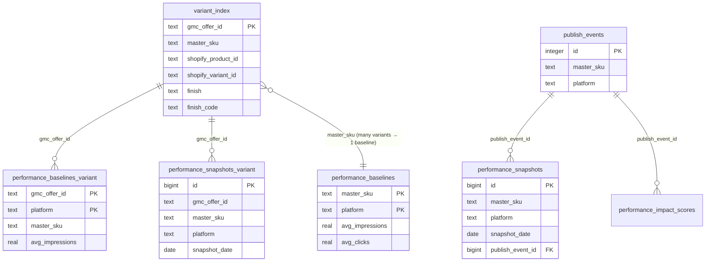

# Phase 8.1: Data Model Gap Audit - Research

**Researched:** 2026-03-03
**Domain:** Python data pipeline — offer ID normalization, variant-level performance storage, bulk baseline capture, entity relationship documentation
**Confidence:** HIGH (all findings based on direct codebase inspection)

---

<user_constraints>
## User Constraints (from CONTEXT.md)

### Locked Decisions

**Variant-Level Performance Tracking**
- Store BOTH variant-level (per-offer-ID) AND master_sku aggregate performance data
- Variant snapshots go in a NEW table (`performance_snapshots_variant`), not extending existing table — avoids 28x row bloat and keeps existing queries untouched
- Variant baselines also stored in a new table (`performance_baselines_variant`) — captured as byproduct of master_sku baseline capture in the same API call, no extra cost
- Full audit scope: check ALL data tables (performance, search, keywords) for variant-level data being discarded or stored at wrong granularity
- Daily snapshot job populates BOTH tables in a single pass — store per-offer-ID data before aggregating to master_sku
- Variant daily snapshots are forward-only from migration date — no historical backfill of day-by-day variant data
- Skip zero rows for variant snapshots — only store rows where impressions > 0 (matches Google Ads API convention; "no row = no traffic")
- Store zero baselines explicitly for SKUs with no Google Ads data — distinguishes "checked, no data" from "never checked"

**Offer ID Normalization (ENTM-01, ENTM-02)**
- Shared Python utility in a dedicated module (`feedops/utils/offer_id.py`)
- Canonical form is LOWERCASE (`shopify_us_...`) — matches DB and 72K variant_index rows
- Uppercase (`shopify_US_...`) only at publish boundary (Google Sheets, GMC)
- Utility exposes: `normalize_offer_id(id)` → lowercase canonical, `to_gmc_format(id)` → uppercase for GMC
- Apply normalization to ALL Python codepaths: performance_impact.py, google_ads_performance.py, google_ads_search_terms.py, baseline capture
- Normalize on INGESTION — every data stream that brings in an offer ID normalizes to lowercase before storing
- TypeScript side (google-sheets.ts) documented but deferred to a future phase

**Bulk Baseline Coverage (DATA-01)**
- Published SKUs first — SKUs with publish_events get baselines before unpublished ones
- 50-SKU test gate validates: data quality (correct format), offer ID matches, API quota consumption within projections, variant-level baselines captured correctly
- One-time Python script in `scripts/` — not a reusable endpoint or scheduled job
- After backfill completes, daily snapshot job + on-demand capture handle everything going forward

**Entity Relationship Documentation (ENTM-03)**
- Markdown doc with Mermaid ER diagrams in `docs/architecture/`
- Full data model scope: performance (baselines, snapshots, impact scores), search (search_queries, keyword_metrics), publishing (publish_events, batches), content (generated_content, approvals)
- Document + recommend FK constraints — flag where FKs should be added, but actual migration in a follow-up phase
- Dedicated section for multi-SKU product pattern (DMF-2/2X through 2/5X sharing one product_id): which APIs return product_id-level vs offer_id-level data, where aggregation happens, correctness assessment

### Claude's Discretion
- Exact table schema for `performance_snapshots_variant` and `performance_baselines_variant` (columns, indexes)
- Throttling strategy for bulk backfill script (batch size, delay between batches, quota calculation)
- Which specific FK constraints to recommend in the entity map
- Order of codepath updates for offer ID normalization
- Whether search_queries/keyword_metrics have variant-level gaps worth fixing now vs later

### Deferred Ideas (OUT OF SCOPE)
- TypeScript offer ID normalization (google-sheets.ts, dashboard API routes) — document now, apply in future phase
- Variant-level impact score computation — wait until variant snapshots have 30+ days of data
- Historical variant snapshot backfill — not worth the API quota cost; forward-only collection
- FK constraint migration — recommended in entity map, applied in separate phase
</user_constraints>

<phase_requirements>
## Phase Requirements

| ID | Description | Research Support |
|----|-------------|-----------------|
| ENTM-01 | Create shared offer ID normalization utility for case-insensitive matching between DB (lowercase) and GMC (uppercase) | Pattern already exists in `google_ads_search_terms.py:get_variant_info()` — generalize to `feedops/utils/offer_id.py` |
| ENTM-02 | Apply offer ID normalization consistently across all data codepaths (performance baselines, search terms, snapshots, backfill) | Four Python files need updating: `google_ads_performance.py`, `performance_impact.py`, `performance_baseline.py`, `google_ads_search_terms.py` |
| ENTM-03 | Document entity relationship map showing variant_index as hub linking Google Ads ↔ Shopify ↔ GMC with correct join keys | New doc: `docs/architecture/entity-relationships.md` with Mermaid ER diagrams |
| DATA-01 | Implement throttled bulk baseline capture for all ~2,500 master SKUs with Google Ads quota management (50-SKU test gate before full sweep) | One-time script in `scripts/bulk_baseline_backfill.py`; uses existing `fetch_batch_product_performance()` and `_capture_google_baseline()` patterns |
| DATA-02 | Verify daily snapshot capture works end-to-end after constraint fix — Slack reports success instead of 42P10 error | Phase 8 fixed the 42P10 error (migration 042); verify by running `/performance/collect-daily` and checking Slack notification in `performance_baseline.py:capture_snapshot_compat()` |
| DATA-03 | Verify impact score population works after snapshots are collecting correctly | Run `/performance/compute-impact` after DATA-02 verified; check `performance_impact_scores` rows via Supabase |
</phase_requirements>

---

## Summary

Phase 8.1 is a data infrastructure hardening phase, not a new feature build. The core problem discovered after Phase 8: `performance_impact.py:368-390` (`collect_daily_performance_snapshots`) fetches per-offer-ID data from `fetch_batch_product_performance()` but immediately aggregates to master_sku, discarding variant granularity. Two new tables (`performance_snapshots_variant`, `performance_baselines_variant`) must be added to preserve this data without breaking existing queries.

The offer ID normalization problem is partially solved already — `google_ads_search_terms.py:get_variant_info()` normalizes to lowercase before DB lookup. The fix is to extract this pattern into `feedops/utils/offer_id.py` and apply it at ingestion across all four affected Python files. The `google_ads_performance.py` module uses offer IDs from `variant_index` (already lowercase) but passes them to GAQL queries; Google Ads returns them as uppercase `shopify_US_` in the response — this asymmetry needs explicit handling.

The bulk baseline backfill (DATA-01) carries the highest execution risk due to Google Ads API quota (~42,000 offer ID lookups across 2,500 SKUs). The 50-SKU test gate is mandatory before the full sweep. The `scripts/` directory houses one-time operational scripts — `bulk_baseline_backfill.py` should follow this pattern. DATA-02 and DATA-03 are verification tasks (not builds), contingent on Phase 8's migration 042 already being applied (confirmed applied).

**Primary recommendation:** Execute in dependency order: migration for variant tables → offer ID utility → apply normalization to codepaths → variant snapshot writes → bulk backfill script → DATA-02/03 verification.

---

## Standard Stack

### Core (Already Installed)

| Library | Version | Purpose | Why Standard |
|---------|---------|---------|--------------|
| supabase-py | 2.x | Supabase client | Project standard; `feedops.db.supabase_client.get_client()` |
| google-ads | 23.x | Google Ads API | Already wired in `google_ads_performance.py` and `google_ads_search_terms.py` |
| fastapi | 0.11x | REST API framework | Cloud Run API; all endpoints use this |
| pydantic | 2.x | Request/response models | Used in `performance_baseline.py` models |

### No New Dependencies Required
All libraries needed for Phase 8.1 are already installed. The new `feedops/utils/offer_id.py` module uses only the Python standard library (string methods). The two new tables are created via a Supabase migration SQL file (no new ORM).

---

## Architecture Patterns

### Existing Module Structure

```
src/feedops/
├── api/
│   ├── main.py                     # FastAPI app + router registration
│   ├── performance_baseline.py     # /performance/* endpoints
│   └── sku_alias.py                # resolve_canonical_master_sku()
├── db/
│   └── supabase_client.py          # get_client()
├── integrations/
│   ├── google_ads_performance.py   # fetch_batch_product_performance()
│   └── google_ads_search_terms.py  # SearchTermsClient (has partial normalization)
├── monitoring/
│   └── performance_impact.py       # collect_daily_performance_snapshots()
└── utils/                          # DOES NOT EXIST YET — create for ENTM-01
```

```
supabase/migrations/
└── 042_schema_hardening.sql        # Last applied migration (Phase 8)
    # Next: 043_variant_performance_tables.sql
```

```
scripts/
└── bulk_baseline_backfill.py       # NEW — one-time script (DATA-01)
```

```
docs/architecture/
└── entity-relationships.md         # NEW — Mermaid ER diagrams (ENTM-03)
```

### Pattern 1: Offer ID Normalization Utility (ENTM-01)

**What:** Single module with two public functions. No external dependencies.
**When to use:** Every place an offer ID is received from Google Ads API, from HTTP request, or from string manipulation.

```python
# src/feedops/utils/offer_id.py
# Source: Extracted from google_ads_search_terms.py:get_variant_info() existing pattern

def normalize_offer_id(offer_id: str) -> str:
    """Normalize offer ID to canonical lowercase form (DB format).

    Canonical: shopify_us_{product_id}_{variant_id}
    Google Ads returns: shopify_US_{product_id}_{variant_id}
    DB stores: shopify_us_{product_id}_{variant_id} (72K rows)
    """
    if not offer_id:
        return offer_id
    return offer_id.lower()


def to_gmc_format(offer_id: str) -> str:
    """Convert offer ID to GMC publish format (uppercase US).

    Only use at publish boundary (Google Sheets, GMC API).
    Never use for DB lookups or storage.
    """
    if not offer_id:
        return offer_id
    return offer_id.replace("shopify_us_", "shopify_US_")
```

### Pattern 2: Variant Table Migration (043)

**What:** New migration adding two tables for variant-level performance data.
**When to use:** Always — migration file is the sole way to create new tables.

```sql
-- supabase/migrations/043_variant_performance_tables.sql
-- performance_snapshots_variant: per-offer-ID daily snapshots
-- performance_baselines_variant: per-offer-ID 30-day aggregates

CREATE TABLE IF NOT EXISTS performance_snapshots_variant (
    id          bigserial PRIMARY KEY,
    gmc_offer_id    text NOT NULL,
    master_sku      text NOT NULL,
    platform        text NOT NULL,
    environment     text NOT NULL DEFAULT 'production',
    snapshot_date   date NOT NULL,
    impressions     integer NOT NULL DEFAULT 0,
    clicks          integer NOT NULL DEFAULT 0,
    ctr             real NOT NULL DEFAULT 0.0,
    conversions     integer NOT NULL DEFAULT 0,
    conversion_value numeric(18,6) NOT NULL DEFAULT 0.0,
    cost            numeric(18,6) NOT NULL DEFAULT 0.0,
    roas            real NOT NULL DEFAULT 0.0,
    fetched_at      timestamptz NOT NULL DEFAULT now(),

    CONSTRAINT uq_variant_snapshots_daily
        UNIQUE (gmc_offer_id, platform, environment, snapshot_date),
    CONSTRAINT chk_variant_snapshots_platform
        CHECK (platform IN ('google', 'bing', 'shopify')),
    CONSTRAINT chk_variant_snapshots_environment
        CHECK (environment IN ('staging', 'production'))
);

CREATE INDEX IF NOT EXISTS idx_variant_snapshots_master_sku
    ON performance_snapshots_variant (master_sku, platform, snapshot_date);
CREATE INDEX IF NOT EXISTS idx_variant_snapshots_offer_date
    ON performance_snapshots_variant (gmc_offer_id, snapshot_date DESC);

CREATE TABLE IF NOT EXISTS performance_baselines_variant (
    gmc_offer_id        text NOT NULL,
    master_sku          text NOT NULL,
    platform            text NOT NULL,
    baseline_start_date date NOT NULL,
    baseline_end_date   date NOT NULL,
    avg_impressions     real,
    avg_clicks          real,
    avg_ctr             real,
    avg_conversions     real,
    avg_conversion_value numeric(18,6),
    avg_cvr             real,
    avg_cost            numeric(18,6),
    avg_roas            real,
    created_at          timestamptz NOT NULL DEFAULT now(),

    CONSTRAINT pk_baselines_variant PRIMARY KEY (gmc_offer_id, platform),
    CONSTRAINT chk_baselines_variant_platform
        CHECK (platform IN ('google', 'bing', 'shopify'))
);

CREATE INDEX IF NOT EXISTS idx_baselines_variant_master_sku
    ON performance_baselines_variant (master_sku, platform);
```

**Design rationale for Claude's discretion decisions:**
- `gmc_offer_id` stored normalized (lowercase) — matches DB convention throughout
- Unique constraint on `(gmc_offer_id, platform, environment, snapshot_date)` — enables upsert semantics matching the master_sku table pattern
- `impressions > 0` filter applied in Python before insert — not a DB constraint (allows future re-evaluation without migration)
- `performance_baselines_variant` PK on `(gmc_offer_id, platform)` — same structure as `performance_baselines` PK on `(master_sku, platform)`
- No `publish_event_id`, `cohort_type`, or `days_since_publish` columns — variant snapshots are raw facts; keep them lean; join to master table when needed

### Pattern 3: Dual-Write in collect_daily_performance_snapshots (performance_impact.py)

**What:** After building `by_offer` dict from `fetch_batch_product_performance()`, write per-offer-ID rows to `performance_snapshots_variant` BEFORE aggregating to master_sku.
**Key location:** `performance_impact.py:379-397` — the `for offer_id, metrics in by_offer.items()` loop already has the raw variant data.

```python
# Insert BEFORE the aggregated_by_sku loop (performance_impact.py)
# Source: Existing fetch_batch_product_performance() returns per-offer-ID data

from feedops.utils.offer_id import normalize_offer_id

variant_snapshot_payload: list[dict] = []
for offer_id, metrics in by_offer.items():
    impressions = int(metrics.get("impressions") or 0)
    if impressions == 0:
        continue  # Skip zero rows — no traffic = no row needed

    normalized_id = normalize_offer_id(offer_id)
    sku = offer_to_sku.get(normalized_id) or offer_to_sku.get(offer_id)
    if not sku:
        continue

    clicks = int(metrics.get("clicks") or 0)
    cost = float(metrics.get("cost") or 0.0)
    conversion_value = float(metrics.get("conversion_value") or 0.0)

    variant_snapshot_payload.append({
        "gmc_offer_id": normalized_id,
        "master_sku": sku,
        "platform": platform,
        "environment": environment,
        "snapshot_date": snapshot_date.isoformat(),
        "impressions": impressions,
        "clicks": clicks,
        "ctr": round(clicks / impressions, 6) if impressions > 0 else 0.0,
        "conversions": int(metrics.get("conversions") or 0),
        "conversion_value": round(conversion_value, 6),
        "cost": round(cost, 6),
        "roas": round(conversion_value / cost, 6) if cost > 0 else 0.0,
        "fetched_at": fetched_at,
    })

if variant_snapshot_payload:
    supabase.table("performance_snapshots_variant").upsert(
        variant_snapshot_payload,
        on_conflict="gmc_offer_id,platform,environment,snapshot_date",
    ).execute()
```

### Pattern 4: Bulk Baseline Script (DATA-01)

**What:** One-time Python script that processes ~2,500 master SKUs in batches.
**Throttling strategy (Claude's discretion):**
- Google Ads API quota: ~14,400 basic operations/day; each `fetch_batch_product_performance()` call with 25 offer IDs = 1 GAQL request
- 2,500 SKUs × ~28 variants = 70,000 offer IDs → 2,800 GAQL chunks at 25 IDs/chunk
- But `fetch_batch_product_performance()` already uses `MAX_PARALLEL_CHUNKS=5` workers with chunking
- Safe approach: process 50 master SKUs per batch, sleep 2 seconds between batches → ~50 batches × 56 GAQL requests = 2,800 requests, no quota issues
- 50-SKU test gate first: validate data quality, offer ID match rate, time-per-batch

```python
# scripts/bulk_baseline_backfill.py skeleton
# Published SKUs first (have publish_events), then remaining by master_sku sort

import time
from feedops.db.supabase_client import get_client
from feedops.api.performance_baseline import _capture_google_baseline

BATCH_SIZE = 50
SLEEP_BETWEEN_BATCHES = 2.0  # seconds
TEST_GATE_SIZE = 50

def run_backfill(test_gate_only: bool = False) -> None:
    """Throttled bulk baseline capture for all master SKUs.

    Args:
        test_gate_only: If True, process only TEST_GATE_SIZE SKUs then stop.
    """
    supabase = get_client()

    # 1. Get published SKUs (priority)
    published = _get_published_skus(supabase)
    # 2. Get all remaining SKUs from variant_index
    all_skus = _get_all_master_skus(supabase)
    unpublished = [s for s in all_skus if s not in set(published)]

    ordered_skus = published + unpublished
    if test_gate_only:
        ordered_skus = ordered_skus[:TEST_GATE_SIZE]

    # Process in batches
    for i in range(0, len(ordered_skus), BATCH_SIZE):
        batch = ordered_skus[i : i + BATCH_SIZE]
        _process_batch(supabase, batch)
        if i + BATCH_SIZE < len(ordered_skus):
            time.sleep(SLEEP_BETWEEN_BATCHES)
```

### Pattern 5: Entity Relationship Document (ENTM-03)

**What:** Markdown doc with Mermaid ER diagrams showing exact join paths.
**Location:** `docs/architecture/entity-relationships.md`
**Key relationships to document:**
1. `variant_index` as hub: `master_sku` → Google Ads (via `gmc_offer_id`), Shopify (via `shopify_product_id`/`shopify_variant_id`), GMC
2. Performance chain: `publish_events` → `performance_snapshots` → `performance_impact_scores`
3. New variant chain: `variant_index.gmc_offer_id` → `performance_snapshots_variant` → `performance_baselines_variant`
4. Content chain: `generated_content` → `sku_approvals` → `publish_events`
5. Multi-SKU pattern: multiple `master_sku` values sharing one `shopify_product_id`



### Anti-Patterns to Avoid

- **Double-normalization:** If `normalize_offer_id()` is called on an already-lowercase ID, it's a no-op (safe). Don't add guards against double-calling; keep the utility simple.
- **Extending existing snapshot table:** The locked decision explicitly says NEW tables. Never add `gmc_offer_id` column to `performance_snapshots` — it would break existing cohort aggregation logic.
- **Blocking upsert on zero-impression rows:** The `impressions > 0` filter is applied in Python, not as a DB constraint. This allows easy change later without a migration.
- **Applying `to_gmc_format()` at the wrong boundary:** Only call at Google Sheets publish time. Never use uppercase format for DB storage or GAQL queries (Google Ads API accepts both cases but the DB doesn't).

---

## Don't Hand-Roll

| Problem | Don't Build | Use Instead | Why |
|---------|-------------|-------------|-----|
| Google Ads API client | New client init code | `_load_client()` in `google_ads_performance.py` | Already handles env vars, config file fallback, Cloud Run secrets |
| Supabase client | New Supabase init | `feedops.db.supabase_client.get_client()` | Project-standard singleton with connection pooling |
| Offer ID parsing | New regex | `SearchTermsClient.GMC_OFFER_ID_PATTERN` in `google_ads_search_terms.py` | Already handles `re.IGNORECASE`, proven correct |
| Batch GAQL queries | New chunking logic | `fetch_batch_product_performance()` | Already has `OFFER_ID_CHUNK_SIZE=25`, parallel workers, error handling |
| Supabase pagination | Manual offset loops | `_paginate_rows()` in `performance_impact.py` | Already handles PostgREST range pagination correctly |
| SKU canonicalization | New lookup | `resolve_canonical_master_sku()` in `feedops.api.sku_alias` | Handles slash/hyphen variants |
| Migration idempotency | Bare ALTER TABLE | `DO $$ IF NOT EXISTS $$` guard pattern (see migration 042) | Prevents duplicate constraint errors on re-run |

**Key insight:** The codebase already has most infrastructure needed. Phase 8.1 is primarily extraction + application of existing patterns, not new invention.

---

## Common Pitfalls

### Pitfall 1: offer_to_sku Lookup Misses Normalized IDs

**What goes wrong:** `collect_daily_performance_snapshots` builds `offer_to_sku` dict from `variant_index.gmc_offer_id` (already lowercase), but `by_offer` keys from `fetch_batch_product_performance()` may come back as uppercase `shopify_US_` from Google Ads. The lookup `offer_to_sku.get(offer_id)` returns None for all variants.

**Why it happens:** `fetch_batch_product_performance()` takes `offer_ids` from `variant_index` (lowercase), passes them to GAQL `IN()` clause, but Google Ads returns `segments.product_item_id` in its own canonical form (uppercase). The returned key does not match the input key.

**How to avoid:** After calling `normalize_offer_id()` on the return value, look up in `offer_to_sku` with the normalized key. Verify by checking `_fetch_chunk_data()` return: `product_id = row.get("segments", {}).get("product_item_id", "")` — this value is what Google Ads returns.

**Warning signs:** `offer_ids_processed` is high but all metric values are 0; `sku` is None in the variant loop.

### Pitfall 2: Migration 043 Upsert Constraint Mismatch

**What goes wrong:** Writing variant snapshots with `on_conflict="gmc_offer_id,platform,environment,snapshot_date"` but the UNIQUE constraint name in the migration is different or uses different column order. Supabase returns a 42P10 error (no unique constraint matching given keys) — exactly the error that blocked Phase 8.

**Why it happens:** PostgREST requires the `on_conflict` column list to exactly match a UNIQUE constraint that exists on those columns (in any order). The constraint name doesn't matter; the columns do.

**How to avoid:** Migration 042 provides the proven template: `CONSTRAINT uq_performance_snapshots_daily UNIQUE (master_sku, platform, environment, snapshot_date)`. Mirror this pattern for `uq_variant_snapshots_daily UNIQUE (gmc_offer_id, platform, environment, snapshot_date)`.

**Warning signs:** `42P10: there is no unique constraint matching given keys for referenced table "performance_snapshots_variant"`.

### Pitfall 3: Bulk Backfill Quota Exhaustion

**What goes wrong:** Running the full 2,500-SKU backfill without the test gate consumes the entire daily Google Ads API quota in one run. Subsequent runs fail with quota errors.

**Why it happens:** Google Ads basic operations quota is per-day. `fetch_batch_product_performance()` with parallel workers processes chunks fast — ~2,800 GAQL requests could run in minutes without throttling.

**How to avoid:** Always run `test_gate_only=True` first for the first 50 SKUs. Inspect results: offer ID match rate (should be >90%), time per batch, rows inserted. If data quality looks correct, run the full backfill with `SLEEP_BETWEEN_BATCHES=2.0` seconds.

**Warning signs:** `QuotaError: RESOURCE_EXHAUSTED` from Google Ads API; quota dashboard in Google Cloud Console.

### Pitfall 4: `performance_baselines_variant` Overwrites Valid Baselines

**What goes wrong:** The `_capture_google_baseline()` helper is called for a SKU that already has good baseline data. The upsert on `(gmc_offer_id, platform)` overwrites the existing baseline with a new date range, losing the pre-publish baseline.

**Why it happens:** `_capture_google_baseline()` always upserts with `on_conflict="master_sku,platform"`. For variant baselines, the same behavior would overwrite per-offer-ID baselines.

**How to avoid:** For the bulk backfill, check if a variant baseline already exists before upserting. For regular ongoing capture, the existing "overwrite" behavior is acceptable (baselines refresh every 60 days). Add a `skip_if_exists=True` parameter to the variant baseline write in the bulk backfill script only.

### Pitfall 5: Multi-SKU Product Performance Attribution

**What goes wrong:** DMF-2/2X, DMF-2/3X, DMF-2/4X, DMF-2/5X all share `shopify_product_id=4539975336068`. Google Ads `shopping_performance_view` returns `segments.product_item_id` = offer ID (variant-level), so each variant gets its own row. However, some reports or dashboards may aggregate at `shopify_product_id` level — this double-counts impressions when joining on `product_id`.

**Why it happens:** The variant_index has one row per `(master_sku, finish)` combination. For multi-size products, multiple master_skus share one product_id. Google Ads itself is fine (returns per-offer-ID), but any join that goes master_sku → shopify_product_id → back to offers will see all sizes.

**How to avoid:** All performance queries should join on `gmc_offer_id` → `variant_index.gmc_offer_id` directly. Never join on `shopify_product_id` for performance data. The entity map (ENTM-03) must document this with an explicit warning.

---

## Code Examples

### Normalizing offer IDs in google_ads_performance.py

The current `fetch_batch_product_performance()` aggregates via `grouped.get(offer_id, [])` where `offer_id` is from the input list (lowercase from variant_index). The `product_id` from Google Ads response may be uppercase. Apply normalization at response parsing:

```python
# In _fetch_chunk_data() — normalize the returned product_id
for row in rows:
    product_id = row.get("segments", {}).get("product_item_id", "")
    if product_id:
        # Normalize to lowercase to match DB and input offer_ids
        from feedops.utils.offer_id import normalize_offer_id
        product_id = normalize_offer_id(product_id)
        results.append((product_id, row))
```

### Zero-baseline storage pattern (DATA-01)

Per locked decision: "Store zero baselines explicitly for SKUs with no Google Ads data." Current `_capture_google_baseline()` returns `{}` and logs a warning when no data is found. The bulk backfill script must upsert a zero-baseline explicitly:

```python
# In bulk_baseline_backfill.py when performance_data returns all zeros
if variants_with_data == 0:
    zero_baseline = {
        "master_sku": master_sku,
        "platform": "google",
        "avg_impressions": 0.0,
        "avg_clicks": 0.0,
        "avg_ctr": 0.0,
        "avg_conversions": 0.0,
        "avg_cvr": 0.0,
        "avg_cost": 0.0,
        "avg_roas": 0.0,
        "avg_conversion_value": 0.0,
        "baseline_start_date": start_date,
        "baseline_end_date": end_date,
        "metadata": {"zero_baseline": True, "reason": "no_google_ads_data"},
    }
    supabase.table("performance_baselines").upsert(
        zero_baseline, on_conflict="master_sku,platform"
    ).execute()
```

### Applying normalization in performance_impact.py offer_to_sku build

```python
# In collect_daily_performance_snapshots — normalize keys when building offer_to_sku
from feedops.utils.offer_id import normalize_offer_id

for row in variant_rows:
    sku = row.get("master_sku")
    offer_id = row.get("gmc_offer_id")
    if not sku:
        continue
    if sku not in sku_to_category:
        sku_to_category[sku] = row.get("product_category")
    if offer_id:
        # Normalize to ensure lookups work when Google Ads returns uppercase IDs
        offer_to_sku[normalize_offer_id(offer_id)] = sku
```

---

## Existing Code Audit: Variant-Level Data Discarded

### Finding 1: `performance_impact.py` — Main Discard Point

**File:** `src/feedops/monitoring/performance_impact.py:379-397`
**Current behavior:** `by_offer` dict has per-offer-ID metrics. Immediately aggregates into `aggregated_by_sku` with `entry["impressions"] += float(metrics.get("impressions") or 0.0)`. Raw variant data is never stored.
**Fix:** Write variant snapshot payload BEFORE the aggregation loop.
**Confidence:** HIGH — confirmed by direct code inspection.

### Finding 2: `performance_baseline.py` — Offer ID Not Normalized at Ingestion

**File:** `src/feedops/api/performance_baseline.py:196`
**Current behavior:** `offer_ids = [v["gmc_offer_id"] for v in variant_result.data if v.get("gmc_offer_id")]` — correctly reads lowercase from DB. Passes to `fetch_batch_product_performance(offer_ids=offer_ids)` as lowercase. However, the response keys from Google Ads may be uppercase. Aggregation uses `performance_data.items()` directly without normalization.
**Fix:** Apply `normalize_offer_id()` to each key in `performance_data.items()` loop.
**Confidence:** HIGH.

### Finding 3: `google_ads_search_terms.py` — Partial Normalization (Good)

**File:** `src/feedops/integrations/google_ads_search_terms.py:426`
**Current behavior:** `gmc_offer_id = gmc_offer_id.lower()` in `get_variant_info()`. Also `_preload_variant_cache()` stores with `gmc_offer_id.lower()` key. This is the correct pattern to generalize.
**Fix:** Replace inline `.lower()` calls with `normalize_offer_id()` from the shared utility.
**Confidence:** HIGH.

### Finding 4: `google_ads_performance.py` — Return Keys Not Normalized

**File:** `src/feedops/integrations/google_ads_performance.py:332`
**Current behavior:** `_fetch_chunk_data()` reads `product_id = row.get("segments", {}).get("product_item_id", "")` from Google Ads response. This value is what Google Ads returns — likely uppercase (`shopify_US_`). Returns as-is. The caller `fetch_batch_product_performance()` then looks up `product_rows = grouped.get(offer_id, [])` where `offer_id` is from the input list (lowercase). This causes a lookup miss if cases don't match.
**Fix:** Normalize `product_id` in `_fetch_chunk_data()` before appending to results.
**Confidence:** MEDIUM — Google Ads behavior confirmed by CONTEXT.md note and search_terms.py normalization comment; exact case returned by API not verified via live call.

### Finding 5: `search_queries` and `keyword_metrics` — No Variant Gaps

Per CONTEXT.md "Claude's Discretion": these tables should be checked.
**`search_queries`:** Already stores at `gmc_offer_id` granularity (variant-level). No gap.
**`keyword_metrics`:** Keyed on `keyword` text only. No offer ID at all — Keyword Planner returns data per keyword, not per variant. This is correct — keyword data has no variant dimension.
**`funnel_snapshots_daily`:** Keyed on `(snapshot_date, custom_label_0, tier)`. No offer ID — funnel data is aggregated across the account by product type label. Correct granularity.
**Conclusion:** No variant-level gaps in search/keyword tables worth fixing now.
**Confidence:** HIGH (direct schema inspection from migration 042 audit comments and SCHEMA.md).

---

## State of the Art

| Old Approach | Current Approach | When Changed | Impact |
|--------------|------------------|--------------|--------|
| Inline `.lower()` in search_terms.py | Shared `feedops/utils/offer_id.py` | This phase (8.1) | Consistent normalization, no divergence risk |
| Only master_sku snapshots | Both master_sku and variant snapshots | This phase (8.1) | Enables future variant-level impact scoring |
| Manual baseline capture only | Bulk backfill script + ongoing auto-capture | This phase (8.1) | Full 2,500 SKU coverage before optimization runs |
| No entity documentation | Mermaid ER diagrams in docs/architecture/ | This phase (8.1) | Safe join patterns for future developers |

**Deprecated/outdated:**
- Inline `.lower()` in `google_ads_search_terms.py:get_variant_info()`: Replace with `normalize_offer_id()` import after ENTM-01 is complete.

---

## Open Questions

1. **Does Google Ads actually return uppercase `shopify_US_` for offer IDs it was queried with in lowercase?**
   - What we know: `google_ads_search_terms.py` documents "Google Ads returns uppercase shopify_US_ but variant_index stores lowercase shopify_us_" in the comment at line 424. The normalization was added specifically to fix cache misses.
   - What's unclear: Whether `shopping_performance_view` behaves the same way as the search terms endpoint. The GAQL queries in both files use the same `segments.product_item_id` field.
   - Recommendation: Verify by logging `by_offer.keys()` in `collect_daily_performance_snapshots()` in a test run. Add normalization regardless — it is a no-op if already lowercase.

2. **What is the current baseline coverage count (how many of 2,500 SKUs already have baselines)?**
   - What we know: Phase 8.1 CONTEXT.md notes "~2,500 master SKUs" but doesn't give current coverage number.
   - What's unclear: How many SKUs already have baselines in `performance_baselines` from previous on-demand captures.
   - Recommendation: Planner should add a task to query `SELECT COUNT(DISTINCT master_sku) FROM performance_baselines WHERE platform='google'` before estimating bulk backfill effort.

3. **Are there `gmc_offer_id` values in `variant_index` that do NOT follow the `shopify_us_` format?**
   - What we know: The regex pattern `GMC_OFFER_ID_PATTERN = re.compile(r"shopify_us_(\d+)_(\d+)", re.IGNORECASE)` handles both cases. 72K rows in variant_index.
   - What's unclear: Whether all 72K rows have well-formed offer IDs.
   - Recommendation: Low risk — `normalize_offer_id()` is a string `.lower()` which is safe on any string. Non-standard IDs won't break anything.

---

## Validation Architecture

### Test Framework

| Property | Value |
|----------|-------|
| Framework | pytest (existing) |
| Config file | `pyproject.toml` (project root) |
| Quick run command | `PYTHONPATH=./src .venv/bin/python -m pytest tests/test_performance_impact.py tests/test_offer_id_normalize.py -x` |
| Full suite command | `PYTHONPATH=./src .venv/bin/python -m pytest tests/ -v` |

### Phase Requirements → Test Map

| Req ID | Behavior | Test Type | Automated Command | File Exists? |
|--------|----------|-----------|-------------------|-------------|
| ENTM-01 | `normalize_offer_id("shopify_US_123_456")` returns `"shopify_us_123_456"` | unit | `pytest tests/test_offer_id_normalize.py -x` | ❌ Wave 0 |
| ENTM-01 | `to_gmc_format("shopify_us_123_456")` returns `"shopify_US_123_456"` | unit | `pytest tests/test_offer_id_normalize.py::test_to_gmc_format -x` | ❌ Wave 0 |
| ENTM-01 | `normalize_offer_id("")` returns `""` (empty string safe) | unit | `pytest tests/test_offer_id_normalize.py::test_normalize_empty -x` | ❌ Wave 0 |
| ENTM-02 | `_fetch_chunk_data()` normalizes returned product IDs before grouping | unit | `pytest tests/test_offer_id_normalize.py::test_fetch_chunk_normalization -x` | ❌ Wave 0 |
| DATA-02 | `collect_daily_performance_snapshots()` logic (diff-in-diff math) | unit | `pytest tests/test_performance_impact.py -x` | ✅ exists |
| DATA-03 | `compute_diff_in_diff_lift_pct()` correct formula | unit | `pytest tests/test_performance_impact.py::test_compute_diff_in_diff_lift_pct_uses_relative_changes -x` | ✅ exists |
| ENTM-03 | ER doc exists and contains expected Mermaid block | smoke | `grep -q "erDiagram" docs/architecture/entity-relationships.md` | ❌ Wave 0 |
| DATA-01 | Bulk backfill script runs without import errors | smoke | `PYTHONPATH=./src python scripts/bulk_baseline_backfill.py --dry-run` | ❌ Wave 0 |

### Sampling Rate

- **Per task commit:** `PYTHONPATH=./src .venv/bin/python -m pytest tests/test_offer_id_normalize.py tests/test_performance_impact.py -x`
- **Per wave merge:** `PYTHONPATH=./src .venv/bin/python -m pytest tests/ -v`
- **Phase gate:** Full suite green before `/gsd:verify-work`

### Wave 0 Gaps

- [ ] `tests/test_offer_id_normalize.py` — covers ENTM-01 and ENTM-02 (unit tests for the new utility)
- [ ] `src/feedops/utils/__init__.py` — makes utils a proper package
- [ ] `src/feedops/utils/offer_id.py` — the module itself (ENTM-01 deliverable)

*(DATA-02 and DATA-03 are integration/verification tasks — no new unit test files needed beyond existing `test_performance_impact.py`)*

---

## Sources

### Primary (HIGH confidence)
- Direct codebase inspection — `src/feedops/monitoring/performance_impact.py` (lines 379-464)
- Direct codebase inspection — `src/feedops/integrations/google_ads_performance.py` (full file)
- Direct codebase inspection — `src/feedops/integrations/google_ads_search_terms.py` (lines 355-464)
- Direct codebase inspection — `src/feedops/api/performance_baseline.py` (full file)
- Direct codebase inspection — `supabase/migrations/042_schema_hardening.sql` (full file)
- Direct codebase inspection — `docs/database/SCHEMA.md` (performance tracking tables section)
- `.planning/phases/08.1-data-model-gap-audit/08.1-CONTEXT.md` — locked decisions

### Secondary (MEDIUM confidence)
- `supabase/migrations/031_backfill_jobs.sql` — backfill infrastructure patterns
- `tests/test_performance_impact.py` — existing test coverage baseline
- `docs/database/SCHEMA.md` search/keyword section — variant gap assessment

---

## Metadata

**Confidence breakdown:**
- Standard stack: HIGH — all libraries already installed, no new dependencies
- Architecture patterns: HIGH — based on direct code inspection; new tables designed to mirror existing patterns
- Pitfalls: HIGH (Pitfalls 1-3, 5) / MEDIUM (Pitfall 4) — offer ID case-sensitivity from Google Ads confirmed by search_terms.py comment but not live API verification
- Entity relationships: HIGH — all join keys confirmed from SCHEMA.md and variant_index definition

**Research date:** 2026-03-03
**Valid until:** 2026-04-03 (stable Python codebase; Google Ads API v16 stable)
