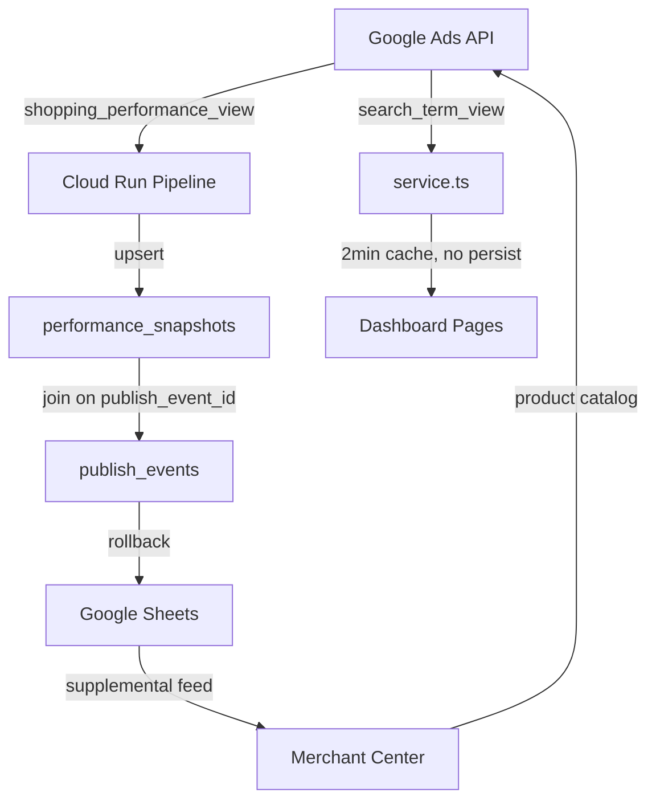

# Phase 28: Architecture Audit & Migration Triage - Research

**Researched:** 2026-02-25
**Domain:** Database schema audit, data flow mapping, migration triage, API quota analysis
**Confidence:** HIGH

## Summary

Phase 28 is a pure audit/analysis phase that produces findings and decisions, with no code changes. The work involves: (1) mapping the complete data flow from Google Ads API through the database to dashboard actions, (2) verifying production schema state matches documentation, (3) triaging all 18 deferred migration tables with KEEP/DEFER/PRUNE decisions, (4) auditing NULL rates in the publish-performance join chain, and (5) confirming Google Ads API quota sustainability for daily snapshot capture.

The codebase has two distinct Google Ads API integration layers -- a TypeScript layer (`dashboard/src/lib/google-ads.ts` + `dashboard/src/lib/shopping-funnel/service.ts`) and a Python pipeline layer (`src/feedops/integrations/google_ads_performance.py`). The TypeScript `service.ts` alone issues 7 GAQL queries per context build with a 2-minute in-memory cache and zero persistence. The Python pipeline handles daily snapshot collection and impact scoring. Both query `shopping_performance_view` and `search_term_view` -- a redundancy the audit should flag for caching strategy.

There are 30 TypeScript files referencing 035b tables and 3 files referencing 034b tables. The 034b tables were "created out-of-band" (already in production), as were the 035b tables. Five dashboard pages (Shopping Funnel, Optimization Control, Intent Control, Search Governance, Experiment Lab) render empty because they depend on these tables. The user explicitly wants GA4 tables evaluated for KEEP with an infrastructure-forward bias.

**Primary recommendation:** Structure the audit as five deliverables (one per AUDIT requirement), using Mermaid diagrams for data flow, per-table decision cards for migration triage, and SQL queries run against production Supabase for NULL rate analysis.

<user_constraints>
## User Constraints (from CONTEXT.md)

### Locked Decisions
- Evaluate ALL 18 tables for KEEP -- including 034b GA4 tables (user considers GA4 important for the master plan)
- Claude decides per-table based on: code references, downstream need for v1.3b-v1.4, complexity, and alignment with the feedback loop
- Lean toward building infrastructure for future scale rather than aggressive pruning
- For tables with orphaned dashboard components: Claude decides per case -- simple wiring now (Phase 31), complex UI deferred to v1.3c/v1.4
- Pruned tables: delete TypeScript consumer files, keep migration SQL files as reference
- Phase 31 executes the actual deletions based on Phase 28's triage decisions
- Go/no-go for feedback view: Any linked data is useful -- even 10 records justifies building the view
- NULL rate handling: Claude decides based on findings -- backfill if data exists to derive values, enforce NOT NULL going forward if not
- Audit scope: All foreign keys in the publish/performance chain, not just prompt_hash and content_version
- Phase 28 scope: Document findings only -- no data fixes during the audit. Issues escalate to Phase 29-31.
- Data flow map: Mermaid diagrams + annotated prose. Renders in GitHub/VS Code.
- Migration triage: Per-table decision cards -- each table gets: purpose, code references, data state, decision (KEEP/DEFER/PRUNE), reasoning
- File locations: Primary in `.planning/phases/28-*/`, with summary/symlink in `docs/architecture/` for long-term reference
- Circular flow validation: Claude decides whether separate document or section within data flow map, based on content volume
- Standard Access is effectively unlimited for our scale (2,784 SKUs, single account)
- Daily snapshot capture confirmed as target frequency
- Quota analysis depth at Claude's discretion -- lightweight confirmation if clearly fine, deeper if surprises emerge
- If redundant API calls found, recommend a caching strategy in the audit deliverable

### Claude's Discretion
- Per-table KEEP/DEFER/PRUNE decisions (with infrastructure-forward bias)
- Backfill vs enforce-going-forward for NULL columns
- Simple component wiring (Phase 31) vs deferring complex UI
- Circular flow document structure
- Quota analysis depth
- Caching strategy recommendations

### Deferred Ideas (OUT OF SCOPE)
None -- discussion stayed within phase scope.
</user_constraints>

<phase_requirements>
## Phase Requirements

| ID | Description | Research Support |
|----|-------------|-----------------|
| AUDIT-01 | Data flow audit document maps complete path from Google Ads API -> service.ts -> database -> dashboard -> actions -> Google Ads, marking every dead end | Data flow research identifies all integration touchpoints: 2 TS Google Ads clients, 1 Python client, 7 GAQL queries in service.ts, publishing chain through Google Sheets to GMC. Mermaid diagrams recommended. |
| AUDIT-02 | API quota analysis confirms daily snapshot capture is sustainable within Google Ads Standard Access limits and recommends caching strategy | Google Ads Standard Access allows 15,000 requests/day. Daily snapshot for 2,784 SKUs uses ~3-5 GAQL queries total (batch). Clearly sustainable. TS service.ts redundancy identified for caching recommendation. |
| AUDIT-03 | Migration triage produces KEEP/DEFER/PRUNE decision for all 18 deferred tables with documented reasoning | All 18 tables cataloged: 4 from 034b (GA4), 14 from 035b (intent/execution). Code reference counts gathered. Decision card template defined. |
| AUDIT-04 | NULL rate audit on join chain keys confirms feedback view will produce meaningful results | Join chain identified: publish_events.prompt_hash + publish_events.content_version + performance_snapshots.content_version + performance_snapshots.publish_event_id. SQL queries defined to measure NULL rates. |
| AUDIT-05 | Circular flow validation confirms schema supports capture -> monitor -> analyze -> optimize -> repeat | Full loop mapped: Google Ads -> performance_baselines/snapshots -> performance_impact_scores -> generated_content -> publish_events -> Google Sheets -> GMC -> Google Ads. Gap analysis possible from schema. |
</phase_requirements>

## Standard Stack

### Core
| Tool | Version | Purpose | Why Standard |
|------|---------|---------|--------------|
| Supabase MCP (`execute_sql`) | N/A | Query production schema for NULL rates, table existence, row counts | Direct DB access, no intermediate layer |
| Mermaid | N/A | Data flow diagrams in Markdown | Renders in GitHub, VS Code, any Markdown renderer |
| Markdown | N/A | Decision cards, prose documentation | Already used for all project docs |

### Supporting
| Tool | Purpose | When to Use |
|------|---------|-------------|
| `pg_tables` / `information_schema.columns` | Schema verification queries | Verifying production state matches SCHEMA.md |
| `grep` / codebase search | Count TypeScript file references per table | Building code reference counts for triage |
| Google Ads API docs | Quota limits documentation | Confirming Standard Access limits |

### Alternatives Considered
| Instead of | Could Use | Tradeoff |
|------------|-----------|----------|
| Mermaid | Draw.io / Excalidraw | Mermaid is text-based, version-controllable, user explicitly chose it |
| Manual SQL | pg_dump schema comparison | Manual SQL is more targeted and sufficient for this scope |

## Architecture Patterns

### Pattern 1: Data Flow Audit with Mermaid
**What:** Map every table, API endpoint, and external service as nodes in a directed graph, with edges showing data movement direction and dead ends explicitly marked.
**When to use:** AUDIT-01 deliverable
**Example:**


### Pattern 2: Per-Table Decision Card
**What:** Structured template for each deferred table triage decision
**When to use:** AUDIT-03 deliverable
**Template:**
```markdown
### [table_name]
- **Migration:** 034b / 035b
- **Purpose:** [what it stores]
- **Code References:** [N files] — [list key files]
- **Data State:** EXISTS / EMPTY / UNKNOWN (query production)
- **Downstream Need:** [which v1.3b-v1.4 requirement benefits]
- **Decision:** KEEP / DEFER / PRUNE
- **Reasoning:** [1-2 sentences]
- **Phase 31 Action:** [wire component / delete files / no action]
```

### Pattern 3: NULL Rate Audit Query
**What:** SQL queries against production to measure join chain integrity
**When to use:** AUDIT-04 deliverable
**Example:**
```sql
-- NULL rate for publish_events.prompt_hash
SELECT
  COUNT(*) AS total_events,
  COUNT(prompt_hash) AS has_prompt_hash,
  COUNT(*) - COUNT(prompt_hash) AS missing_prompt_hash,
  ROUND(100.0 * COUNT(prompt_hash) / NULLIF(COUNT(*), 0), 1) AS pct_populated
FROM publish_events
WHERE status = 'success';

-- Join chain completeness
SELECT
  COUNT(*) AS total_snapshots,
  COUNT(ps.publish_event_id) AS has_publish_event,
  COUNT(pe.prompt_hash) AS has_prompt_hash_via_join,
  COUNT(ps.content_version) AS has_content_version
FROM performance_snapshots ps
LEFT JOIN publish_events pe ON ps.publish_event_id = pe.id;
```

### Anti-Patterns to Avoid
- **Making schema changes during audit:** Phase 28 is findings-only. All fixes go to Phases 29-31.
- **Assuming tables don't exist because migration is "deferred":** Both 034b and 035b note "Tables created out-of-band." Must query production to verify.
- **Counting only direct table references:** Some tables may be referenced indirectly through TypeScript types or ORM patterns.

## Don't Hand-Roll

| Problem | Don't Build | Use Instead | Why |
|---------|-------------|-------------|-----|
| Schema comparison | Custom schema diff tool | `pg_tables` + `information_schema.columns` queries | Standard Postgres introspection, no dependencies |
| Code reference counting | Manual file-by-file search | `grep` with table name patterns | Accurate, reproducible, fast |
| Diagram generation | Custom visualization | Mermaid in Markdown | User explicitly chose this; renders everywhere |

**Key insight:** This phase is documentation and analysis only. No custom tooling needed -- SQL queries, grep, and Markdown are the entire toolkit.

## Common Pitfalls

### Pitfall 1: Assuming "Out-of-Band" Means Tables Exist with Data
**What goes wrong:** Migration files say "created out-of-band" but tables may be empty or have stale data
**Why it happens:** Tables were created in a previous session but may never have been populated
**How to avoid:** Query `SELECT COUNT(*) FROM [table]` for every 034b/035b table before making triage decisions
**Warning signs:** "Data State: UNKNOWN" in decision cards

### Pitfall 2: Missing the TypeScript-Python Redundancy
**What goes wrong:** Audit only maps one integration layer, missing that both TS and Python query Google Ads
**Why it happens:** Two separate codebases evolved independently
**How to avoid:** Map both `dashboard/src/lib/google-ads.ts` + `dashboard/src/lib/shopping-funnel/service.ts` AND `src/feedops/integrations/google_ads_performance.py` as separate data flow paths
**Warning signs:** Data flow diagram has only one path from Google Ads

### Pitfall 3: Overlooking the service.ts Cache-Only Pattern
**What goes wrong:** Assuming service.ts data is persisted when it's actually a 2-minute in-memory cache with no database writes
**Why it happens:** service.ts looks like a full data service but only caches transiently
**How to avoid:** Explicitly mark service.ts as "ephemeral/no-persist" in data flow map; this is the key gap that HIST-01 (Phase 30) addresses
**Warning signs:** funnel_snapshots_daily table doesn't exist yet (confirmed: no matches in codebase)

### Pitfall 4: Confusing "No Code References" with "Not Needed"
**What goes wrong:** Pruning GA4 tables because no TypeScript files reference them
**Why it happens:** GA4 data pipeline hasn't been built yet, but tables are infrastructure for v1.4
**How to avoid:** User explicitly said GA4 tables should be evaluated for KEEP with infrastructure-forward bias
**Warning signs:** Recommending PRUNE for 034b tables without considering future roadmap

### Pitfall 5: Incomplete Join Chain Audit
**What goes wrong:** Only checking prompt_hash and content_version, missing other broken FK links
**Why it happens:** AUDIT-04 requirement mentions those two columns specifically
**How to avoid:** User expanded scope to "all foreign keys in the publish/performance chain" -- include publish_event_id, batch_id, master_sku consistency
**Warning signs:** Only 2 columns in NULL rate report

## Code Examples

### Schema Verification Query
```sql
-- Get all public tables and compare against documented schema
SELECT tablename
FROM pg_tables
WHERE schemaname = 'public'
ORDER BY tablename;
```

### Table Row Count for All Deferred Tables
```sql
-- Run for each 034b table
SELECT 'ga4_source_medium_daily' AS table_name, COUNT(*) AS row_count FROM ga4_source_medium_daily
UNION ALL SELECT 'ga4_landing_page_quality_daily', COUNT(*) FROM ga4_landing_page_quality_daily
UNION ALL SELECT 'ga4_attribution_root_cause_daily', COUNT(*) FROM ga4_attribution_root_cause_daily
UNION ALL SELECT 'ga4_shopify_reconciliation_daily', COUNT(*) FROM ga4_shopify_reconciliation_daily
-- 035b tables
UNION ALL SELECT 'intent_taxonomy_versions', COUNT(*) FROM intent_taxonomy_versions
UNION ALL SELECT 'term_intent_state', COUNT(*) FROM term_intent_state
UNION ALL SELECT 'policy_decision_log', COUNT(*) FROM policy_decision_log
UNION ALL SELECT 'policy_action_execution_log', COUNT(*) FROM policy_action_execution_log
UNION ALL SELECT 'policy_snapshots', COUNT(*) FROM policy_snapshots
UNION ALL SELECT 'sku_margin_daily', COUNT(*) FROM sku_margin_daily
UNION ALL SELECT 'order_line_returns_daily', COUNT(*) FROM order_line_returns_daily
UNION ALL SELECT 'attribution_confidence_daily', COUNT(*) FROM attribution_confidence_daily
UNION ALL SELECT 'experiment_registry', COUNT(*) FROM experiment_registry
UNION ALL SELECT 'experiment_assignments', COUNT(*) FROM experiment_assignments
UNION ALL SELECT 'experiment_outcomes', COUNT(*) FROM experiment_outcomes
UNION ALL SELECT 'negative_registry', COUNT(*) FROM negative_registry
UNION ALL SELECT 'search_buildout_recommendations', COUNT(*) FROM search_buildout_recommendations
UNION ALL SELECT 'operator_review_audit', COUNT(*) FROM operator_review_audit;
```

### Full Join Chain Audit
```sql
-- Audit publish -> performance join integrity
WITH publish_stats AS (
  SELECT
    COUNT(*) AS total,
    COUNT(prompt_hash) AS has_prompt_hash,
    COUNT(evidence_hash) AS has_evidence_hash,
    COUNT(content_version) AS has_content_version,
    COUNT(final_payload_hash) AS has_payload_hash,
    COUNT(segment_key) AS has_segment_key,
    COUNT(batch_id) AS has_batch_id
  FROM publish_events
  WHERE status = 'success'
),
snapshot_stats AS (
  SELECT
    COUNT(*) AS total,
    COUNT(publish_event_id) AS has_publish_event,
    COUNT(content_version) AS has_content_version,
    COUNT(cohort_type) AS has_cohort_type,
    COUNT(days_since_publish) AS has_days_since_publish
  FROM performance_snapshots
)
SELECT 'publish_events' AS source, * FROM publish_stats
UNION ALL
SELECT 'performance_snapshots', total, has_publish_event, 0, has_content_version, 0, 0, has_cohort_type FROM snapshot_stats;
```

### Google Ads API Quota Estimation
```python
# Google Ads Standard Access limits (from official docs)
# - 15,000 requests per day
# - 1,000 operations per request
# - No specific page limit for GAQL queries
#
# Daily snapshot capture for Allied FeedOps:
# - ~2,784 master SKUs -> ~100 unique product_ids
# - shopping_performance_view query batches by product_item_id (IN clause)
# - Typically 1-3 GAQL queries for full snapshot
# - Plus 1-2 for impact computation lookups
# - Total: ~5-10 API requests per daily run
#
# Conclusion: <0.1% of daily quota. Standard Access is more than sufficient.
```

## Key Inventory

### 034b Tables (4 GA4 Attribution)
| Table | TS References | Python References | Status |
|-------|:---:|:---:|--------|
| ga4_source_medium_daily | 1 (types.ts) | 0 | Created out-of-band |
| ga4_landing_page_quality_daily | 1 (types.ts) | 0 | Created out-of-band |
| ga4_attribution_root_cause_daily | 1 (types.ts) | 0 | Created out-of-band |
| ga4_shopify_reconciliation_daily | 1 (types.ts) | 0 | Created out-of-band |

**TS consumer files:** `dashboard/src/lib/supabase/types.ts`, `dashboard/src/app/api/ga4/snapshot-capture/route.ts`, `dashboard/src/app/api/ga4/__tests__/snapshot-capture.route.test.ts`

### 035b Tables (14 Intent/Execution)
| Table | TS References (approx) | Dashboard Page |
|-------|:---:|--------|
| intent_taxonomy_versions | 5+ | Intent Control |
| term_intent_state | 5+ | Intent Control, Shopping Funnel |
| policy_decision_log | 5+ | Intent Control |
| policy_action_execution_log | 3+ | Intent Control |
| policy_snapshots | 2+ | Intent Control |
| sku_margin_daily | 2+ | Optimization Control |
| order_line_returns_daily | 2+ | Optimization Control |
| attribution_confidence_daily | 2+ | Optimization Control |
| experiment_registry | 3+ | Experiment Lab |
| experiment_assignments | 3+ | Experiment Lab |
| experiment_outcomes | 3+ | Experiment Lab |
| negative_registry | 2+ | Search Governance |
| search_buildout_recommendations | 2+ | Search Governance |
| operator_review_audit | 2+ | Intent Control |

**TS consumer directories:** `dashboard/src/lib/intent/` (18 files), `dashboard/src/app/api/intent/` (10+ routes), `dashboard/src/app/api/experiments/` (3 routes), `dashboard/src/app/api/search/governance/` (5 routes), `dashboard/src/app/api/shopping-funnel/tier-movement/route.ts`

### Orphaned Components
| Component | File | Depends On |
|-----------|------|-----------|
| GmcDisapprovalBadge | `dashboard/src/components/gmc/GmcDisapprovalBadge.tsx` | gmc_product_status table |
| PromptLineagePanel | `dashboard/src/components/lineage/PromptLineagePanel.tsx` | prompt_version_aliases + regeneration_history |

### Empty Dashboard Pages (depend on 035b tables)
1. Shopping Funnel (`dashboard/src/app/(dashboard)/shopping-funnel/page.tsx`)
2. Optimization Control Center (`dashboard/src/app/(dashboard)/optimization-control-center/page.tsx`)
3. Intent Control Center (`dashboard/src/app/(dashboard)/intent-control-center/page.tsx`)
4. Search Governance (`dashboard/src/app/(dashboard)/search-governance/page.tsx`)
5. Experiment Lab (`dashboard/src/app/(dashboard)/experiment-lab/page.tsx`)

### Data Flow Integration Points
| Source | File | Queries | Persists To |
|--------|------|---------|-------------|
| Google Ads (TS) | `dashboard/src/lib/google-ads.ts` | `shopping_performance_view` (1 GAQL) | performance_baselines (via baseline-capture.ts) |
| Google Ads (TS) | `dashboard/src/lib/shopping-funnel/service.ts` | `search_term_view` + 6 supporting queries (7 total) | **NOTHING** (2-min memory cache only) |
| Google Ads (Python) | `src/feedops/integrations/google_ads_performance.py` | `shopping_performance_view` (2-3 GAQL) | performance_snapshots, performance_impact_scores |
| Google Ads (Python) | `src/feedops/integrations/google_ads_search_terms.py` | `shopping_performance_view` + `search_term_view` (4+ GAQL) | search_queries, search_queries_by_master_sku |
| Publishing (TS) | `dashboard/src/lib/publishing/expand-variants.ts` | Reads generated_content | publish_events (with prompt_hash from generation_prompt_hash) |
| Publishing (TS) | `dashboard/src/lib/publishing/google-sheets.ts` | Reads publish data | Google Sheets -> GMC |
| Snapshot capture | `dashboard/src/app/api/performance/capture-snapshot/route.ts` | Proxies to Python pipeline | performance_snapshots (via Cloud Run) |
| Search monitoring | `dashboard/src/app/api/monitoring/snapshot-capture/route.ts` | Reads search_queries | search_query_snapshots |
| Search delta | `dashboard/src/app/api/monitoring/search-delta/route.ts` | Reads search_query_snapshots | (read-only endpoint) |

### Publish-Performance Join Chain
```
generated_content.generation_prompt_hash
    -> publish_events.prompt_hash (copied during expand-variants)
    -> publish_events.content_version
    -> performance_snapshots.publish_event_id (FK)
    -> performance_snapshots.content_version
    -> performance_impact_scores.publish_event_id (FK)
```

**Key nullable columns to audit:**
- `publish_events.prompt_hash` (added in migration 034, nullable)
- `publish_events.evidence_hash` (added in migration 034, nullable)
- `publish_events.content_version` (nullable)
- `publish_events.final_payload_hash` (added in migration 034, nullable)
- `publish_events.segment_key` (added in migration 034, nullable)
- `performance_snapshots.publish_event_id` (nullable)
- `performance_snapshots.content_version` (text, nullable)
- `performance_snapshots.cohort_type` (nullable)
- `performance_snapshots.days_since_publish` (nullable)

## State of the Art

| Old Approach | Current Approach | When Changed | Impact |
|--------------|------------------|--------------|--------|
| Dashboard-only snapshot capture | Pipeline-based (Cloud Run) capture | v1.2 | capture-snapshot/route.ts now proxies to Python pipeline |
| No content versioning linkage | prompt_hash + evidence_hash in publish_events | Migration 034 | Enables content-performance correlation (but nullable) |
| No impact scoring | Diff-in-diff in performance_impact_scores | v1.2 (migration 035) | Automated lift measurement |
| Live-only service.ts queries | Still live-only (no persistence) | N/A - gap | Phase 30 (HIST-01) will add funnel_snapshots_daily |

## Open Questions

1. **Production table existence for 034b/035b**
   - What we know: Migration files say "created out-of-band" suggesting tables exist
   - What's unclear: Whether they actually contain data
   - Recommendation: Query production with `SELECT COUNT(*)` for each table (first task in implementation)

2. **prompt_hash population rate**
   - What we know: `expand-variants.ts` copies `generation_prompt_hash` to `prompt_hash` during publishing
   - What's unclear: How many publish_events were created before migration 034 (pre-existing events have NULL)
   - Recommendation: Run NULL rate query against production; the ratio tells us how useful the feedback view is today

3. **Redundant Google Ads API calls between TS and Python**
   - What we know: Both layers query `shopping_performance_view`; service.ts queries `search_term_view`
   - What's unclear: Whether the same data windows overlap, causing wasted quota
   - Recommendation: Map query patterns side-by-side in the data flow document; recommend caching strategy

4. **funnel_snapshots_daily table (does not exist yet)**
   - What we know: Referenced in HIST-01 requirement (Phase 30), not in SCHEMA.md, no code references
   - What's unclear: Whether service.ts data should be the source or a separate pipeline
   - Recommendation: Flag as dead end in data flow map; Phase 30 creates this table

## Validation Architecture

### Test Framework
| Property | Value |
|----------|-------|
| Framework (TS) | Vitest (via `dashboard/vitest.config.ts`) |
| Framework (Python) | pytest (via `pyproject.toml [tool.pytest.ini_options]`) |
| Config file (TS) | `dashboard/vitest.config.ts` |
| Config file (Python) | `pyproject.toml` |
| Quick run command (TS) | `cd dashboard && npx vitest run --reporter=verbose` |
| Quick run command (Python) | `cd /Users/bobby/Documents/GitHub/Allied-FeedOps && PYTHONPATH=./src .venv/bin/python -m pytest tests/ -v` |
| Estimated runtime | ~15-30 seconds per suite |

### Phase Requirements -> Test Map
| Req ID | Behavior | Test Type | Automated Command | File Exists? |
|--------|----------|-----------|-------------------|-------------|
| AUDIT-01 | Data flow document exists and is correct | manual-only | N/A (documentation deliverable) | N/A |
| AUDIT-02 | API quota analysis confirms sustainability | manual-only | N/A (analysis deliverable) | N/A |
| AUDIT-03 | 18 tables have KEEP/DEFER/PRUNE decisions | manual-only | N/A (documentation deliverable) | N/A |
| AUDIT-04 | NULL rates documented with go/no-go decision | smoke | SQL query against production | N/A |
| AUDIT-05 | Circular flow validated with no missing tables | manual-only | N/A (analysis deliverable) | N/A |

**Note:** Phase 28 is a documentation/analysis phase. All 5 requirements produce documents, not code. Validation is via document review and production SQL queries, not automated tests. The Nyquist sampling approach doesn't apply to pure documentation tasks -- verification is done by checking deliverable completeness against success criteria.

### Nyquist Sampling Rate
- **Minimum sample interval:** After each deliverable section is written, verify all claimed facts with production SQL
- **Full suite trigger:** Before marking phase complete, run schema verification query to confirm documented state matches production
- **Phase-complete gate:** All 5 deliverables exist, all SQL results documented, all 18 tables have decisions
- **Estimated feedback latency per task:** ~10-30 seconds (SQL query execution)

### Wave 0 Gaps
None -- this phase produces documentation, not code. No test files needed. SQL queries are run ad-hoc against production via Supabase MCP.

## Sources

### Primary (HIGH confidence)
- Codebase analysis: Migration files (`034b_DEFERRED_ga4_attribution_forensics.sql`, `035b_DEFERRED_unified_intent_execution_system.sql`)
- Codebase analysis: `docs/database/SCHEMA.md` (comprehensive schema reference)
- Codebase analysis: `dashboard/src/lib/shopping-funnel/service.ts` (7 GAQL queries, 2-min cache)
- Codebase analysis: `src/feedops/integrations/google_ads_performance.py` (Python pipeline queries)
- Codebase analysis: `dashboard/src/lib/publishing/expand-variants.ts` (prompt_hash flow)
- Codebase grep: 30 TS files reference 035b tables, 3 TS files reference 034b tables

### Secondary (MEDIUM confidence)
- Google Ads Standard Access limits: 15,000 requests/day (well-documented in Google Ads API docs, verified from training data)
- "Created out-of-band" status: Migration file comments indicate tables exist but must be verified with production queries

### Tertiary (LOW confidence)
- Actual row counts in 034b/035b tables: Must be queried from production (unknown until Phase 28 execution)
- NULL rates for prompt_hash/content_version: Must be queried from production

## Metadata

**Confidence breakdown:**
- Standard stack: HIGH - SQL + Markdown + Mermaid, no libraries needed
- Architecture: HIGH - All integration points identified from codebase analysis
- Pitfalls: HIGH - Clear patterns from codebase (redundant API layers, nullable join columns, out-of-band migrations)

**Research date:** 2026-02-25
**Valid until:** 2026-03-25 (stable -- schema changes only during v1.3b execution)
