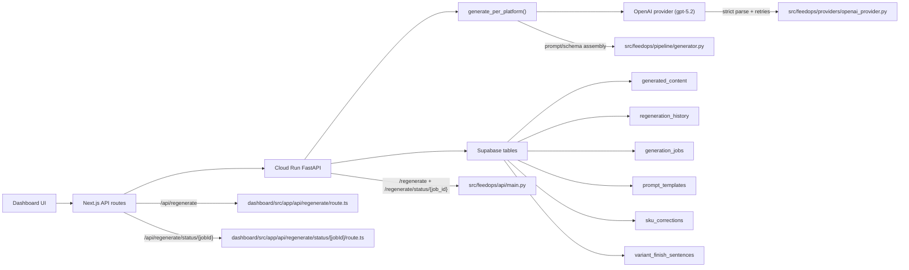
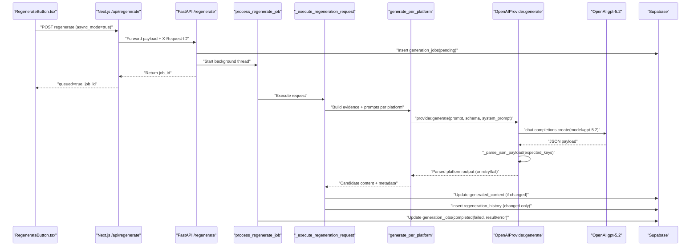
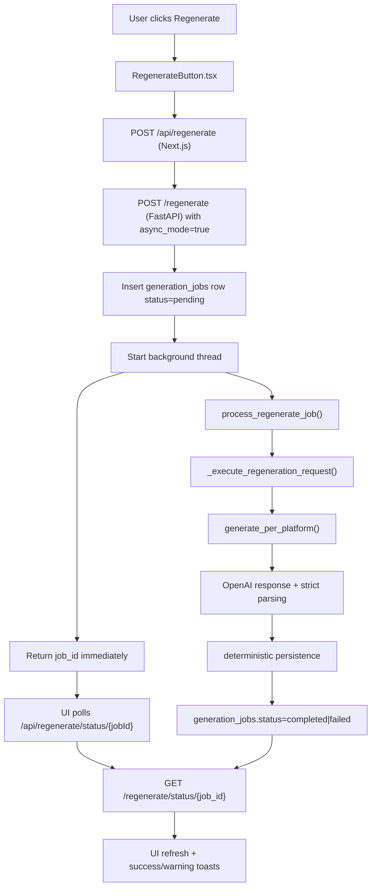
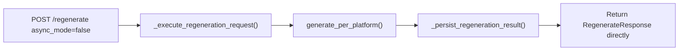
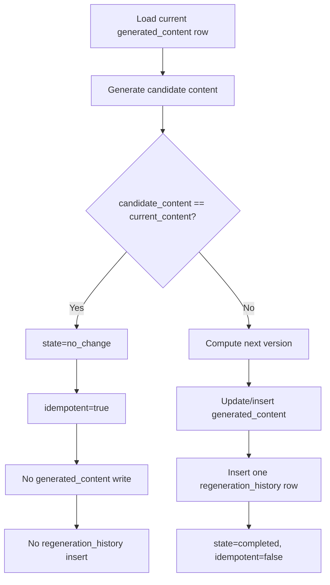
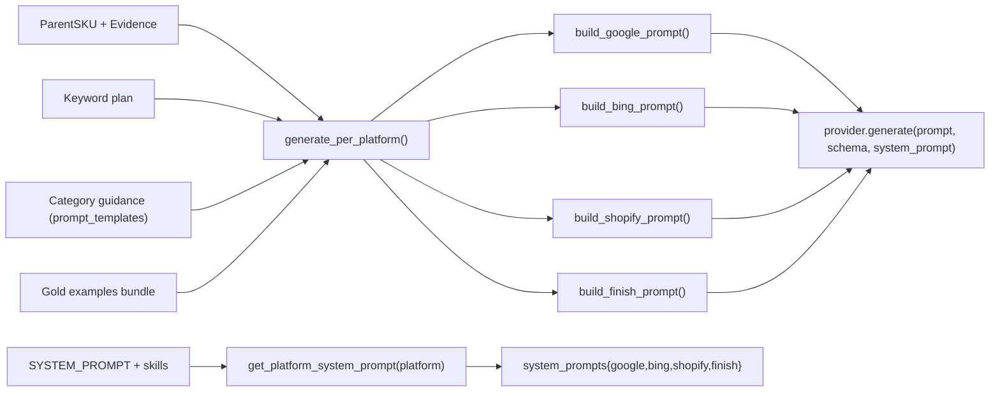
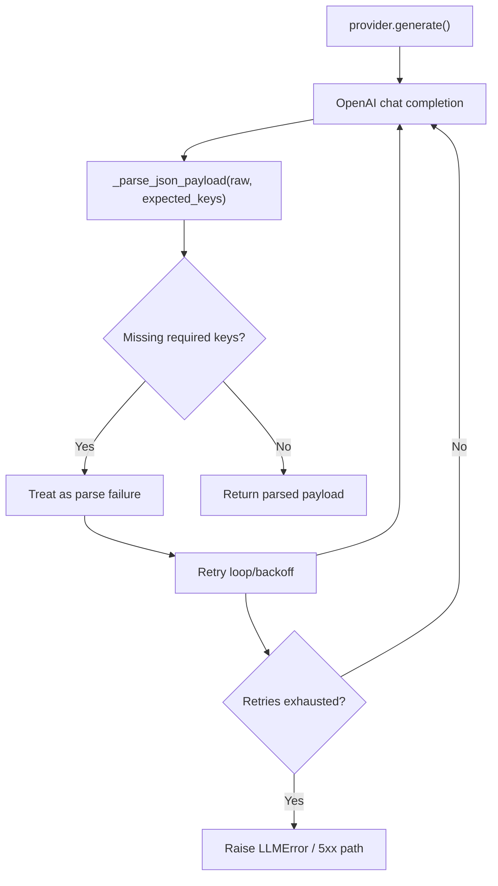
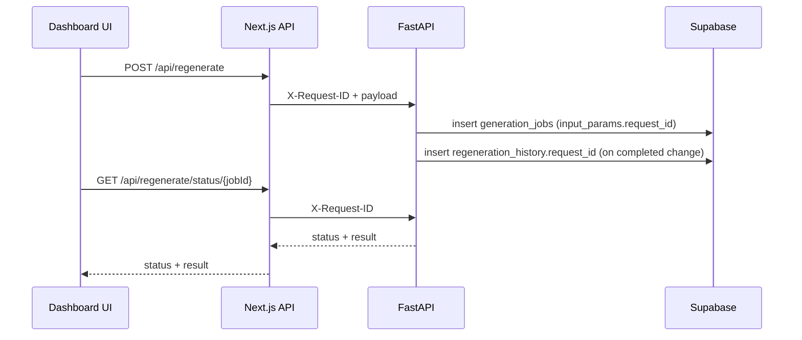

# Prompt Source And Generation Flow (Current Runtime)

## Purpose
This document describes the **current, active runtime architecture** for title/description generation in Allied FeedOps.
It reflects the post-PlanFix path and the current async regeneration flow.

It is intentionally scoped to what the code does now, not historical v1.3a routing issues.

## What Is Runtime-Authoritative

1. System prompt authority is code-owned in `src/feedops/pipeline/prompts.py` and assembled via `src/feedops/pipeline/skill_loader.py`.
2. Regeneration persistence authority is Python API (`src/feedops/api/main.py`) as the single writer for `generated_content` and `regeneration_history`.
3. Dashboard regenerate route (`dashboard/src/app/api/regenerate/route.ts`) is orchestration-only.
4. Supabase `prompt_templates` provides guidance/examples, not authoritative runtime system prompt text.

## High-Level Module Map

## Exact GPT-5.2 Call Path (Function-Level)

The exact runtime call chain for a dashboard-initiated regenerate is:

1. `dashboard/src/components/review/RegenerateButton.tsx`
2. `dashboard/src/app/api/regenerate/route.ts` (`POST /api/regenerate`)
3. `src/feedops/api/main.py` (`POST /regenerate`)
4. `src/feedops/api/main.py` (`process_regenerate_job` for async mode, or direct sync path)
5. `src/feedops/api/main.py` (`_execute_regeneration_request`)
6. `src/feedops/pipeline/generator.py` (`generate_per_platform`)
7. `src/feedops/providers/factory.py` (`provider.generate(...)`)
8. `src/feedops/providers/openai_provider.py` (`OpenAIProvider.generate`)
9. OpenAI Chat Completions API (`model="gpt-5.2"`)
10. `src/feedops/providers/openai_provider.py` (`_parse_json_payload` strict key validation + retries)
11. `src/feedops/api/main.py` (`_persist_regeneration_result` deterministic single-writer persistence)

## Regenerate Flow (Async Path Used By Dashboard)

`RegenerateButton` now submits with `async_mode: true`, so dashboard users do not wait on a long synchronous request.

## Regenerate Flow (Sync Path Still Supported)

Sync mode is still available for internal/programmatic callers (or if explicitly sent with `async_mode: false`).

## Deterministic Persistence Decision

The persistence branch is deterministic and idempotent.

## Prompt Construction Pipeline (Current)

### System Prompt
1. Base canonical system prompt starts from `feedops.pipeline.prompts.SYSTEM_PROMPT`.
2. `prompt_loader.get_system_prompt()` appends skill content (via `load_skills_for_prompt`) for enriched runtime instructions.
3. Platform-specific system prompts used by per-platform generation come from `skill_loader.get_platform_system_prompt(platform)`.

### User Prompt
`generate_per_platform()` builds user prompts using:
1. Product evidence (`build_evidence_table()` + filtered evidence).
2. Keyword placement plan and section formatter.
3. Category guidance from Supabase `prompt_templates.category_guidance`.
4. Gold examples bundle.
5. Platform-specific prompt templates (`build_google_prompt`, `build_bing_prompt`, `build_shopify_prompt`, `build_finish_prompt`).

## OpenAI Call And Strict Parse Contract

`OpenAIProvider.generate()` uses schema-bound generation and strict key enforcement.

Key behavior:
1. Missing expected schema keys are not accepted as partial success.
2. Parse diagnostics are still captured (`parse_mode`, `missing_keys`) for telemetry.
3. If retries fail, no partial content is persisted.

## Response Contracts

### `/regenerate` (FastAPI)

#### Sync response
`RegenerateResponse` includes:
- `success`
- `master_sku`
- `content_type`
- `platform`
- `content`
- `finish_sentences` (when applicable)
- `used_feedback`
- `prompt_hash`
- `model`
- `generated_content_id`
- `version`
- `state` (`completed` or `no_change`)
- `idempotent`
- `request_id`

#### Async enqueue response
`RegenerateJobResponse` includes:
- `success`
- `job_id`
- `status` (`pending|running|completed|failed`)
- `request_id`
- `master_sku`
- `content_type`
- `platform`

### `/regenerate/status/{job_id}` (FastAPI)
`RegenerateJobStatusResponse` includes:
- `success`
- `job_id`
- `status`
- `request_id`
- `master_sku`
- `content_type`
- `platform`
- `result` (embedded `RegenerateResponse` when completed)
- `error`
- `created_at`, `started_at`, `completed_at`

## Request-ID Traceability

## Supabase Tables Touched In Regeneration

1. `product_catalog` / related source tables: loaded to construct `ParentSKU` and evidence.
2. `sku_corrections`: optional persistent correction layer read/write.
3. `generation_jobs`: async job tracking (`pending/running/completed/failed`).
4. `generated_content`: canonical latest content per `(master_sku, platform, content_type)`.
5. `regeneration_history`: append-only audit trail for changed writes.
6. `variant_finish_sentences`: finish-sentence map for Google/Bing descriptions.
7. `prompt_templates`: guidance/examples input only.

## Current Operational Reality

1. Regeneration architecture is now deterministic: one authoritative writer path in Python.
2. Dashboard no longer performs persistence writes for regenerate.
3. Prompt source authority is code-owned; Supabase prompt template text is not runtime authority.
4. Async dashboard flow removes long blocking waits in UI while preserving full traceability.

## What This Means For Ongoing Optimization

For title/description quality improvements, the highest-leverage knobs now are:
1. Evidence quality and completeness.
2. Prompt wording/constraints in canonical code-owned prompt modules.
3. Platform-specific rules and schema strictness.
4. Validation and retry criteria.

Historical v1.3a drift issues are useful context, but they are no longer the active runtime architecture.
