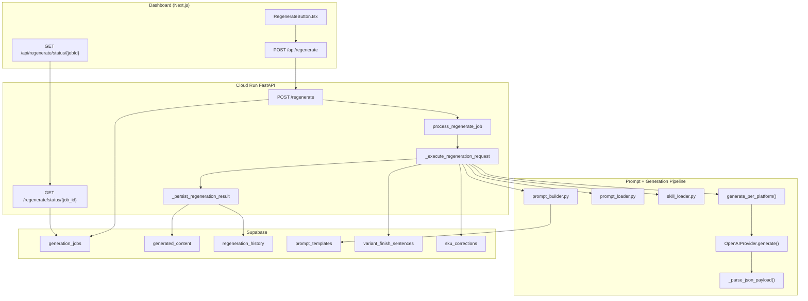
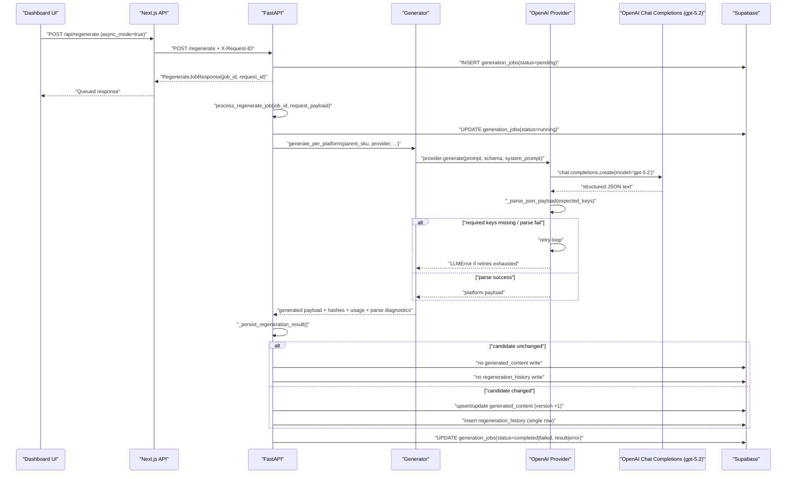
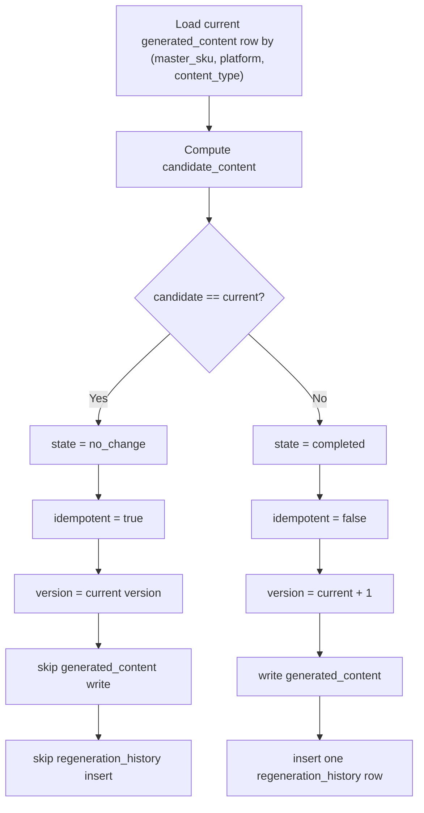
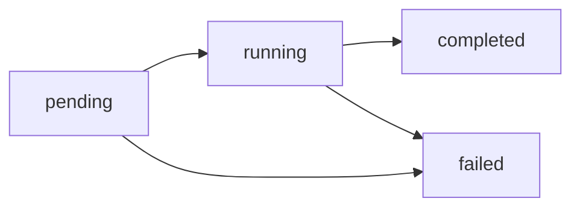
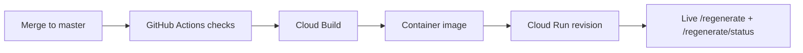

# Prompt Source And Generation Flow (Current Runtime)

## Scope
This document describes the current production architecture only.
It excludes retired v1/v2 runtime routing decisions and focuses on the code path active on `master` after deterministic regeneration + async enqueue landing.

## Runtime Authority

1. Canonical system prompt authority is code-owned in `src/feedops/pipeline/prompts.py`.
2. Platform system prompt assembly is in `src/feedops/pipeline/skill_loader.py`.
3. Generation orchestration is in `src/feedops/pipeline/generator.py` via `generate_per_platform()`.
4. Regeneration persistence authority is in `src/feedops/api/main.py` (`_persist_regeneration_result`).
5. Dashboard route `dashboard/src/app/api/regenerate/route.ts` is orchestration only.
6. Supabase `prompt_templates` is guidance/evidence input, not system-prompt authority.

## What Is Explicitly Not Runtime Authority

1. `dashboard/src/lib/regeneration/prompts.ts` (legacy/reference only).
2. `prompt_templates.system_prompt` in Supabase (historical lineage only).
3. `FEEDOPS_PROMPT_VERSION` runtime branching for generation behavior.

## Codebase Module Map

## Exact GPT-5.2 Invocation Path

## Deterministic Persistence State Machine

## Async Job Lifecycle

`process_regenerate_job()` now catches failures that occur during the initial `pending -> running` transition and writes terminal `failed` status when possible.

## Prompt Construction (Current)

1. `generate_per_platform()` loads platform-specific system prompts via `get_platform_system_prompt(platform)`.
2. User prompts are built per platform via:
   - `build_google_prompt()`
   - `build_bing_prompt()`
   - `build_shopify_prompt()`
   - `build_finish_prompt()`
3. Prompt evidence inputs include:
   - product evidence table
   - keyword placement plan
   - category guidance (`prompt_templates.category_guidance`)
   - gold example bundle (`prompt_templates.gold_standard_examples`)
4. Prompt hash lineage is stored per platform and propagated into persistence/history surfaces.

## Request-ID Lineage

1. Dashboard forwards `X-Request-ID` to FastAPI.
2. FastAPI includes `request_id` in regenerate responses.
3. `request_id` is persisted in `regeneration_history` for traceability.
4. `generation_jobs.request_id` links async polling and final lineage queries.

## Deployment Pipeline (Current)

Operational note: a merged PR is not equivalent to an active Cloud Run revision until Cloud Build deploy completes and traffic moves to the new revision.

## Why A Single Regenerate Can Feel Slow

A synchronous regenerate may include multiple sequential provider calls (`google`, `bing`, `shopify`, `finish`) plus parsing/retries and persistence. Async mode avoids UI timeout by queueing work and returning immediately.

## Runtime Drift Guards

1. `backend-parity` workflow enforces parity suites on `master` and `main` branch PR/push triggers.
2. `scripts/verify_locked_parity.sh` runs frozen tests and fails on lockfile drift.
3. Strict parse contract rejects missing required keys instead of accepting partial payloads.
4. Deterministic single-writer persistence prevents duplicate or conflicting DB writes.
