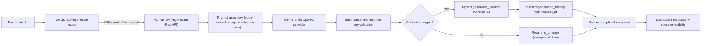
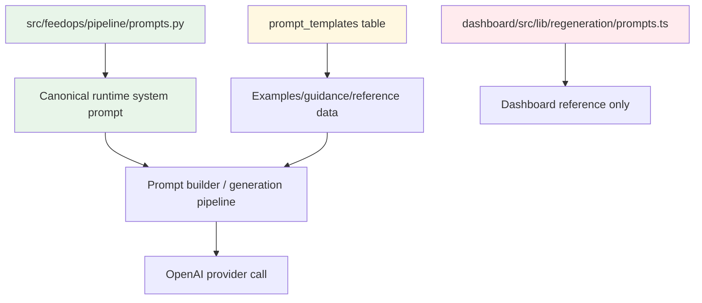
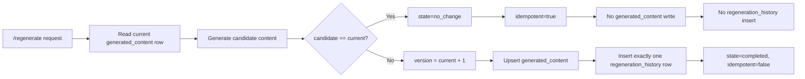
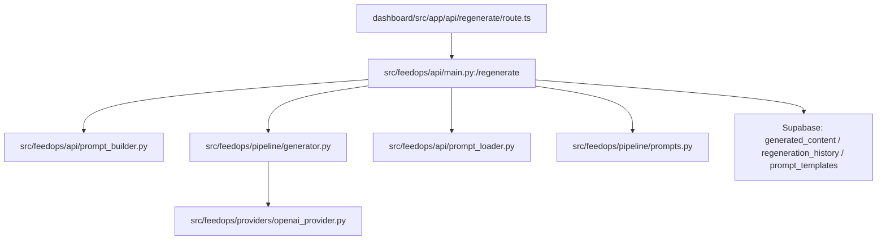

# Prompt Source And Generation Flow (Current Runtime)

## Purpose
This document describes how generation works **in the current codebase** after the PlanFix merges.
It is intentionally runtime-focused and excludes legacy v1 routing behavior as an active path.

## Current Runtime Truth
- Runtime prompt authority is code-owned in `src/feedops/pipeline/prompts.py`.
- Dashboard regenerate route orchestrates only; Python API is the single writer for regeneration persistence.
- Per-platform generation is the active path for regenerate/hybrid/batch generation.
- Regeneration persistence is deterministic:
  - changed content => write `generated_content` + one linked `regeneration_history` row
  - unchanged content => no content/history writes; return `state="no_change"`
- Request lineage is first-class: dashboard forwards `X-Request-ID`, Python returns/persists `request_id`.

## End-To-End Regeneration Flow

## Prompt Source Lineage (Current)

Notes:
- `prompt_templates.system_prompt` is not runtime authority for Python generation.
- Dashboard prompt files are not the source of truth for pipeline generation.

## Deterministic Persistence Lifecycle

## Runtime Module Map

## Response Contract (Regenerate)
Current response contract includes these operational fields:
- `state`: `completed | no_change`
- `idempotent`: boolean
- `generated_content_id`: string | null
- `version`: number
- `request_id`: string

Backward-compatible fields remain available (`content`, `model`, `prompt_hash`, `validation_errors`).

## Policy And Quality Guardrails In Runtime
- Required platform keys are enforced during model payload parse.
- Missing required keys are treated as parse failure and retried.
- If retries still fail contract, API returns actionable error and does not persist partial payload.
- Post-generation quality/policy checks remain in place for channel constraints.

## What This Means For Optimization Work
The v1.3a planning artifacts are still useful as **goal context**, but this runtime architecture document is scoped to what the code does now.
Current optimization work should iterate on:
- better evidence quality
- stronger product-specific prompt constraints
- deterministic parser contracts
- measurable title/description quality outcomes

