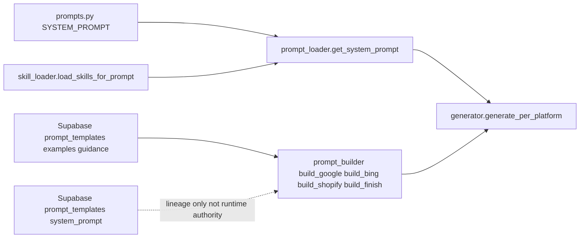
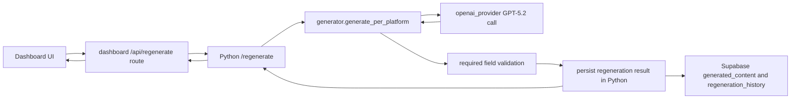
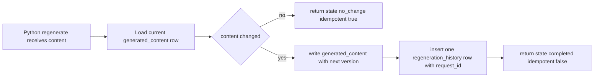
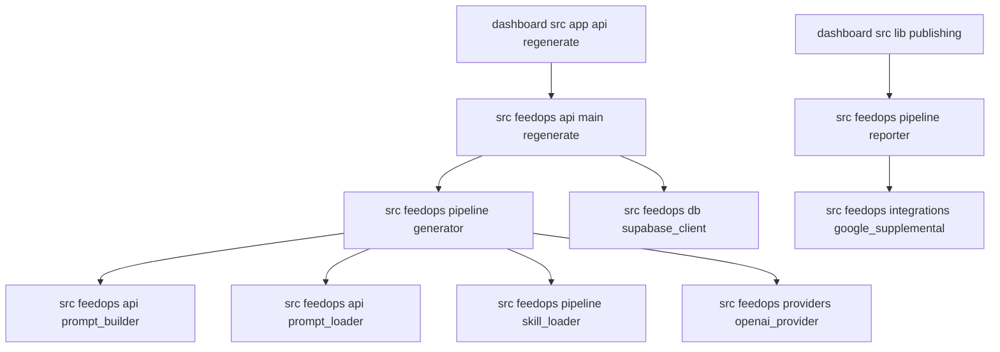

# Prompt Source And Generation Flow (2026-02-26)

## Purpose

This document records:

1. Where the runtime prompt is created from today.
2. How `/api/regenerate` flows through dashboard, Python, GPT-5.2, and Supabase.
3. How deterministic persistence and request lineage are enforced.
4. Which v1.3a phase failures repeated, and how to remediate them in a rollout-safe way aligned to the strategic milestone plan.

## Runtime Prompt Source Of Truth

### Authoritative runtime source

- Canonical system prompt base: `src/feedops/pipeline/prompts.py` (`SYSTEM_PROMPT`)
- Canonical runtime loader: `src/feedops/api/prompt_loader.py`
  - `get_system_prompt()` starts from `CANONICAL_SYSTEM_PROMPT`.
  - Skill enrichment is appended via `load_skills_for_prompt(...)`.
  - Supabase `prompt_templates.system_prompt` is not used as runtime authority.
- Platform-targeted prompt extraction: `src/feedops/pipeline/skill_loader.py` via `get_platform_system_prompt(platform)`.
- Per-platform user prompts are assembled in `src/feedops/api/prompt_builder.py`.

### Non-authoritative (lineage/reference only)

- Supabase `prompt_templates.system_prompt` column.
- Legacy dashboard prompt files under `dashboard/src/lib/regeneration/`.

## Regenerate End-To-End Flow

### Request path

1. Dashboard route receives regenerate request:
   - `dashboard/src/app/api/regenerate/route.ts`
2. Route resolves canonical SKU and forwards to Python:
   - `POST {FEEDOPS_PIPELINE_URL}/regenerate`
   - Forwards `X-Request-ID`.
3. Python endpoint executes:
   - `src/feedops/api/main.py` `/regenerate`
4. Generation path:
   - `generate_per_platform(...)` in `src/feedops/pipeline/generator.py` (per-platform mandatory path)
   - OpenAI call via `src/feedops/providers/openai_provider.py`
5. Deterministic persistence:
   - `_persist_regeneration_result(...)` in `src/feedops/api/main.py`
6. Dashboard returns pipeline-authored state fields.

## Deterministic Persistence Lifecycle

### Single-writer rule

- Dashboard route does not write `generated_content` or `regeneration_history`.
- Python `/regenerate` is sole writer for those tables.

### State outcomes

- `no_change`:
  - Content equals current candidate.
  - No `generated_content` write.
  - No `regeneration_history` write.
- `completed`:
  - Content changed.
  - Version increment in `generated_content`.
  - Exactly one linked `regeneration_history` row with `request_id`.

## GPT-5.2 Response Contract

- `_parse_json_payload(...)` in `src/feedops/providers/openai_provider.py`:
  - Parses strict JSON (or controlled fenced/substr recovery).
  - Computes `missing_keys` against schema-required keys.
  - Missing required keys raises parse failure.
- Retry loop treats missing-key failures like other parse failures.
- If retries are exhausted, endpoint returns actionable failure and does not persist partial payload.

## Generation And Publishing Module Map

## v1.3a Phase Synthesis: Recurring Issues And Remediation

Source reviewed: `/Users/bobby/Documents/GitHub/Allied-FeedOps/.planning/milestones/v1.3a-phases`

| Recurring issue | Where it appeared in phases | Current impact | Deterministic remediation |
|---|---|---|---|
| Runtime routing drift (`v1` vs `v2`) | 25.4, 26, 27 | Inconsistent content behavior and regressions after env/config changes | Remove runtime behavior split; keep per-platform generation path mandatory |
| Harness vs runtime mismatch | 26.02 and prompt eval artifacts | Good offline results not matching Cloud Run behavior | Run parity suite against real runtime contracts and endpoint flow |
| Template-like openings and generic copy | 24 and 26 outputs | Weak CTR/CVR due to robotic intros | Add prompt quality gates that reject fragment/template-style openings |
| Placeholder leakage | 26 blind comparisons and quality notes | Broken or low-trust customer-facing copy | Enforce placeholder integrity checks and block save on unresolved placeholders |
| Weak example enforcement | 23/24/25 quality scaffolding vs observed outputs | Gold examples not consistently reflected in generation | Add explicit rubric gates + stronger evidence-to-brief assembly constraints |
| Parse leniency | Pre-fix provider behavior patterns | Silent partial success, polluted persistence | Missing required keys is hard parse failure with retry and hard-stop |
| Ambiguous persistence writers | Dashboard and Python ownership concerns | Duplicate writes and version/history mismatch risk | Python single-writer contract and dashboard orchestration-only behavior |

## Strategic Alignment To 2026-02-21 Assessment

Reference: `docs/plans/2026-02-21-strategic-milestone-assessment.md`

This implementation aligns with the staged strategy:

1. **Content foundation first**:
   - Deterministic runtime behavior and strict output contract.
2. **Architecture confidence**:
   - Cloud Run parity gate prevents environment drift regressions.
3. **Actionable optimization next**:
   - Request-level lineage (`request_id`) and deterministic state/version enable reliable measurement loops.

## Rollout-Safe Prompt Improvement Recommendations

These recommendations are designed to avoid architectural regressions while improving title/description quality:

1. Keep one canonical runtime prompt path in Python and remove behavior flags from runtime routing.
2. Add deterministic quality guardrails before persistence:
   - fail on fragment-first intros.
   - fail on unresolved placeholders for publishable platform fields.
   - fail on missing required per-platform keys.
3. Keep Supabase prompt templates as evidence/guidance storage, not runtime prompt override source.
4. Evaluate prompt changes through the same runtime path used by Cloud Run endpoints.
5. Gate rollout with parity + contract suites before merge/deploy.

## Verification References

- Cloud Run parity suite script: `scripts/verify_cloud_run_parity.sh`
- Cloud Run parity tests: `tests/test_cloud_run_parity.py`, `tests/test_env_parity.py`
- Regenerate contract tests:
  - `tests/api/test_dashboard_regenerate_route_contract.py`
  - `tests/api/test_main_master_sku_alias_runtime.py`
  - `tests/api/test_regenerate_response_contract.py`
- Parser strictness tests:
  - `tests/test_phase28_prompt_quality.py`
- Routing drift test:
  - `tests/test_v1_path_regression.py`
