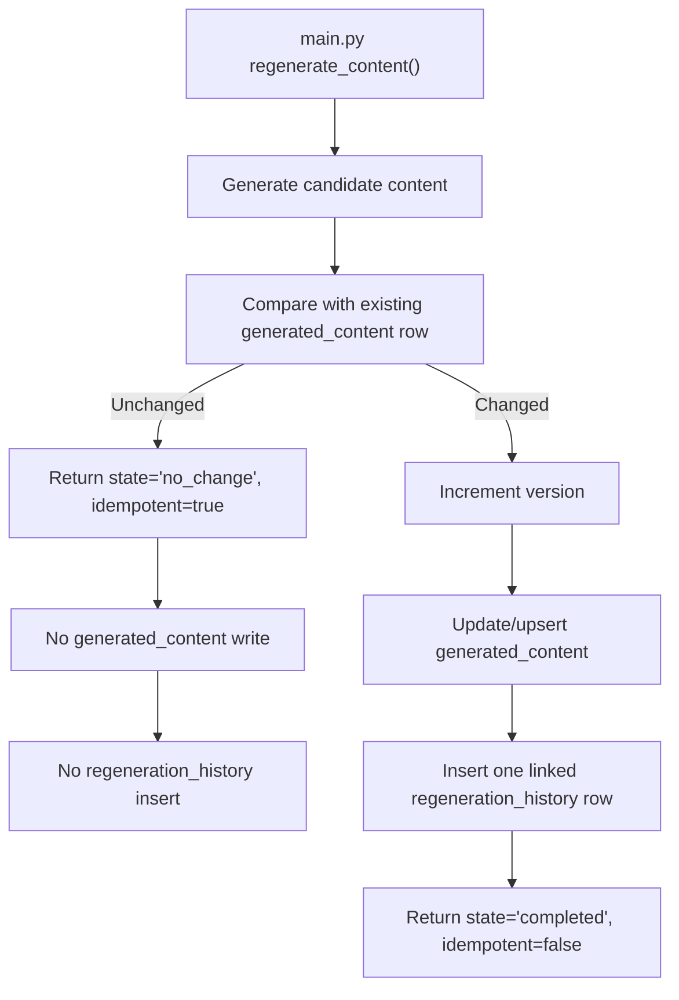
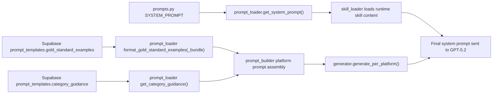
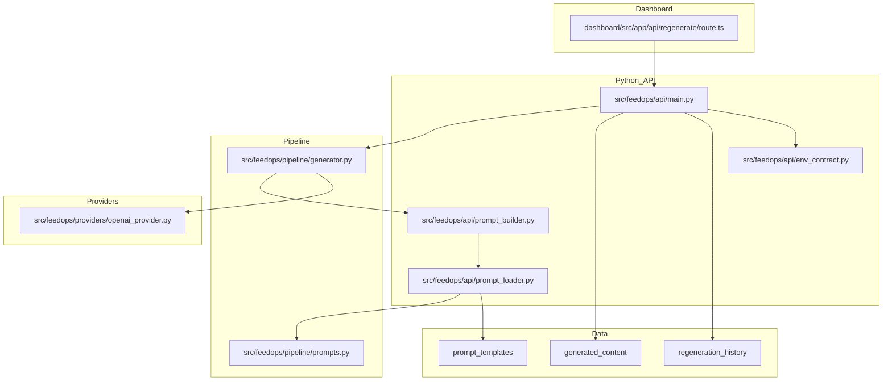

# Prompt Source and Generation Flow

Date: 2026-02-26  
Scope: Current `origin/master` runtime behavior + v1.3a phase synthesis

## 1) Runtime Prompt Source of Truth

The production runtime prompt authority is:

- `src/feedops/pipeline/prompts.py` (base canonical system prompt + schemas)
- `src/feedops/api/prompt_loader.py` (`get_system_prompt`, system-prompt hashing, Supabase examples/guidance loading)
- `src/feedops/api/prompt_builder.py` (platform-specific user prompt assembly)

Supabase `prompt_templates` is **supporting context** (gold examples/category guidance), not runtime system-prompt authority.

Dashboard prompt files are legacy/reference (`dashboard/src/lib/regeneration/prompts.ts`) and are not the Cloud Run runtime authority.

## 2) End-to-End Regenerate Call Flow

```mermaid
flowchart LR
  U["User clicks Regenerate in Dashboard"] --> R["Next.js route: dashboard/src/app/api/regenerate/route.ts"]
  R -->|Forward body + "X-Request-ID"| P["Cloud Run API: POST /regenerate"]
  P --> M["main.py: regenerate_content()"]
  M --> G["pipeline/generator.py: generate_per_platform()"]
  G --> PB["api/prompt_builder.py: build_google/bing/shopify_prompt()"]
  PB --> PL["api/prompt_loader.py: get_system_prompt() + examples/guidance"]
  PL --> SYS["pipeline/prompts.py canonical base prompt"]
  G --> OAI["providers/openai_provider.py: GPT-5.2 calls + strict parsing/retries"]
  OAI --> M
  M --> DB1["Supabase: generated_content"]
  M --> DB2["Supabase: regeneration_history (request_id, prompt_hash, links)"]
  M --> R
  R --> U
```

## 3) Deterministic Persistence Lifecycle (Changed vs No-Change)



## 4) Prompt Construction Path (Authority vs Lineage)



## 5) Module Map (Generation + Persistence)



## 6) v1.3a Recurring Failure Themes (from phase artifacts)

Primary artifacts reviewed:

- `.planning/milestones/v1.3a-phases/25.2-gpt52-prompt-engineering/ROOT-CAUSE-ANALYSIS.md`
- `.planning/milestones/v1.3a-phases/25.3-prompt-rewrite/25.3-03-SUMMARY.md`
- `.planning/milestones/v1.3a-phases/25.4-production-impact-audit/AUDIT-REPORT.md`
- `.planning/milestones/v1.3a-phases/26-human-evaluation-test-batch/26-02-quality-scores.md`
- `.planning/milestones/v1.3a-phases/26-human-evaluation-test-batch/26-02-blind-comparison.md`
- `docs/plans/2026-02-21-strategic-milestone-assessment.md`

Recurring issues:

1. Prompt-routing drift between harness/runtime paths.
2. Overloaded prompts with contradictory instructions.
3. Template-like openings and generic copy patterns.
4. Placeholder behavior causing unnatural sentence flow.
5. Self-scoring optimism vs human-perceived quality gaps.
6. Inconsistent persistence and lineage visibility under regeneration retries.

## 7) Issue-to-Remediation Matrix

| Issue | Likely Root Cause | Deterministic Remediation | Verification Gate |
|---|---|---|---|
| Generic, repetitive openings | Prompt structure over-weights fixed templates | Enforce per-platform opening templates with 3 approved structural patterns; randomize by deterministic seed per `master_sku` | Golden-SKU test asserts pattern distribution and non-duplication |
| Prompt regressions after edits | Multiple implicit prompt sources and flag drift | Keep code-owned canonical prompt only; treat DB prompt text as non-authoritative | Static test forbids runtime use of DB `system_prompt` |
| Partial schema success | Missing required key fallback accepted | Strict parse failure on missing required platform keys; retry then fail loud | Contract test asserts 5xx on missing key after retries |
| No-change vs changed ambiguity | Multiple writers and weak response metadata | Python single-writer contract (`state/idempotent/version/generated_content_id`) | API contract test + DB write-count assertions |
| Hard to debug production incidents | Missing end-to-end lineage keys | Require `X-Request-ID` propagation and DB persistence in history rows | Smoke test + DB query by request_id |
| Local/prod mismatch | Tests not running inside runtime-equivalent image | Add dockerized parity gate in Cloud Build before deploy | CI gate blocks deploy on parity failure |

## 8) Final Prompt Improvement Plan (Strategic Alignment)

Aligned to `docs/plans/2026-02-21-strategic-milestone-assessment.md` objective: higher-quality feed content that improves CTR/CVR and supports closed-loop optimization.

### Phase A: Prompt Contract Stabilization (Now)

1. Freeze prompt architecture:
- one canonical system prompt source in code
- one platform-specific prompt builder path
- strict required-field response contract

2. Add regression corpus:
- 20 canonical SKUs + 20 unseen SKUs
- fixed seed, fixed constraints, deterministic evaluation outputs

3. Add hard quality guardrails:
- ban template-fragment openings
- require one product-specific differentiator sentence
- require one customer-use-case sentence for descriptions

### Phase B: Quality Lift Without Drift

1. Replace self-score-only gating with mixed evaluation:
- automated rule checks
- embedding similarity against low-quality phrase blacklist
- human rubric sampling on rotating SKU batch

2. Enforce “no generic boilerplate” constraints:
- reject known generic phrases from phase audits
- add retry hint with explicit failed phrase

3. Improve finish sentence integration:
- verify context sentence before and after `{FINISH_SENTENCE}`
- reject if placeholder is sentence-initial unless policy-justified

### Phase C: Closed-Loop Improvement

1. Join content lineage to performance outcomes:
- tie `prompt_hash + request_id + generated_content_id` to downstream CTR/CVR

2. Weekly optimization loop:
- identify lowest-performing prompt_hash cohorts
- run controlled prompt experiments on those cohorts only
- ship only if unseen-SKU gate + live KPI guardrail pass

## 9) Operational Checklist

Before merge:

1. Run `bash scripts/verify_cloud_run_parity.sh`
2. Run `python scripts/smoke_regenerate_lineage.py --pipeline-url "<run.app URL>" ...`
3. Execute DB sign-off queries emitted by the smoke script
4. Confirm one changed case and one no-change case behave deterministically

After deploy:

1. Verify Cloud Run has `FEEDOPS_ENV_CONTRACT_STRICT=1`
2. Monitor `request_id` lineage for first 10 regenerations
3. Review one human spot-check batch before bulk publish
