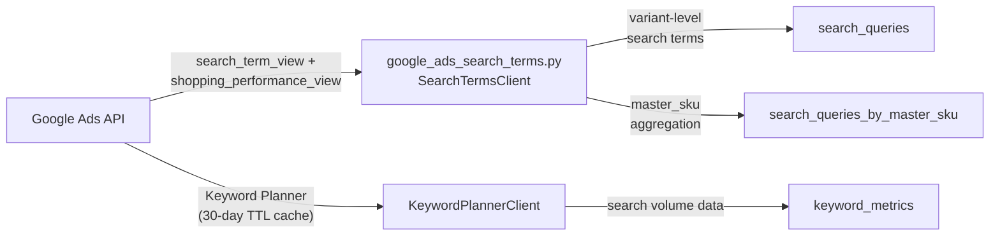
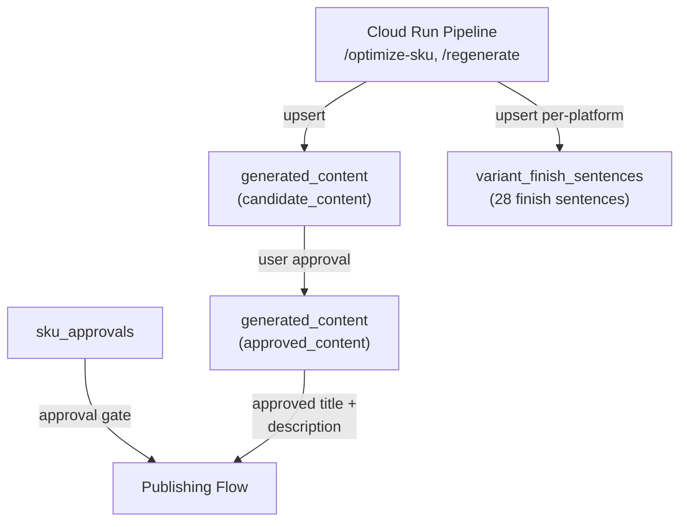
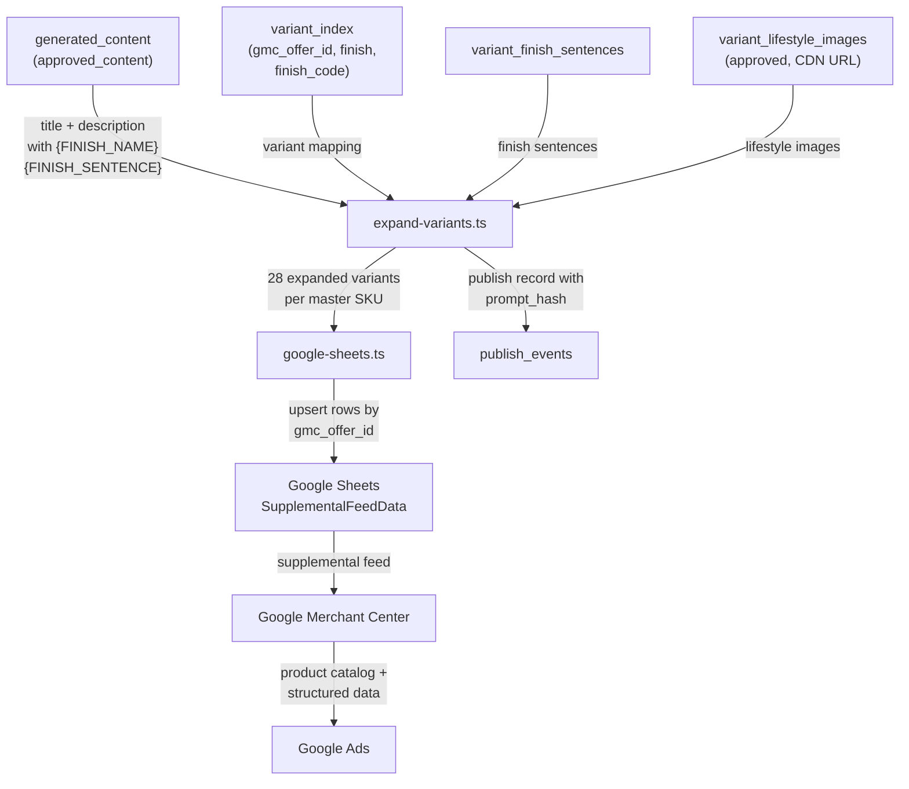
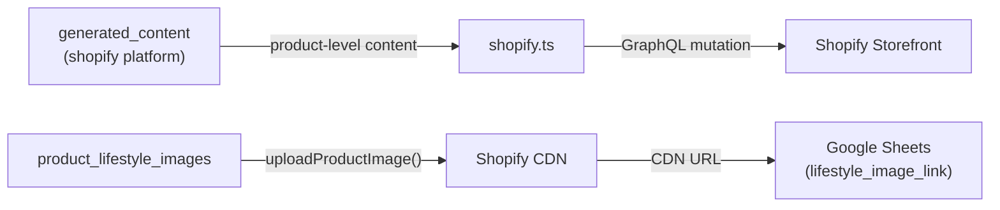
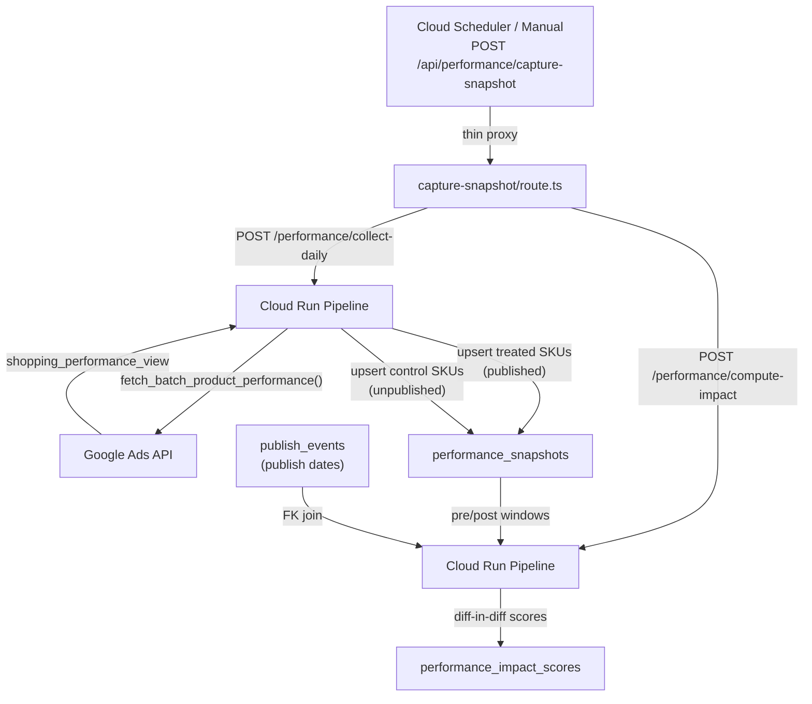
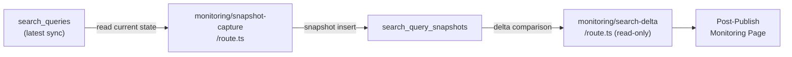
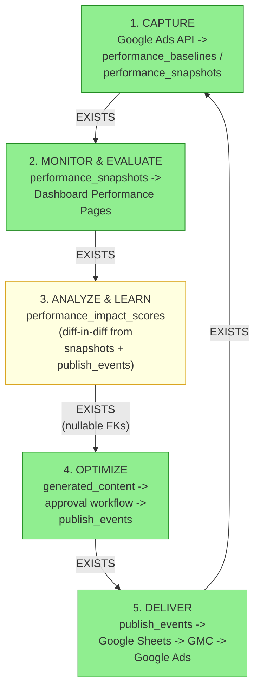

# Allied-FeedOps Data Flow Map

**Created:** 2026-02-25
**Phase:** 28 (Architecture Audit & Migration Triage)
**Requirements:** AUDIT-01, AUDIT-05
**Status:** Production-verified from source code review

---

## Master Overview

```mermaid
graph TD
    subgraph External["External Systems"]
        GAds["Google Ads API"]
        GMC["Google Merchant Center"]
        GSheets["Google Sheets<br/>(Supplemental Feed)"]
        Shopify["Shopify"]
        ShopifyCDN["Shopify CDN"]
    end

    subgraph PythonPipeline["Cloud Run Pipeline (Python)"]
        PerfCollector["performance_baseline.py<br/>/collect-daily"]
        ImpactComputer["performance_baseline.py<br/>/compute-impact"]
        SearchSync["search_insights.py<br/>/search-insights/sync"]
        ContentGen["main.py<br/>/optimize-sku, /regenerate"]
        ImageGen["lifestyle_images.py<br/>/generate-images"]
    end

    subgraph TSLayer["Dashboard (TypeScript)"]
        GoogleAdsTS["google-ads.ts"]
        ServiceTS["service.ts<br/>(2-min cache, NO persist)"]
        ExpandVariants["expand-variants.ts"]
        GoogleSheetsTS["google-sheets.ts"]
        ShopifyTS["shopify.ts"]
        CaptureSnapshotRoute["capture-snapshot/route.ts<br/>(thin proxy)"]
        MonitorRoute["monitoring/snapshot-capture<br/>/route.ts"]
    end

    subgraph Database["Supabase Database"]
        PerfBaselines["performance_baselines"]
        PerfSnapshots["performance_snapshots"]
        PerfImpact["performance_impact_scores"]
        SearchQueries["search_queries"]
        SearchByMaster["search_queries_by_master_sku"]
        SearchSnapshots["search_query_snapshots"]
        GenContent["generated_content"]
        SkuApprovals["sku_approvals"]
        PublishEvents["publish_events"]
        VariantIndex["variant_index"]
        FinishSentences["variant_finish_sentences"]
        ProdImages["product_lifestyle_images"]
        VarImages["variant_lifestyle_images"]
        KeywordMetrics["keyword_metrics"]
    end

    subgraph DashboardPages["Dashboard Pages"]
        PerfPage["Performance<br/>Baselines/Snapshots"]
        ReviewPage["SKU Review"]
        BatchPage["Batches/Publishing"]
        SearchPage["Search Insights"]
        MonitorPage["Post-Publish Monitoring"]
        FunnelPage["Shopping Funnel<br/>(EMPTY - 035b)"]
        OptPage["Optimization Control<br/>(EMPTY - 035b)"]
        IntentPage["Intent Control<br/>(EMPTY - 035b)"]
        GovPage["Search Governance<br/>(EMPTY - 035b)"]
        ExpPage["Experiment Lab<br/>(EMPTY - 035b)"]
    end

    %% Data Ingestion
    GAds -->|"shopping_performance_view<br/>(GAQL)"| PerfCollector
    GAds -->|"shopping_performance_view<br/>(GAQL)"| GoogleAdsTS
    GAds -->|"search_term_view + 6 queries<br/>(GAQL, ephemeral)"| ServiceTS
    GAds -->|"search_term_view<br/>(GAQL)"| SearchSync
    GAds -->|"shopping_performance_view<br/>(GAQL)"| SearchSync

    %% Python -> DB
    PerfCollector -->|upsert| PerfSnapshots
    ImpactComputer -->|upsert| PerfImpact
    SearchSync -->|upsert| SearchQueries
    SearchSync -->|upsert| SearchByMaster
    ContentGen -->|upsert| GenContent
    ContentGen -->|upsert| FinishSentences
    ImageGen -->|insert| ProdImages
    ImageGen -->|insert| VarImages

    %% TS -> DB
    GoogleAdsTS -->|"via baseline-capture"| PerfBaselines
    CaptureSnapshotRoute -->|"proxy to Python"| PerfCollector
    MonitorRoute -->|insert| SearchSnapshots

    %% Publishing chain
    GenContent -->|"approved_content"| ExpandVariants
    VariantIndex -->|"finish mapping"| ExpandVariants
    FinishSentences -->|"finish sentences"| ExpandVariants
    VarImages -->|"CDN URLs"| ExpandVariants
    ExpandVariants -->|"expanded rows"| GoogleSheetsTS
    ExpandVariants -->|"publish record"| PublishEvents
    GoogleSheetsTS --> GSheets
    GSheets -->|"supplemental feed"| GMC
    GMC -->|"product catalog"| GAds

    %% Shopify publishing
    GenContent -->|"shopify content"| ShopifyTS
    ShopifyTS --> Shopify
    ImageGen -->|"upload"| ShopifyCDN

    %% Dashboard reads
    PerfBaselines --> PerfPage
    PerfSnapshots --> PerfPage
    PerfImpact --> PerfPage
    GenContent --> ReviewPage
    PublishEvents --> BatchPage
    SearchQueries --> SearchPage
    SearchSnapshots --> MonitorPage
    ServiceTS -.->|"DEAD END<br/>no persist"| FunnelPage

    %% Impact computation
    PerfSnapshots -->|"join on publish_event_id"| ImpactComputer
    PublishEvents -->|"publish dates"| ImpactComputer

    style ServiceTS fill:#ff9999,stroke:#cc0000
    style FunnelPage fill:#ff9999,stroke:#cc0000
    style OptPage fill:#ffcc99,stroke:#cc6600
    style IntentPage fill:#ffcc99,stroke:#cc6600
    style GovPage fill:#ffcc99,stroke:#cc6600
    style ExpPage fill:#ffcc99,stroke:#cc6600
```



---

## Section 1: Data Ingestion (Google Ads -> Database)

### 1A. TypeScript Path: google-ads.ts -> performance_baselines

**File:** `dashboard/src/lib/google-ads.ts`

**GAQL Query:**
```sql
SELECT
  segments.product_item_id, segments.date,
  metrics.impressions, metrics.clicks, metrics.ctr,
  metrics.conversions, metrics.conversions_value, metrics.cost_micros
FROM shopping_performance_view
WHERE segments.product_item_id LIKE 'shopify_%'
  AND segments.date BETWEEN '{startDate}' AND '{endDate}'
```

**Flow:**


**Notes:**
- Queries ALL shopping performance then filters in-memory by Shopify product IDs
- Aggregates at `shopify_product_id` level (extracts from offer ID format `shopify_US_{product_id}_{variant_id}`)
- Returns `Map<string, ProductPerformance>` with daily breakdown
- Consumer: `dashboard/src/lib/data-collection/ensure-data.ts` triggers baseline capture when stale (>60 days)

### 1B. TypeScript Ephemeral Path: service.ts (DEAD END for persistence)

**File:** `dashboard/src/lib/shopping-funnel/service.ts`

**GAQL Queries (7 total in `buildAdsContext()`):**

| # | GAQL Resource | Purpose | Persisted? |
|---|---------------|---------|:----------:|
| 1 | `campaign` | Campaign structure, names, IDs | NO |
| 2 | `ad_group` | Ad group names, IDs by campaign | NO |
| 3 | `shared_set` | Shared negative lists (Global Block, Competitor, Branded) | NO |
| 4 | `campaign_criterion` | Campaign-level negative keywords | NO |
| 5 | `ad_group_criterion` | Ad group-level negative keywords | NO |
| 6 | `search_term_view` | Search terms with performance metrics | NO |
| 7 | `shared_criterion` | Shared list membership details | NO |

**Flow:**


**DEAD END:** `service.ts` builds a rich `AdsContext` object with campaign structure, search terms, negative keywords, and tier assignments. This data is held in a `Map` with 2-minute TTL (`CACHE_TTL_MS = 2 * 60 * 1000`). There is NO database write anywhere in the file. When the cache expires, the data is gone.

**Impact:**
- Shopping Funnel page renders live data only while cache is warm
- No historical trend analysis possible
- Phase 30 (HIST-01) addresses this by creating `funnel_snapshots_daily` table
- `funnel_snapshots_daily` does NOT exist in production today

**Redundancy flag:** Both `google-ads.ts` and `service.ts` query Google Ads API for performance data. `google-ads.ts` queries `shopping_performance_view` for baselines. `service.ts` queries `search_term_view` and 6 supporting views. The Python pipeline ALSO queries both views. See Section 5 for caching recommendation.

### 1C. Python Pipeline Path: google_ads_performance.py -> performance_snapshots

**File:** `src/feedops/integrations/google_ads_performance.py`

**GAQL Query:**
```sql
SELECT
  segments.product_item_id, segments.date,
  campaign.advertising_channel_type,
  metrics.impressions, metrics.clicks, metrics.ctr,
  metrics.conversions, metrics.conversions_value, metrics.cost_micros
FROM shopping_performance_view
WHERE segments.product_item_id IN ('{offer_ids}')
  AND segments.date BETWEEN '{start_date}' AND '{end_date}'
```

**Flow:**


**Notes:**
- Uses chunked queries: `OFFER_ID_CHUNK_SIZE = 25` IDs per GAQL `IN()` clause to prevent API hang
- Parallel execution: `MAX_PARALLEL_CHUNKS = 5` threads via `ThreadPoolExecutor`
- Triggered by: Dashboard `capture-snapshot/route.ts` (thin proxy) -> Cloud Run `/performance/collect-daily`
- Separate from TS `google-ads.ts` path: Python targets per-offer-ID granularity; TS targets product-level aggregation

### 1D. Python Search Terms Path: google_ads_search_terms.py -> search_queries

**File:** `src/feedops/integrations/google_ads_search_terms.py`

**GAQL Queries (4+ per sync):**

| # | GAQL Resource | Purpose |
|---|---------------|---------|
| 1 | `campaign` | Resolve campaign names to IDs |
| 2 | `shopping_performance_view` | Map offer IDs to campaigns for variant-level attribution |
| 3 | `search_term_view` | Fetch search terms with performance (variant-level) |
| 4 | `search_term_view` | Keyword Planner enrichment queries (cached) |

**Flow:**


**Notes:**
- Triggered by: Cloud Run `/search-insights/sync` endpoint
- Also triggered automatically by `ensure-data.ts` when search data is stale (>7 days)
- Keyword Planner data cached in `keyword_metrics` with 30-day TTL

### Redundancy Summary: TS vs Python Google Ads Queries

| GAQL Resource | TypeScript (google-ads.ts) | TypeScript (service.ts) | Python (performance) | Python (search) |
|---------------|:-------------------------:|:-----------------------:|:--------------------:|:---------------:|
| `shopping_performance_view` | YES (baselines) | NO | YES (snapshots) | YES (attribution) |
| `search_term_view` | NO | YES (ephemeral) | NO | YES (persisted) |
| `campaign` | NO | YES (ephemeral) | NO | YES |
| `ad_group` | NO | YES (ephemeral) | NO | NO |
| `shared_set` | NO | YES (ephemeral) | NO | NO |
| `campaign_criterion` | NO | YES (ephemeral) | NO | NO |
| `ad_group_criterion` | NO | YES (ephemeral) | NO | NO |
| `shared_criterion` | NO | YES (ephemeral) | NO | NO |

**Key redundancy:** `shopping_performance_view` is queried by THREE separate code paths (TS google-ads.ts, Python performance, Python search). The TS and Python performance paths query the same data for different persistence targets (baselines vs snapshots).

---

## Section 2: Content Generation & Publishing (Database -> External)

### 2A. Content Generation Flow



**Tables involved:**
- `generated_content`: Stores baseline, candidate, and approved content per (master_sku, platform, content_type)
- `variant_finish_sentences`: 28 finish-specific sentences per (master_sku, platform)
- `sku_approvals`: Global approval gate controlling publish eligibility
- `prompt_templates`: Gold standard examples, category guidance (read by Python pipeline during generation)

### 2B. Publishing Chain (Google/Bing)



**expand-variants.ts details:**
- Reads `variant_index` for all variants of a master SKU (28 finishes)
- Reads `variant_finish_sentences` for platform-specific finish descriptions
- Replaces `{FINISH_NAME}` in title, integrates `{FINISH_SENTENCE}` in description
- Queries `variant_lifestyle_images` for approved CDN URLs
- Validates: exactly 1 `{FINISH_SENTENCE}` placeholder, no hardcoded finishes, all 28 sentences present

**google-sheets.ts details:**
- Writes to Google Sheets `SupplementalFeedData` tab
- Columns: id (gmc_offer_id), mpn, product_type, pattern, custom_label_0-2, title, google_product_category, description, custom_label_4, lifestyle_image_link, structured_title, structured_description
- Offer ID format transformation: `shopify_us_` -> `shopify_US_` (uppercase for GMC)
- Dynamic column mapping via `buildColumnMap()` from sheet headers

**publish_events record includes:**
- `prompt_hash` (copied from `generated_content.generation_prompt_hash`)
- `content_version`
- `evidence_hash`, `final_payload_hash`, `segment_key` (nullable, added in migration 034)
- `published_content_snapshot` (JSONB snapshot for rollback)

### 2C. Publishing Chain (Shopify)



**Notes:**
- Shopify gets product-level content (no variant-specific titles/descriptions)
- Lifestyle images uploaded via `uploadProductImage()` (NOT `uploadVariantImage()`)
- CDN URLs written back to `variant_lifestyle_images.shopify_cdn_url` for Google Sheets feed

---

## Section 3: Performance Monitoring (External -> Database)

### 3A. Daily Snapshot Collection



**performance_snapshots table:**
- Keyed by: (master_sku, platform, environment, run_date, cohort_type)
- `cohort_type`: 'treated' (published SKUs) or 'control' (unpublished SKUs)
- `publish_event_id`: FK to `publish_events` (nullable -- NULL for control cohort)
- `days_since_publish`: computed from `publish_events.published_at`
- `content_version`: text field linking to content generation version

**performance_impact_scores table:**
- Keyed by: (publish_event_id, platform, environment, run_date)
- Stores pre-window and post-window metric averages
- Computes lift: `(post - pre) / pre` for impressions, clicks, CTR, conversions
- Diff-in-diff: compares treated lift vs control lift

### 3B. Search Query Monitoring



**Notes:**
- `search_query_snapshots` captures point-in-time snapshots of search query data
- Delta endpoint compares snapshots to detect search term changes after publishing
- This is the monitoring leg of the feedback loop

---

## Section 4: Dashboard Consumption

### Active Pages and Data Sources

| Dashboard Page | Primary Data Source | Secondary Sources | Status |
|---------------|-------------------|-------------------|--------|
| SKU Review (3 variants) | `generated_content` | `sku_approvals`, `variant_approvals`, `variant_finish_sentences` | ACTIVE |
| Performance Baselines | `performance_baselines` | `variant_index` (offer ID mapping) | ACTIVE |
| Performance Snapshots | `performance_snapshots` | `performance_impact_scores`, `publish_events` | ACTIVE |
| Batches/Publishing | `publish_batches`, `batch_sku_assignments` | `publish_events`, `generated_content` | ACTIVE |
| Search Insights | `search_queries`, `search_queries_by_master_sku` | `keyword_metrics`, `keyword_coverage_*` | ACTIVE |
| Post-Publish Monitoring | `search_query_snapshots` | `search_queries` | ACTIVE |
| Competitor Intelligence | `competitor_listings`, `competitor_patterns` | `competitor_scrape_jobs` | ACTIVE |
| Evidence Table | `search_queries`, `keyword_metrics` | `competitor_listings` | ACTIVE |
| Settings | Configuration endpoints | N/A | ACTIVE |
| Generate/Regeneration | API proxy to Cloud Run | `generated_content` (write) | ACTIVE |

### Empty Pages (depend on 035b tables)

| Dashboard Page | Required Tables (035b) | TS File Count | Status |
|---------------|----------------------|:---:|--------|
| Shopping Funnel | `term_intent_state` | 5+ | EMPTY -- tables exist but service.ts data not persisted |
| Optimization Control | `sku_margin_daily`, `order_line_returns_daily`, `attribution_confidence_daily` | 6+ | EMPTY -- tables exist but no data pipeline |
| Intent Control | `intent_taxonomy_versions`, `term_intent_state`, `policy_decision_log`, `policy_action_execution_log`, `policy_snapshots`, `operator_review_audit` | 18+ | EMPTY -- tables exist but no data pipeline |
| Search Governance | `negative_registry`, `search_buildout_recommendations` | 4+ | EMPTY -- tables exist but no data pipeline |
| Experiment Lab | `experiment_registry`, `experiment_assignments`, `experiment_outcomes` | 6+ | EMPTY -- tables exist but no data pipeline |

### Ephemeral-Only Pages (service.ts dependent)

The Shopping Funnel page partially depends on live `service.ts` data (search terms, tier assignments, negative keywords). This data comes from 7 GAQL queries with a 2-minute cache. There is no historical persistence, making trend analysis impossible.

---

## Section 5: Dead Ends & Gaps

### Dead End 1: service.ts Ephemeral Cache (Phase 30 gap)

**What:** `service.ts` builds a comprehensive `AdsContext` with campaign structure, search terms, negative keywords, and tier assignments from 7 GAQL queries. This context is stored in a `Map` with 2-minute TTL.

**Impact:** No historical funnel data. Shopping Funnel page only shows current state when cache is warm.

**Resolution:** Phase 30 (HIST-01) creates `funnel_snapshots_daily` table and a write-behind persistence layer.

### Dead End 2: funnel_snapshots_daily Does Not Exist

**What:** No table exists for persisting shopping funnel historical data. Not in SCHEMA.md, not referenced in any code.

**Impact:** Historical trend analysis for funnel movements is impossible.

**Resolution:** Phase 30 creates this table as part of HIST-01 requirement.

### Dead End 3: 034b/035b Tables (Empty Infrastructure)

**What:** 18 tables were "created out-of-band" per migration file comments. All likely exist in production but have no data population pipelines.

**Tables:**
- **034b (4 GA4):** `ga4_source_medium_daily`, `ga4_landing_page_quality_daily`, `ga4_attribution_root_cause_daily`, `ga4_shopify_reconciliation_daily`
- **035b (14 Intent/Execution):** `intent_taxonomy_versions`, `term_intent_state`, `policy_decision_log`, `policy_action_execution_log`, `policy_snapshots`, `sku_margin_daily`, `order_line_returns_daily`, `attribution_confidence_daily`, `experiment_registry`, `experiment_assignments`, `experiment_outcomes`, `negative_registry`, `search_buildout_recommendations`, `operator_review_audit`

**Impact:** 5 dashboard pages render empty. ~32 TypeScript files reference these tables.

**Resolution:** Plan 02 of Phase 28 performs per-table KEEP/DEFER/PRUNE triage.

### Dead End 4: Orphaned Components

| Component | File | Depends On | Status |
|-----------|------|-----------|--------|
| GmcDisapprovalBadge | `dashboard/src/components/gmc/GmcDisapprovalBadge.tsx` | `gmc_product_status` table | Table exists but component not wired into any active page |
| PromptLineagePanel | `dashboard/src/components/lineage/PromptLineagePanel.tsx` | `prompt_version_aliases` + `regeneration_history` | Tables exist, component not actively rendered |

### Dead End 5: Redundant Google Ads API Queries

**Problem:** `shopping_performance_view` is queried by 3 separate code paths:
1. **TS google-ads.ts** -> `performance_baselines` (product-level aggregation)
2. **Python google_ads_performance.py** -> `performance_snapshots` (offer-level, daily snapshots)
3. **Python google_ads_search_terms.py** -> attribution mapping (offer-to-campaign mapping)

**Recommendation:** Consolidate TS google-ads.ts baseline capture into the Python pipeline's daily collection. The Python path already handles batched queries with chunking and parallelism. The TS path should become read-only (read from `performance_baselines` table, populated by Python).

### Gap 1: Caching Strategy for service.ts

**Current state:** 7 GAQL queries per context build with no persistence.

**Recommended approach (for Phase 30):**
1. Write-behind pattern: After building `AdsContext`, persist key metrics to `funnel_snapshots_daily`
2. Reduce API calls: Cache campaign structure separately (changes infrequently) vs search terms (changes daily)
3. Stale-while-revalidate: Serve from DB while refreshing from API in background

### Gap 2: No Automated Daily Snapshot Trigger

**Current state:** `capture-snapshot/route.ts` exists but requires manual trigger or external scheduler.

**Recommended approach (for Phase 29/30):**
- GCP Cloud Scheduler calling Cloud Run `/performance/collect-daily` daily
- Followed by `/performance/compute-impact` on completion

---

## Schema Comparison: SCHEMA.md vs Expected Production Tables

### Tables Documented in SCHEMA.md (Core)

| Category | Tables |
|----------|--------|
| Core Content | `generated_content`, `sku_approvals`, `variant_approvals`, `variant_finish_sentences` |
| Publishing | `publish_batches`, `batch_sku_assignments`, `publish_events` |
| Product Data | `variant_index`, `product_catalog` |
| Performance | `performance_baselines`, `performance_snapshots`, `performance_impact_scores` |
| Search | `search_queries`, `search_queries_by_master_sku`, `keyword_metrics`, `search_query_snapshots`, `search_query_sync_jobs`, `keyword_coverage_master`, `keyword_coverage_variant`, `finish_search_patterns` |
| Images | `product_lifestyle_images`, `variant_lifestyle_images`, `lifestyle_image_selections` |
| Content Generation | `regeneration_history`, `prompt_version_aliases`, `prompt_templates`, `batch_generation_jobs`, `batch_generation_job_skus`, `generation_jobs` |
| Measurement | `sku_bottleneck_classifications`, `gmc_product_status` |
| Competitors | `competitor_listings`, `competitor_patterns`, `competitor_scrape_jobs` |
| Support | `shopify_products` |
| Backfill | `backfill_jobs`, `backfill_job_errors` |
| 035b Intent/Execution (14) | `intent_taxonomy_versions`, `term_intent_state`, `policy_decision_log`, `policy_action_execution_log`, `policy_snapshots`, `sku_margin_daily`, `order_line_returns_daily`, `attribution_confidence_daily`, `experiment_registry`, `experiment_assignments`, `experiment_outcomes`, `negative_registry`, `search_buildout_recommendations`, `operator_review_audit` |

### Tables NOT in SCHEMA.md but Expected in Production

| Table | Source | Notes |
|-------|--------|-------|
| `ga4_source_medium_daily` | 034b migration | GA4 attribution, "created out-of-band" |
| `ga4_landing_page_quality_daily` | 034b migration | GA4 attribution |
| `ga4_attribution_root_cause_daily` | 034b migration | GA4 attribution |
| `ga4_shopify_reconciliation_daily` | 034b migration | GA4 attribution |

**Note:** The 034b GA4 tables are documented in the migration file but NOT in SCHEMA.md. They should be verified via production `pg_tables` query and added to SCHEMA.md if they exist.

### Verification Query

To confirm production matches documentation:
```sql
SELECT tablename
FROM pg_tables
WHERE schemaname = 'public'
ORDER BY tablename;
```

Any tables found in production but NOT in SCHEMA.md or the lists above represent undocumented schema drift.

---

## Section 6: Circular Flow Validation (AUDIT-05)

### The Feedback Loop

The core value proposition of FeedOps is a closed-loop optimization cycle: capture performance data, evaluate impact, learn what works, generate better content, publish, and repeat. This section validates each link in that loop against the production schema.



**Legend:** Green = working with data. Yellow = exists but has gaps (nullable join keys).

### Per-Link Validation

#### Link 1: CAPTURE (Google Ads -> Database)

| Property | Status |
|----------|--------|
| **Table exists** | YES -- `performance_baselines` and `performance_snapshots` |
| **Has working code** | YES -- `google_ads_performance.py` (Python), `google-ads.ts` (TS) |
| **Contains data** | YES -- baselines populated by `ensure-data.ts`, snapshots by daily collection |
| **Gap assessment** | Minor: TS baseline path could be consolidated into Python pipeline |

**Verification query (run against production):**
```sql
SELECT 'performance_baselines' as tbl, COUNT(*) as rows FROM performance_baselines
UNION ALL SELECT 'performance_snapshots', COUNT(*) FROM performance_snapshots;
```

#### Link 2: MONITOR & EVALUATE (Database -> Dashboard)

| Property | Status |
|----------|--------|
| **Table exists** | YES -- `performance_snapshots` |
| **Has working code** | YES -- Performance Baselines/Snapshots dashboard pages |
| **Contains data** | YES -- populated by daily collection pipeline |
| **Gap assessment** | None for core loop. Extended monitoring (funnel trends) blocked by service.ts dead end |

#### Link 3: ANALYZE & LEARN (Impact Scoring)

| Property | Status |
|----------|--------|
| **Table exists** | YES -- `performance_impact_scores` |
| **Has working code** | YES -- `compute_and_store_impact_scores()` in `performance_baseline.py` |
| **Contains data** | PARTIAL -- depends on treated SKUs having publish_events with valid dates |
| **Gap assessment** | **Nullable FKs weaken the join chain.** `publish_events.prompt_hash` and `performance_snapshots.publish_event_id` are nullable. Pre-migration-034 publish events have NULL prompt_hash, making content-performance correlation impossible for historical publishes. Plan 03 (AUDIT-04) measures exact NULL rates. |

**Key join chain:**
```
performance_snapshots.publish_event_id -> publish_events.id
publish_events.prompt_hash -> (correlate with generated_content.generation_prompt_hash)
publish_events.content_version -> performance_snapshots.content_version
```

**Verification query:**
```sql
SELECT 'performance_impact_scores' as tbl, COUNT(*) as rows FROM performance_impact_scores;
```

#### Link 4: OPTIMIZE (Content Generation -> Approval -> Publishing)

| Property | Status |
|----------|--------|
| **Table exists** | YES -- `generated_content`, `sku_approvals`, `publish_events` |
| **Has working code** | YES -- Cloud Run pipeline generates, dashboard manages approval, batch publishing creates events |
| **Contains data** | YES -- active content generation and approval workflow |
| **Gap assessment** | None. This is the most mature part of the system. |

**Verification query:**
```sql
SELECT 'generated_content' as tbl, COUNT(*) as rows FROM generated_content
UNION ALL SELECT 'publish_events', COUNT(*) FROM publish_events;
```

#### Link 5: DELIVER (Publishing -> Google Ads)

| Property | Status |
|----------|--------|
| **Table exists** | YES -- `publish_events` (audit trail) |
| **Has working code** | YES -- `expand-variants.ts` -> `google-sheets.ts` -> Google Sheets -> GMC -> Google Ads |
| **Contains data** | YES -- publish events logged with content snapshots |
| **Gap assessment** | None. Publishing chain is complete and tested in production. |

### Loop Closure Assessment

**Can the loop close today?** YES, partially.

The complete loop exists in production:
1. Google Ads performance data is captured into `performance_snapshots` (daily)
2. Dashboard pages display performance trends
3. `performance_impact_scores` computes lift via diff-in-diff
4. Content is regenerated via the pipeline with feedback context
5. Approved content is published through Google Sheets back to Google Ads

**What's limiting the loop quality:**

| Gap | Severity | Phase Fix |
|-----|----------|-----------|
| Nullable `prompt_hash` in pre-034 publish events | MEDIUM -- limits historical content-performance correlation | Phase 29 (backfill if data derivable) |
| Nullable `publish_event_id` in performance_snapshots | LOW -- NULL for control cohort by design | N/A (correct behavior) |
| No automated daily trigger | MEDIUM -- requires manual or external scheduler | Phase 29/30 (Cloud Scheduler) |
| service.ts data not persisted | HIGH for funnel analysis, LOW for core loop | Phase 30 (HIST-01) |
| No score-model quality gating on v2 | LOW -- v2 has constraint checks but no numeric quality gate | Phase 29 evaluation |

**What Phases 29-31 need to fix:**

- **Phase 29 (Data Persistence Foundation):** Backfill nullable join keys where data is derivable. Set up Cloud Scheduler for daily automated capture. Evaluate adding NOT NULL constraints going forward.
- **Phase 30 (Historical Data Layer):** Create `funnel_snapshots_daily` table and write-behind persistence for `service.ts`. Enable historical funnel trend analysis.
- **Phase 31 (Schema Cleanup):** Execute KEEP/DEFER/PRUNE decisions from Plan 02 triage. Wire simple components. Delete pruned code.

### Combined Row Count Verification Query

```sql
SELECT 'performance_baselines' as tbl, COUNT(*) as rows FROM performance_baselines
UNION ALL SELECT 'performance_snapshots', COUNT(*) FROM performance_snapshots
UNION ALL SELECT 'performance_impact_scores', COUNT(*) FROM performance_impact_scores
UNION ALL SELECT 'publish_events', COUNT(*) FROM publish_events
UNION ALL SELECT 'generated_content', COUNT(*) FROM generated_content
UNION ALL SELECT 'search_queries', COUNT(*) FROM search_queries
UNION ALL SELECT 'search_query_snapshots', COUNT(*) FROM search_query_snapshots;
```

**Note:** This query should be run against production Supabase to populate actual row counts. The existence of rows in each table confirms the loop links are active. Even 10+ rows in `performance_impact_scores` justifies building the feedback view (per user constraint: "Any linked data is useful").
