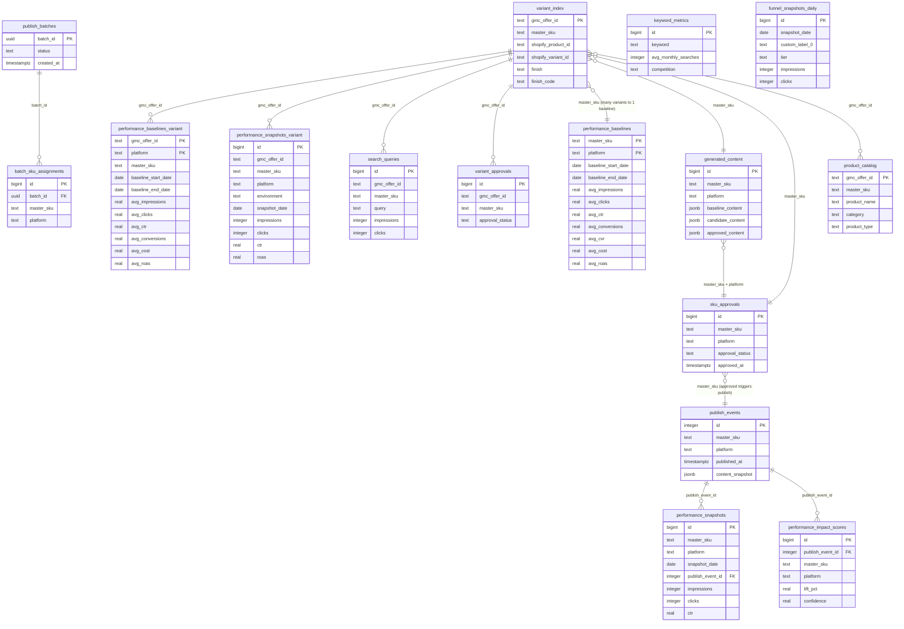
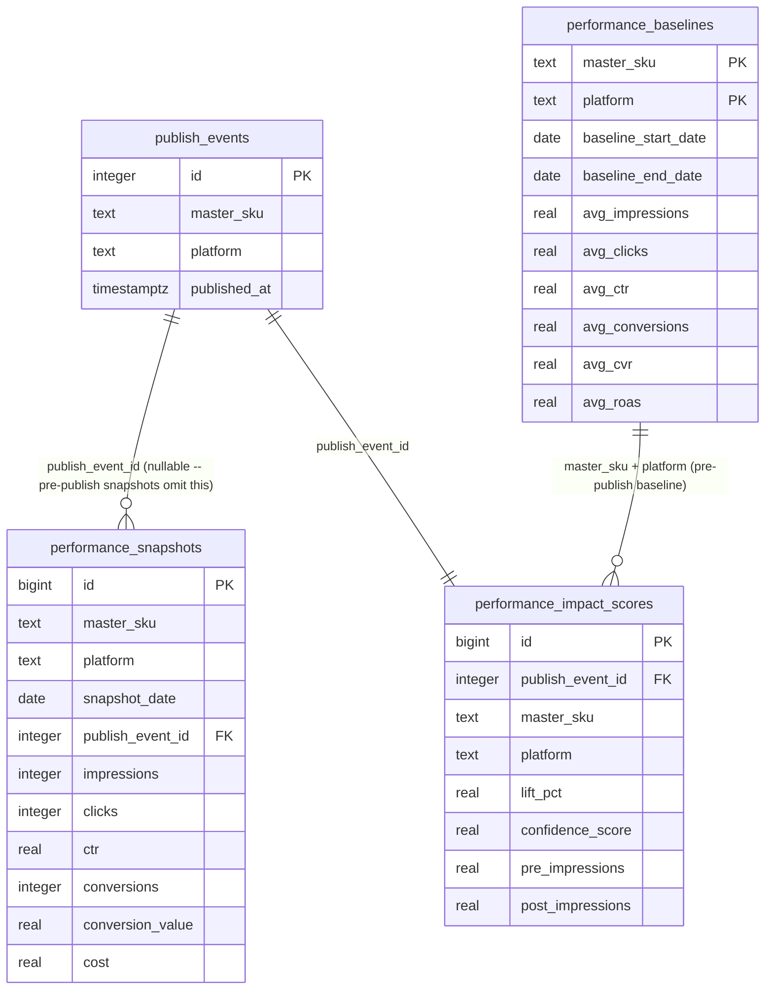
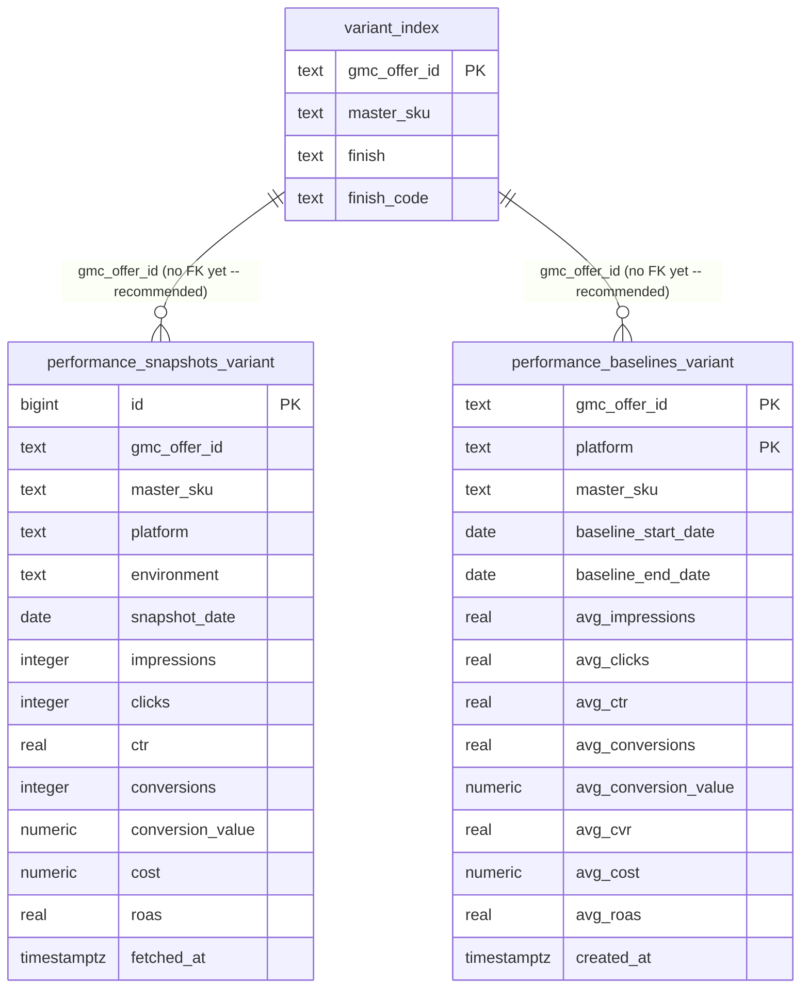
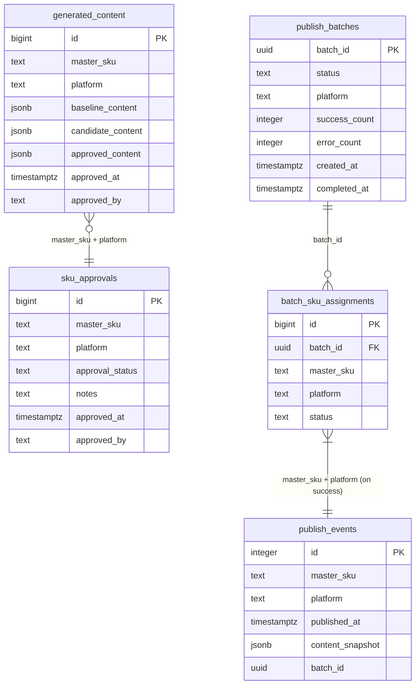
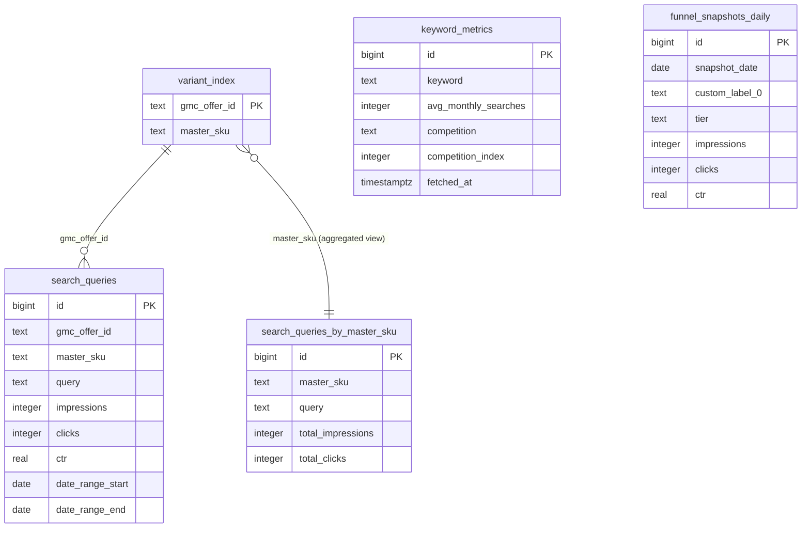

# Entity Relationship Map

**Last updated:** 2026-03-04
**Phase:** 8.1 — Data Model Gap Audit (ENTM-03)

This document is the authoritative reference for join keys, data granularity, and entity relationships across all data flows (Google Ads, Merchant Center, Shopify, internal tables). Read this before writing any query that touches performance, publishing, or content data.

---

## Overview: `variant_index` as the Central Hub

`variant_index` (72,000 rows) is the single source of truth for cross-platform identity mapping. Every variant that has ever been published has a row here. It is the only table that links:
- `master_sku` (internal content identifier, slash-format: `WP-2/16-GAL`)
- `gmc_offer_id` (Google Merchant Center offer identifier)
- `shopify_product_id` / `shopify_variant_id` (Shopify platform identifiers)
- `finish` / `finish_code` (one of 28 finish variants)

**Offer ID Format — CRITICAL:**

| Boundary | Format | Example |
|----------|--------|---------|
| Database (`variant_index`) | Lowercase `shopify_us_` | `shopify_us_4539975336068_40286148591748` |
| Google Ads API response | Uppercase `shopify_US_` | `shopify_US_4539975336068_40286148591748` |
| GMC / Google Sheets publish | Uppercase `shopify_US_` | `shopify_US_4539975336068_40286148591748` |

**Always normalize to lowercase on ingestion.** See `src/feedops/utils/offer_id.py`:
- `normalize_offer_id(id)` → canonical lowercase (DB format)
- `to_gmc_format(id)` → uppercase `shopify_US_` (publish boundary only)

See also: `docs/database/SCHEMA.md`

---

## Core Entity Relationship Diagram



---

## Performance Data Chain



---

## Variant-Level Performance Chain (Phase 8.1 Addition)



**Data flow for variant snapshots:**
1. `performance_impact.py:collect_daily_performance_snapshots()` calls `fetch_batch_product_performance()` — returns per-offer-ID metrics
2. Before aggregating to `master_sku`, write variant rows to `performance_snapshots_variant` (skip zero-impression rows)
3. Continue existing aggregation into `performance_snapshots` (master_sku level) — no change to existing logic
4. Result: both granularities preserved in separate tables, existing queries unaffected

---

## Content and Publishing Chain



**Content state machine:**
- `candidate_content` → human approval → `approved_content` (immutable after approval)
- `sku_approvals.approval_status`: `pending` → `approved` / `rejected`
- Approved content feeds batch publishing → `publish_events` record created

---

## Search and Keyword Data



**Data granularity notes:**
- `search_queries`: **Variant-level** (`gmc_offer_id`). Google Ads search term reports are offer-ID-level. No gap.
- `keyword_metrics`: **Keyword-level** (no offer ID). Keyword Planner returns aggregated market data — no variant dimension exists. Correct granularity.
- `funnel_snapshots_daily`: **Campaign-tier-level** (`custom_label_0 + tier + date`). Funnel data is account-level aggregation. No offer ID dimension. Correct granularity.

---

## Join Key Reference Table

| Source | Target | Join Key | Direction | Notes |
|--------|--------|----------|-----------|-------|
| `variant_index` | `performance_baselines` | `master_sku` | many→one | Many variants (28 finishes) per baseline |
| `variant_index` | `performance_snapshots_variant` | `gmc_offer_id` | one→many | No FK constraint yet (recommended) |
| `variant_index` | `performance_baselines_variant` | `gmc_offer_id` | one→one | No FK constraint yet (recommended) |
| `variant_index` | `search_queries` | `gmc_offer_id` | one→many | Already lowercase in both tables |
| `variant_index` | `variant_approvals` | `gmc_offer_id` | one→many | |
| `variant_index` | `generated_content` | `master_sku` | many→one | |
| `variant_index` | `sku_approvals` | `master_sku` | many→one | |
| `publish_events` | `performance_snapshots` | `publish_event_id` | one→many | Nullable — pre-publish snapshots have NULL |
| `publish_events` | `performance_impact_scores` | `publish_event_id` | one→one | |
| `publish_batches` | `batch_sku_assignments` | `batch_id` | one→many | |
| `performance_baselines` | `performance_impact_scores` | `master_sku + platform` | one→many | Pre-publish baseline for lift calculation |
| `generated_content` | `publish_events` | `master_sku + platform` | one→many | At publish time, `approved_content` snapshotted into `publish_events.content_snapshot` |

### INCORRECT Joins — Do Not Use

| Wrong Join | Why Wrong | Correct Alternative |
|------------|-----------|---------------------|
| Performance data via `shopify_product_id` | Multi-SKU products share one `shopify_product_id` — double-counts all variants | Join via `gmc_offer_id` directly |
| `performance_snapshots` → `variant_index` via `master_sku` | `master_sku` maps to 28+ rows in `variant_index` — ambiguous | Use `gmc_offer_id` for variant-level joins |
| Google Ads response keys without normalization | Google Ads returns `shopify_US_` (uppercase); DB stores `shopify_us_` (lowercase) | Always call `normalize_offer_id()` before DB lookup |

---

## Multi-SKU Product Pattern

> **WARNING: This is the #1 source of query correctness bugs in this codebase.**

### The Problem

Some products come in multiple sizes/configurations that are distinct master SKUs but share a single Shopify product ID.

**Example: DMF-2 series**

| master_sku | shopify_product_id | Description |
|------------|-------------------|-------------|
| `DMF-2/2X` | `4539975336068` | Double Towel Bar 18" |
| `DMF-2/3X` | `4539975336068` | Double Towel Bar 24" |
| `DMF-2/4X` | `4539975336068` | Double Towel Bar 30" |
| `DMF-2/5X` | `4539975336068` | Double Towel Bar 36" |

All four SKUs share `shopify_product_id = 4539975336068`. Each has its own `gmc_offer_id` for each of the 28 finishes — potentially 112 distinct offer IDs under one Shopify product.

### Which APIs Return What Granularity

| API / Source | Return Granularity | Identifier | Multi-SKU Impact |
|---|---|---|---|
| Google Ads `shopping_performance_view` | Per offer ID (variant-level) | `segments.product_item_id` = `gmc_offer_id` | Correct — each size gets its own row |
| Google Merchant Center | Per offer ID | `offer_id` | Correct — variant-level |
| Shopify Product API | Per product | `shopify_product_id` | **Ambiguous** — returns all sizes under one product |
| Shopify Variant API | Per variant | `shopify_variant_id` | Correct — finish-level within a size |
| Keyword Planner | Per keyword | keyword text | No offer ID dimension at all |

### Where Aggregation Happens

- `performance_impact.py:368-390`: `fetch_batch_product_performance()` returns per-offer-ID data. The function immediately aggregates `by_offer` → `aggregated_by_sku` via `offer_to_sku` lookup. This is intentional at the master-SKU level (all 28 finishes of `DMF-2/2X` aggregate together), but the raw per-offer-ID data is discarded.
- Phase 8.1 fix: Write variant snapshots (`performance_snapshots_variant`) BEFORE aggregation to preserve this data.

### Correctness Assessment

| Operation | Correct? | Notes |
|-----------|----------|-------|
| Join `performance_snapshots` on `master_sku` | Correct | Each size has its own baseline and snapshot rows |
| Join performance data on `shopify_product_id` | **WRONG** | All 4 sizes return under same product_id — 4x overcounting |
| Query Google Ads by offer ID | Correct | API is variant-level; each finish gets separate metrics |
| Aggregate search queries from offer_id to master_sku | Correct | Done via `offer_to_sku` lookup in `search_terms.py` |

> **Never join on `shopify_product_id` for performance data.** This pattern silently inflates all metrics by 4x (or the number of size variants).

---

## Recommended FK Constraints

These FK relationships exist logically but are not enforced in the database schema. They should be added in a future migration phase after verifying data integrity.

| Table | Column | Should Reference | Priority | Notes |
|-------|--------|-----------------|----------|-------|
| `performance_snapshots_variant` | `gmc_offer_id` | `variant_index.gmc_offer_id` | HIGH | New table in Phase 8.1 — add at creation time or soon after |
| `performance_baselines_variant` | `gmc_offer_id` | `variant_index.gmc_offer_id` | HIGH | Same — new table, clean window to add FK |
| `search_queries` | `gmc_offer_id` | `variant_index.gmc_offer_id` | MEDIUM | Existing table — verify no orphaned rows before adding |
| `variant_approvals` | `gmc_offer_id` | `variant_index.gmc_offer_id` | MEDIUM | Same caution as above |
| `batch_sku_assignments` | `batch_id` | `publish_batches.batch_id` | HIGH | Logical FK already enforced by application code |
| `performance_snapshots` | `publish_event_id` | `publish_events.id` | MEDIUM | Column is nullable — FK would need `ON DELETE SET NULL` |
| `performance_impact_scores` | `publish_event_id` | `publish_events.id` | HIGH | Already enforced as `performance_snapshots_publish_event_id_fkey` (Phase 8) |
| `generated_content` | `master_sku` | `variant_index.master_sku` | LOW | `master_sku` in `variant_index` is not unique (28 finishes per SKU) — FK would need a denormalized reference table |

**Migration note:** These are recommendations for a future phase — NOT applied in Phase 8.1. When adding FKs to existing tables, first run:
```sql
-- Check for orphaned rows before adding FK
SELECT COUNT(*) FROM performance_snapshots_variant v
LEFT JOIN variant_index vi ON vi.gmc_offer_id = v.gmc_offer_id
WHERE vi.gmc_offer_id IS NULL;
```

---

## Data Granularity Audit Results

Findings from Phase 8.1 audit of all data tables (RESEARCH.md Finding 5).

| Table | Granularity | Key Columns | Variant-Level Gap? | Notes |
|-------|-------------|-------------|-------------------|-------|
| `performance_baselines` | master_sku × platform | `(master_sku, platform)` PK | YES — fixed in 8.1 | 28 finish variants aggregated into one row |
| `performance_snapshots` | master_sku × platform × date | `master_sku, platform, snapshot_date` | YES — fixed in 8.1 | Daily snapshot aggregated at master_sku level |
| `performance_baselines_variant` | offer_id × platform | `(gmc_offer_id, platform)` PK | None — this IS the fix | New table in Phase 8.1 |
| `performance_snapshots_variant` | offer_id × platform × date × env | `(gmc_offer_id, platform, environment, snapshot_date)` UNIQUE | None — this IS the fix | New table in Phase 8.1 |
| `performance_impact_scores` | publish_event × platform | `publish_event_id, platform` | Not yet addressable | Wait for 30+ days of variant snapshot data |
| `search_queries` | offer_id × query × date_range | `gmc_offer_id, query` | None | Already variant-level from Google Ads API |
| `keyword_metrics` | keyword | `keyword` text | Not applicable | Keyword Planner has no variant dimension |
| `funnel_snapshots_daily` | date × custom_label_0 × tier | `(date, custom_label_0, tier)` | Not applicable | Account-level funnel data; no variant dimension exists |
| `search_queries_by_master_sku` | master_sku × query | `master_sku, query` | Intentional aggregation | Derived view from `search_queries` for master-SKU-level analysis |
| `generated_content` | master_sku × platform | `master_sku, platform` | Not applicable | Content is authored at master_sku level (finish expansion at publish time) |
| `sku_approvals` | master_sku × platform | `master_sku, platform` | Not applicable | Approval is at master_sku level |
| `variant_approvals` | offer_id | `gmc_offer_id` | Not applicable | Already variant-level |
| `publish_events` | master_sku × platform × date | `master_sku, platform, published_at` | Not applicable | Publish is at master_sku level |
| `variant_index` | offer_id | `gmc_offer_id` PK | Not applicable | Definition of variant; IS the reference |

### Summary

- **2 tables had variant-level gaps** (performance_baselines, performance_snapshots) — fixed in Phase 8.1 by adding parallel variant tables
- **All search/keyword tables** are at correct granularity — no gaps
- **Content/publishing tables** operate at master_sku level by design — finish expansion happens at publish boundary

---

## TypeScript Boundary Notes (Deferred)

The following TypeScript files transform offer IDs but have NOT been updated with shared normalization logic. This is deferred to a future phase.

| File | Current Behavior | Deferred Action |
|------|-----------------|-----------------|
| `dashboard/src/lib/publishing/google-sheets.ts:757` | `.replace('shopify_us_', 'shopify_US_')` at publish time | Correct behavior; may be formalized when TS utility is added |
| `dashboard/src/app/api/regenerate/route.ts` | Passes `master_sku` from request body | No offer ID involved; no change needed |
| `dashboard/src/lib/data-collection/ensure-data.ts` | Reads from DB (already lowercase) | Passes through correctly; no normalization bug |

---

## Related Documentation

- `docs/database/SCHEMA.md` — Complete table schema with column names, types, and constraints
- `docs/architecture/multi-sku-pattern.md` — Deep dive on DMF-2/2X through 2/5X pattern
- `docs/architecture/data-pipeline.md` — End-to-end data flow from Acatalog.csv → GMC
- `src/feedops/utils/offer_id.py` — Offer ID normalization utility (ENTM-01)
- `supabase/migrations/043_variant_performance_tables.sql` — Migration adding `performance_snapshots_variant` and `performance_baselines_variant` (ENTM-02 context)
