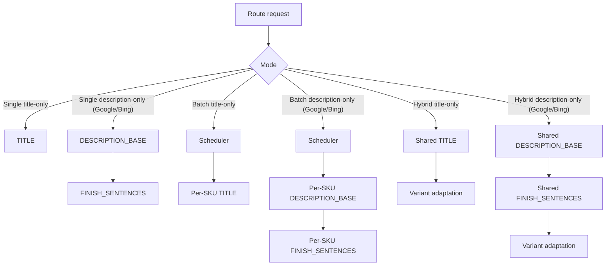
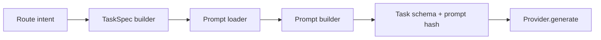
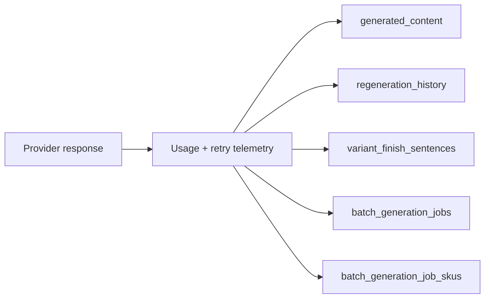
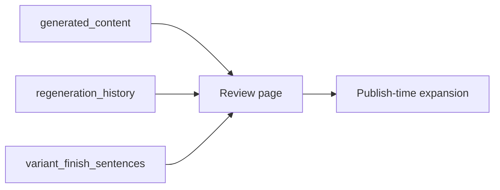
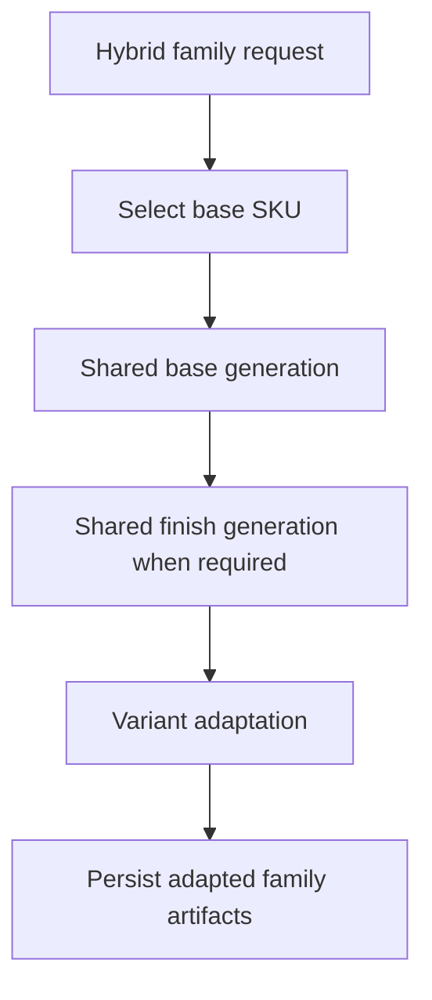

# Generation Pipeline Routing Reference

## Purpose
This is the deep routing and process-flow reference for the Allied FeedOps generation system. Future developers and LLMs should use this document to understand the live pipeline before making changes.

## Canonical Entry Points

The generation system exposes four primary runtime routes:

- `POST /regenerate`
- `POST /batch-optimize`
- `POST /hybrid-generate`
- `GET /batch-status/{job_id}`

Supporting orchestration routes in the dashboard call these runtime endpoints through `FEEDOPS_PIPELINE_URL`.

## Route Semantics

### `/regenerate`

Synchronous content regeneration for a single master SKU and requested scope.

Behavior:

- returns `RegenerateResponse`
- does not create a background job for the standard sync path
- therefore single-route Google title/description runs are expected to have no `job_id`

### `/batch-optimize`

Creates a background batch job and persists orchestration rows in:

- `batch_generation_jobs`
- `batch_generation_job_skus`

Per-SKU generation still follows the same task model as single-route generation.

### `/hybrid-generate`

Creates a background hybrid job for related family SKUs.

Behavior:

- one shared generation for the family
- one shared finish generation when required
- variant adaptation for family members

### `/batch-status/{job_id}`

Reads batch job progress and per-SKU job state. This is orchestration status, not an alternate content source.

## Request Intent Derivation

The runtime derives intent from:

- route type
- requested platforms
- requested content types
- whether the request is title-only or description-only
- whether the route is single, batch, or hybrid
- whether user feedback is supplied for a regenerate flow

## Task Graph Construction

Task building is centralized in the scoped generation runtime under `src/feedops/generation/`.

### Task kinds

- `TITLE`
- `DESCRIPTION_BASE`
- `FINISH_SENTENCES`

### Selection rules

#### Single title-only
- `TITLE`

#### Single description-only on Google/Bing
- `DESCRIPTION_BASE`
- `FINISH_SENTENCES`

#### Batch title-only
- scheduler + per-SKU `TITLE`

#### Batch description-only on Google/Bing
- scheduler + per-SKU `DESCRIPTION_BASE`
- scheduler + per-SKU `FINISH_SENTENCES`

#### Hybrid title-only
- shared `TITLE`
- variant adaptation

#### Hybrid description-only on Google/Bing
- shared `DESCRIPTION_BASE`
- shared `FINISH_SENTENCES`
- variant adaptation

## Prompt Construction Path

### Base path

1. route builds request intent
2. scoped task builder constructs task specs
3. prompt loader retrieves canonical system prompt components
4. prompt builder assembles the user prompt
5. task helper computes prompt hash

### Hybrid adaptation path

Hybrid adaptation uses a separate user prompt that references:

- base SKU
- variant SKU
- base content
- base spec
- variant spec

### Finish generation path

Google/Bing description flows call a dedicated finish prompt builder. That subcall is provider-backed and persisted as first-class lineage.

## Provider Lifecycle

1. route obtains provider through the provider factory
2. task executor sends task-scoped prompt + schema
3. usage, attempts, parse retries, latency, and cost are collected
4. provider is explicitly closed after use

## Persistence Flow

### Base writes

- content artifacts to `generated_content`
- lineage to `regeneration_history`

### Finish writes

- finish lineage row to `regeneration_history`
- finish map to `variant_finish_sentences`

### Batch writes

- parent job state to `batch_generation_jobs`
- per-SKU state to `batch_generation_job_skus`

## Dashboard Read Path

The review page is a readback layer over Supabase, not an alternate content generator.

Read path responsibilities:

1. load current generated content for a canonical SKU
2. load variant finish maps for Google/Bing description expansion
3. resolve URL-safe SKU aliases such as `1033-24` to canonical `1033/24`
4. expand approved variant content at publish time

## Mermaid Maps

### Route To Task Graph

### Prompt To Provider Graph

### Provider To Persistence Graph

### Persistence To Dashboard Graph

### Hybrid Family Flow

## Common Failure Modes

1. source/runtime drift
2. stale deployed revision
3. legacy host drift in dashboard runtime paths
4. missing prompt lineage rows
5. missing finish metadata assets in container build
6. prompt parity drift between expected and stored values
7. dashboard SKU alias misunderstanding

## How To Use This Document

Before changing generation behavior:

1. identify the route
2. identify the exact intended task graph
3. identify the prompt-building path
4. identify the persistence path
5. identify the dashboard readback path

If any of those five are uncertain, stop and reconstruct them before patching.
