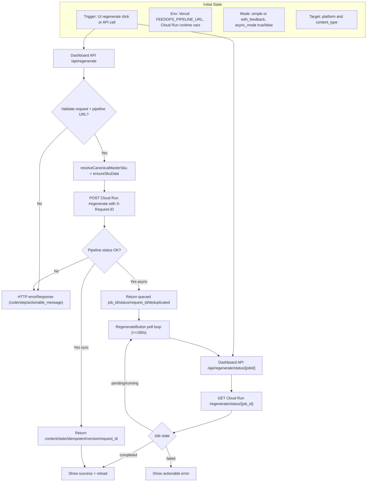

# D1 System Entry Map (AS-IS)

## Legend
- Dashboard entrypoints: `/dashboard/src/app/api/regenerate/*`
- Pipeline endpoints: `/src/feedops/api/main.py` (`/regenerate`, `/regenerate/status/{job_id}`)
- Polling semantics: client-side in `RegenerateButton.tsx`
