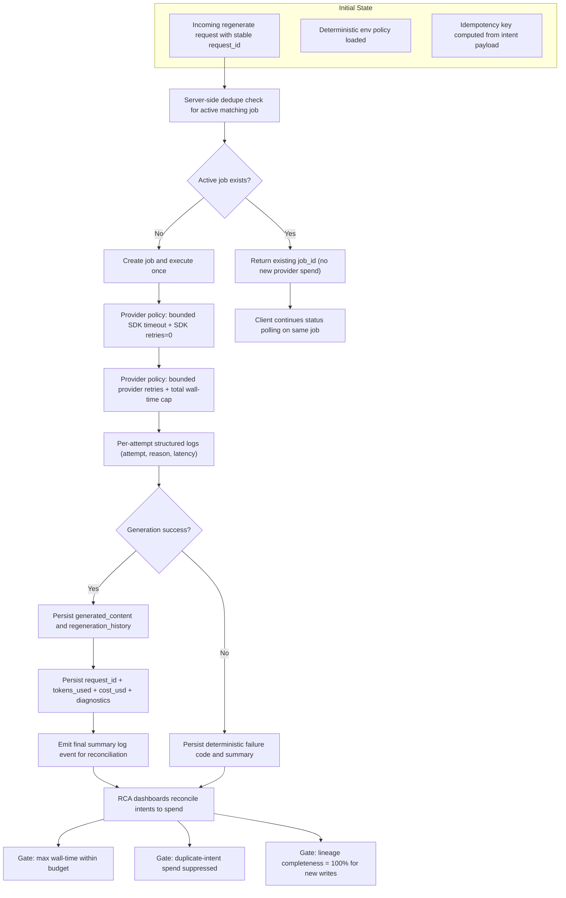

# D10 TO-BE Target State

```mermaid
flowchart TD
  subgraph INIT["Initial State"]
    I1["Incoming regenerate request with stable request_id"]
    I2["Deterministic env policy loaded"]
    I3["Idempotency key computed from intent payload"]
  end

  I1 --> T1["Server-side dedupe check for active matching job"]
  T1 --> T2{"Active job exists?"}
  T2 -->|"Yes"| T3["Return existing job_id (no new provider spend)"]
  T2 -->|"No"| T4["Create job and execute once"]

  T4 --> T5["Provider policy: bounded SDK timeout + SDK retries=0"]
  T5 --> T6["Provider policy: bounded provider retries + total wall-time cap"]
  T6 --> T7["Per-attempt structured logs (attempt, reason, latency)"]

  T7 --> T8{"Generation success?"}
  T8 -->|"Yes"| T9["Persist generated_content and regeneration_history"]
  T8 -->|"No"| T10["Persist deterministic failure code and summary"]

  T9 --> T11["Persist request_id + tokens_used + cost_usd + diagnostics"]
  T11 --> T12["Emit final summary log event for reconciliation"]

  T3 --> T13["Client continues status polling on same job"]
  T12 --> T14["RCA dashboards reconcile intents to spend"]
  T10 --> T14

  T14 --> G1["Gate: max wall-time within budget"]
  T14 --> G2["Gate: duplicate-intent spend suppressed"]
  T14 --> G3["Gate: lineage completeness = 100% for new writes"]
```

## Legend
- TO-BE assumes current additive fixes plus required tests remain green.
- No breaking API contract changes; async/sync contracts preserved.
