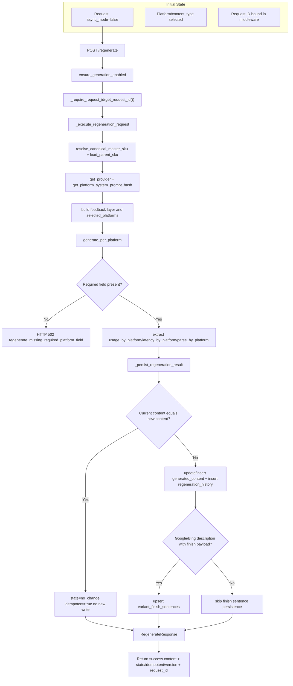

# D2 Regenerate Sync Path (AS-IS)

## Legend
- Primary orchestration: `src/feedops/api/main.py`
- Platform generation fanout: `src/feedops/pipeline/generator.py`
- Idempotent write path: `_persist_regeneration_result`
