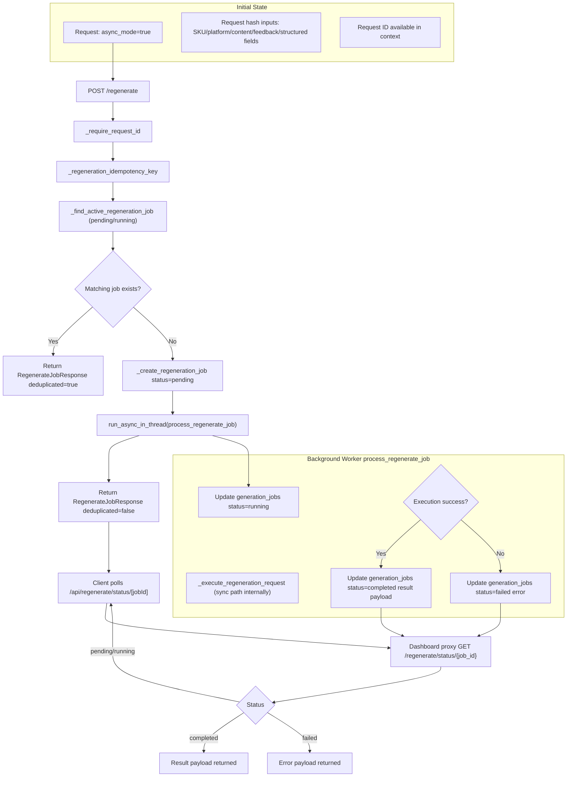

# D3 Regenerate Async Path (AS-IS)

## Legend
- Job table: `generation_jobs`
- Dedupe key stored in `generation_jobs.input_params.idempotency_key`
- Async status contract: `RegenerateJobStatusResponse`
