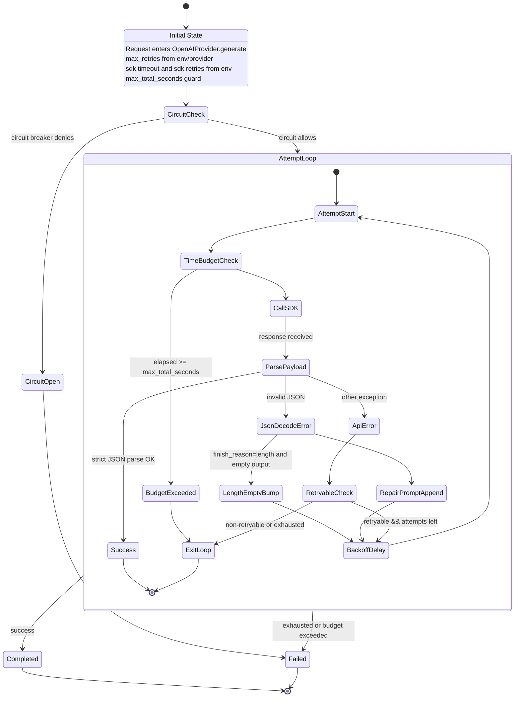

# D4 Provider Retry/Timeout State Machine (AS-IS)

## Legend
- SDK layer: `AsyncOpenAI(... timeout, max_retries ...)`
- Provider layer retries: `for attempt in range(self.max_retries)`
- Additional amplification branch: completion budget bump on `finish_reason=length`
