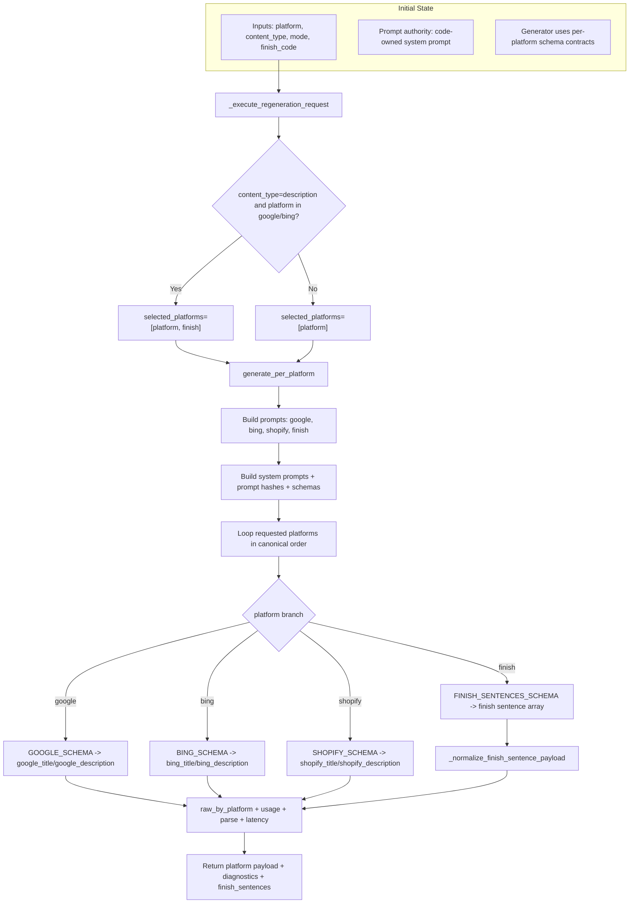

# D5 Platform Branching Map (AS-IS)

## Legend
- Execution fanout function: `src/feedops/pipeline/generator.py:377`
- Description+finish expansion trigger: `src/feedops/api/main.py:1428`
- Placeholder/finish rules live in prompt builder and platform skills.
