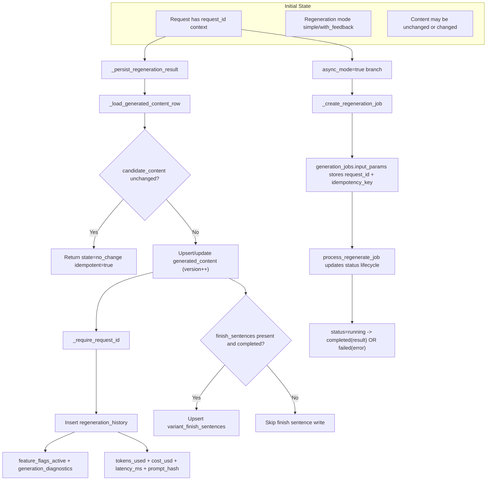

# D6 Persistence + Lineage Map (AS-IS)

## Legend
- Tables: `generated_content`, `regeneration_history`, `generation_jobs`, `variant_finish_sentences`
- Lineage hard requirement: `_require_request_id` blocks placeholder `"-"` IDs
- Diagnostic attribution currently lands in `regeneration_history`.
