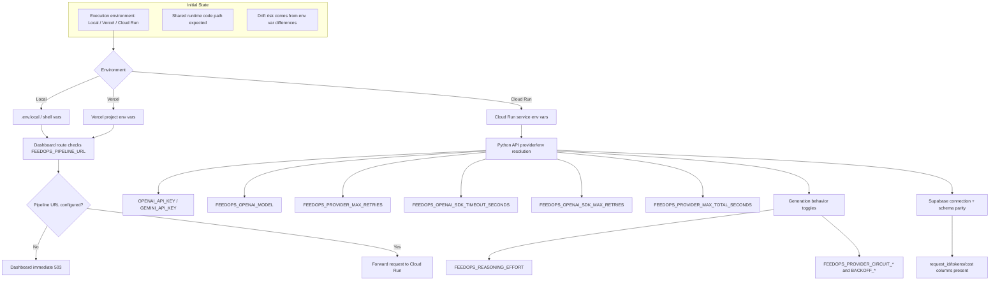

# D7 Environment Parity Map (AS-IS)

```mermaid
flowchart TD
  subgraph INIT["Initial State"]
    I1["Execution environment: Local / Vercel / Cloud Run"]
    I2["Shared runtime code path expected"]
    I3["Drift risk comes from env var differences"]
  end

  I1 --> E1{"Environment"}
  E1 -->|"Local"| L1[".env.local / shell vars"]
  E1 -->|"Vercel"| V1["Vercel project env vars"]
  E1 -->|"Cloud Run"| C1["Cloud Run service env vars"]

  L1 --> R1["Dashboard route checks FEEDOPS_PIPELINE_URL"]
  V1 --> R1
  C1 --> R2["Python API provider/env resolution"]

  R2 --> P1["OPENAI_API_KEY / GEMINI_API_KEY"]
  R2 --> P2["FEEDOPS_OPENAI_MODEL"]
  R2 --> P3["FEEDOPS_PROVIDER_MAX_RETRIES"]
  R2 --> P4["FEEDOPS_OPENAI_SDK_TIMEOUT_SECONDS"]
  R2 --> P5["FEEDOPS_OPENAI_SDK_MAX_RETRIES"]
  R2 --> P6["FEEDOPS_PROVIDER_MAX_TOTAL_SECONDS"]

  R2 --> G1["Generation behavior toggles"]
  G1 --> G2["FEEDOPS_REASONING_EFFORT"]
  G1 --> G3["FEEDOPS_PROVIDER_CIRCUIT_* and BACKOFF_*"]

  R2 --> D1["Supabase connection + schema parity"]
  D1 --> D2["request_id/tokens/cost columns present"]

  R1 --> X1{"Pipeline URL configured?"}
  X1 -->|"No"| X2["Dashboard immediate 503"]
  X1 -->|"Yes"| X3["Forward request to Cloud Run"]
```

## Legend
- Env-driven divergence is the main parity failure mode.
- Code path parity is maintained when env contracts are aligned.
