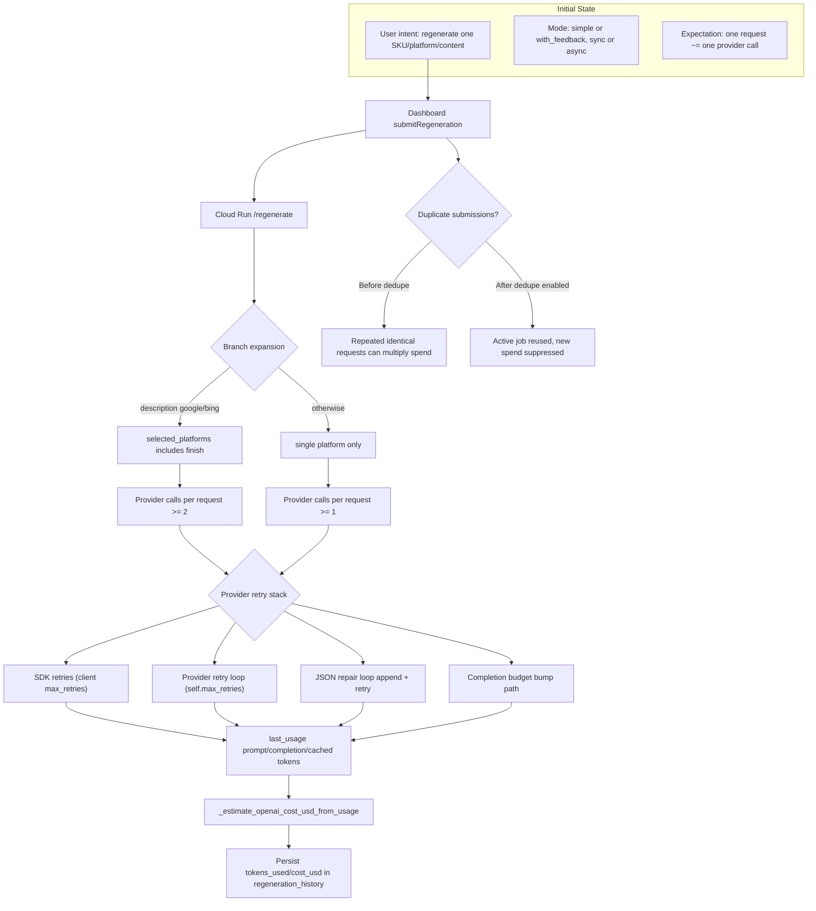

# D8 Spend Attribution Map (AS-IS)

## Legend
- Spend can amplify via branch expansion and layered retries even when user action appears singular.
- Historical rows lacking `tokens_used/cost_usd/request_id` impede post-hoc reconciliation.
