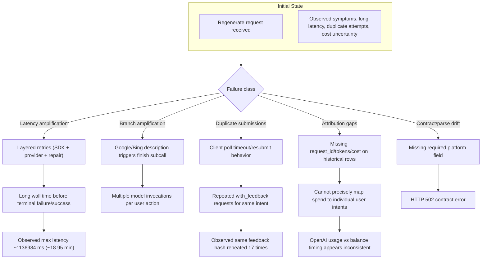

# D9 Failure Taxonomy Map (AS-IS)

```mermaid
flowchart TD
  subgraph INIT["Initial State"]
    I1["Regenerate request received"]
    I2["Observed symptoms: long latency, duplicate attempts, cost uncertainty"]
  end

  I1 --> F1{"Failure class"}

  F1 -->|"Latency amplification"| L1["Layered retries (SDK + provider + repair)"]
  L1 --> L2["Long wall time before terminal failure/success"]

  F1 -->|"Branch amplification"| B1["Google/Bing description triggers finish subcall"]
  B1 --> B2["Multiple model invocations per user action"]

  F1 -->|"Duplicate submissions"| D1["Client poll timeout/resubmit behavior"]
  D1 --> D2["Repeated with_feedback requests for same intent"]

  F1 -->|"Attribution gaps"| A1["Missing request_id/tokens/cost on historical rows"]
  A1 --> A2["Cannot precisely map spend to individual user intents"]

  F1 -->|"Contract/parse drift"| P1["Missing required platform field"]
  P1 --> P2["HTTP 502 contract error"]

  L2 --> H1["Observed max latency ~1136984 ms (~18.95 min)"]
  D2 --> H2["Observed same feedback hash repeated 17 times"]
  A2 --> H3["OpenAI usage vs balance timing appears inconsistent"]
```

## Legend
- Taxonomy separates user-facing symptoms from underlying mechanical causes.
- RCA ranking in report maps to these branches.
