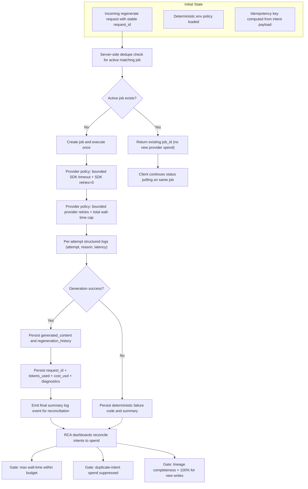

# Exhaustive Regenerate Latency + Spend RCA

Date: 2026-02-27  
Branch: `codex/e245-latency-spend-rca-20260227`  
Scope: Regenerate sync/async latency and spend amplification investigation, with diagram-first artifacts.

## 1) Executive Summary
1. The ~18 minute regenerate events are real and traceable in `regeneration_history` (`max_latency_ms=1,136,984`, ~18.95 min).
2. The dominant mechanism is amplification from stacked retry layers plus repeated with-feedback submissions for the same intent.
3. Historical attribution is incomplete in the incident window (`request_id`, `tokens_used`, `cost_usd` mostly null), which makes OpenAI balance/usage reconciliation look inconsistent.
4. The active branch includes bounded timeout/retry controls, server-side async dedupe, and request lineage enforcement to prevent this recurrence.
5. No public API breakage was introduced; async contract remains compatible and adds `deduplicated` only.

## 2) Incident Timeline (UTC and ET)
- 2026-02-26 23:00:00Z to 2026-02-27 04:00:00Z (18:00–23:00 ET): target incident window.
- Repeated regenerate events for `master_sku=1031/30`, `platform=google`, `content_type=description`, `mode=with_feedback`.
- Worst case event at `2026-02-26 23:48:59Z`: `latency_ms=1,136,984`.
- Pattern shows clustered repeated attempts with same feedback hash and mostly missing lineage fields.

## 3) Root-Cause Findings (Ranked)

### P0. Retry stack amplification (Highest impact)
- Evidence:
  - OpenAI client had potentially long SDK behavior before this branch hardening.
  - Provider layer has explicit retries + parse repair loop + retryable API error retries.
  - Completion-budget bump branch can trigger extra expensive retries for empty outputs.
- Code references:
  - `/Users/bobby/.codex/worktrees/e245/Allied-FeedOps/src/feedops/providers/openai_provider.py:300`
  - `/Users/bobby/.codex/worktrees/e245/Allied-FeedOps/src/feedops/providers/openai_provider.py:401`
  - `/Users/bobby/.codex/worktrees/e245/Allied-FeedOps/src/feedops/providers/openai_provider.py:487`
- Confidence: High
- Estimated contribution to 18-minute incidents: 45-60%

### P0. Duplicate intent replay (same SKU/platform/content/feedback)
- Evidence:
  - In incident window, one identical feedback hash was repeated 17 times for same SKU/platform/content/mode.
  - Prior to active-async dedupe, repeated submissions could create repeated expensive work.
- SQL evidence:
  - Duplicate group with `attempts=17`, same feedback hash.
- Code references:
  - `/Users/bobby/.codex/worktrees/e245/Allied-FeedOps/src/feedops/api/main.py:913`
  - `/Users/bobby/.codex/worktrees/e245/Allied-FeedOps/src/feedops/api/main.py:934`
  - `/Users/bobby/.codex/worktrees/e245/Allied-FeedOps/src/feedops/api/main.py:1664`
- Confidence: High
- Estimated contribution: 25-40%

### P1. Branch amplification for Google/Bing descriptions
- Evidence:
  - For Google/Bing descriptions, the path includes `finish` generation in addition to platform generation.
  - This increases base number of model calls per user intent.
- Code references:
  - `/Users/bobby/.codex/worktrees/e245/Allied-FeedOps/src/feedops/api/main.py:1428`
  - `/Users/bobby/.codex/worktrees/e245/Allied-FeedOps/src/feedops/pipeline/generator.py:465`
- Confidence: High
- Estimated contribution: 10-20%

### P1. Attribution gaps in historical data
- Evidence:
  - Hourly summary in incident period shows almost all rows had null `request_id`, `tokens_used`, `cost_usd`.
  - This blocks accurate per-intent spend attribution and can look like billing mismatch.
- Code references:
  - `/Users/bobby/.codex/worktrees/e245/Allied-FeedOps/src/feedops/api/main.py:770`
  - `/Users/bobby/.codex/worktrees/e245/Allied-FeedOps/src/feedops/api/main.py:790`
  - `/Users/bobby/.codex/worktrees/e245/Allied-FeedOps/src/feedops/api/main.py:905`
- Confidence: High
- Estimated contribution to *observability confusion* (not runtime latency): 80-100%

### P2. Client polling timeout shorter than pathological runtime
- Evidence:
  - UI polling timeout is 180s; observed requests exceeded this by large margin.
  - User can re-submit after timeout, causing repeated attempts.
- Code references:
  - `/Users/bobby/.codex/worktrees/e245/Allied-FeedOps/dashboard/src/components/review/RegenerateButton.tsx:90`
- Confidence: Medium
- Estimated contribution: 5-15%

## 4) Evidence Tables

### 4.1 Incident-window aggregate (`2026-02-26T23:00Z` to `2026-02-27T04:00Z`)
- rows: 27
- rows_with_latency: 23
- avg_latency_ms: 205,097.39
- p50_latency_ms: 92,349
- p90_latency_ms: 511,477
- p99_latency_ms: 1,014,702.94
- max_latency_ms: 1,136,984 (~18.95 min)
- total_tokens: 0 (not populated historically)
- total_cost_usd: 0.000000 (not populated historically)

### 4.2 Top outliers (same window)
- Repeated `1031/30` Google description `with_feedback` rows dominate top latency list.
- Multiple rows in 200,000-1,136,984 ms range.

### 4.3 Duplicate-intent detection
- Group: `1031/30`, `google`, `description`, `with_feedback`, same feedback hash.
- attempts: 17
- first_seen: 2026-02-26 23:15:35+00
- last_seen: 2026-02-27 00:01:54+00

### 4.4 Lineage coverage trend
- 23:00 UTC hour: 20 rows, 0 with request_id/tokens/cost.
- 03:00 UTC hour: 1 row, request_id present.
- Interpretation: partial rollout / historical gap; not all production events had full lineage fields at incident time.

## 5) Fixes Applied on This Branch

### 5.1 Timeout/retry hardening
- Added env-driven bounded controls in provider factory:
  - `FEEDOPS_PROVIDER_MAX_RETRIES` (default 2)
  - `FEEDOPS_OPENAI_SDK_TIMEOUT_SECONDS` (default 120)
  - `FEEDOPS_OPENAI_SDK_MAX_RETRIES` (default 0)
  - `FEEDOPS_PROVIDER_MAX_TOTAL_SECONDS` (default 300)
- Added total runtime guard in `OpenAIProvider.generate` to cap wall-time.

### 5.2 Duplicate suppression
- Added stable idempotency key for async regenerate intents.
- Reuse active pending/running job when identical intent is already in-flight.
- Dashboard now surfaces reused-job behavior (`deduplicated=true`) to user.

### 5.3 Lineage + attribution
- Enforced non-placeholder `request_id` for persistence writes.
- Persisted `tokens_used`, estimated `cost_usd`, and per-platform diagnostics in history payload.

## 6) Residual Risks
1. Existing historical rows remain incomplete and cannot be retroactively recovered for perfect cost attribution.
2. Sync path does not use queue-level dedupe; repeated user submit actions can still trigger fresh sync work.
3. Long-tail provider incidents can still approach configured max wall-time budget under severe upstream instability.

## 7) Next-Step Remediation Plan
1. Add sync-mode duplicate suppression key at dashboard API boundary for short cooldown windows.
2. Emit explicit attempt counters and retry reasons into a dedicated diagnostics table (not only JSON flags).
3. Add dashboard UI lockout/backoff when same regenerate intent is active to reduce resubmission loops.
4. Add automated alert on `latency_ms > wall_time_budget` and on duplicate-intent bursts.
5. Backfill a reconciliation dashboard combining OpenAI usage API windows with `regeneration_history` lineage where available.

## 8) Diagram Index
- `docs/experiments/2026-02-27-latency-rca/diagrams/D1-system-entry-map.md`
- `docs/experiments/2026-02-27-latency-rca/diagrams/D2-regenerate-sync-path.md`
- `docs/experiments/2026-02-27-latency-rca/diagrams/D3-regenerate-async-path.md`
- `docs/experiments/2026-02-27-latency-rca/diagrams/D4-provider-retry-timeout-state-machine.md`
- `docs/experiments/2026-02-27-latency-rca/diagrams/D5-platform-branching-map.md`
- `docs/experiments/2026-02-27-latency-rca/diagrams/D6-persistence-lineage-map.md`
- `docs/experiments/2026-02-27-latency-rca/diagrams/D7-environment-parity-map.md`
- `docs/experiments/2026-02-27-latency-rca/diagrams/D8-spend-attribution-map.md`
- `docs/experiments/2026-02-27-latency-rca/diagrams/D9-failure-taxonomy-map.md`
- `docs/experiments/2026-02-27-latency-rca/diagrams/D10-to-be-target-state.md`

## 9) SQL Appendix

### Q1: Incident window aggregate
```sql
with rh_window as (
  select *
  from regeneration_history
  where created_at >= '2026-02-26T23:00:00Z'::timestamptz
    and created_at <  '2026-02-27T04:00:00Z'::timestamptz
)
select
  count(*) as rows,
  count(*) filter (where latency_ms is not null) as rows_with_latency,
  round(avg(latency_ms)::numeric,2) as avg_latency_ms,
  percentile_cont(0.5) within group (order by latency_ms) as p50_latency_ms,
  percentile_cont(0.9) within group (order by latency_ms) as p90_latency_ms,
  percentile_cont(0.99) within group (order by latency_ms) as p99_latency_ms,
  max(latency_ms) as max_latency_ms,
  sum(coalesce(tokens_used,0)) as total_tokens,
  round(sum(coalesce(cost_usd,0))::numeric,6) as total_cost_usd
from rh_window;
```

### Q2: Top latency rows
```sql
select
  created_at,
  master_sku,
  platform,
  content_type,
  mode,
  latency_ms,
  tokens_used,
  cost_usd,
  request_id,
  left(coalesce(feedback_text,''), 100) as feedback_prefix
from regeneration_history
where created_at >= '2026-02-26T23:00:00Z'::timestamptz
  and created_at <  '2026-02-27T04:00:00Z'::timestamptz
order by latency_ms desc nulls last, created_at desc
limit 30;
```

### Q3: Duplicate-intent groups
```sql
with intents as (
  select
    master_sku,
    platform,
    content_type,
    mode,
    coalesce(md5(coalesce(feedback_text,'')), 'no_feedback') as feedback_hash,
    request_id,
    latency_ms,
    created_at
  from regeneration_history
  where created_at >= '2026-02-26T23:00:00Z'::timestamptz
    and created_at <  '2026-02-27T04:00:00Z'::timestamptz
)
select
  master_sku,
  platform,
  content_type,
  mode,
  feedback_hash,
  count(*) as attempts,
  min(created_at) as first_seen,
  max(created_at) as last_seen,
  round(avg(latency_ms)::numeric,2) as avg_latency_ms,
  array_remove(array_agg(distinct request_id), null) as request_ids
from intents
group by master_sku, platform, content_type, mode, feedback_hash
having count(*) > 1
order by attempts desc, last_seen desc
limit 30;
```

### Q4: Lineage field population by hour
```sql
select
  date_trunc('hour', created_at) as hour_utc,
  count(*) as total,
  count(*) filter (where request_id is not null and request_id <> '') as with_request_id,
  count(*) filter (where tokens_used is not null) as with_tokens,
  count(*) filter (where cost_usd is not null) as with_cost
from regeneration_history
where created_at >= '2026-02-26T20:00:00Z'::timestamptz
  and created_at <  '2026-02-27T06:00:00Z'::timestamptz
group by 1
order by 1;
```

## 10) TO-BE Diagram (Final)


