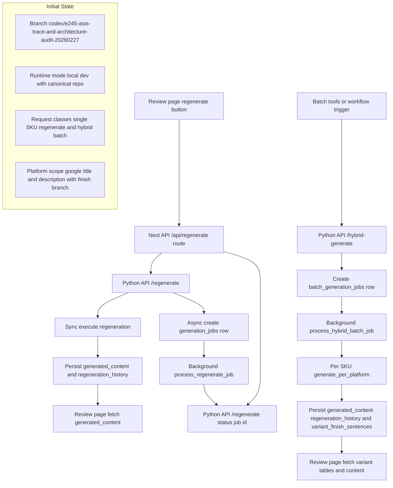

# D1 System Entry Map (As-Is)

```mermaid
flowchart TD
  subgraph Initial_State["Initial State"]
    I1["Branch codex/e245-asis-trace-and-architecture-audit-20260227"]
    I2["Runtime mode local dev with canonical repo"]
    I3["Request classes single SKU regenerate and hybrid batch"]
    I4["Platform scope google title and description with finish branch"]
  end

  UI1["Review page regenerate button"] --> N1["Next API /api/regenerate route"]
  UI2["Batch tools or workflow trigger"] --> N2["Python API /hybrid-generate"]

  N1 --> P1["Python API /regenerate"]
  N1 --> P2["Python API /regenerate status job id"]

  P1 --> S1["Sync execute regeneration"]
  P1 --> A1["Async create generation_jobs row"]
  A1 --> A2["Background process_regenerate_job"]
  A2 --> P2

  N2 --> H1["Create batch_generation_jobs row"]
  H1 --> H2["Background process_hybrid_batch_job"]
  H2 --> H3["Per SKU generate_per_platform"]

  S1 --> G1["Persist generated_content and regeneration_history"]
  H3 --> G2["Persist generated_content regeneration_history and variant_finish_sentences"]

  G1 --> D1["Review page fetch generated_content"]
  G2 --> D2["Review page fetch variant tables and content"]
```
