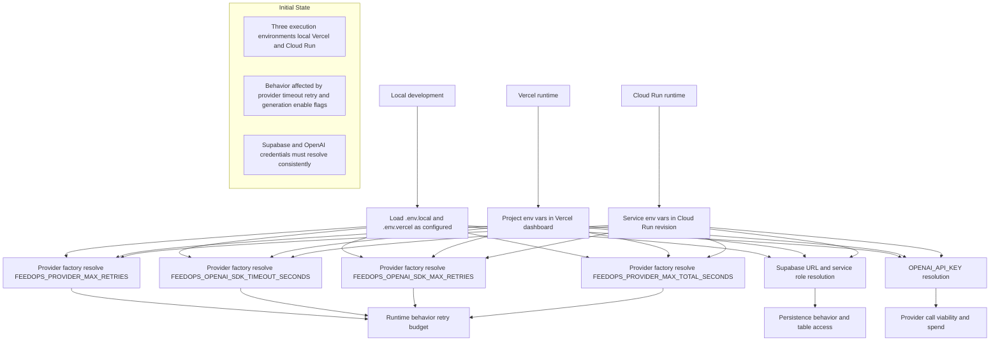

# D10 Environment and Parity Resolution Map (As-Is)

```mermaid
flowchart TD
  subgraph Initial_State["Initial State"]
    I1["Three execution environments local Vercel and Cloud Run"]
    I2["Behavior affected by provider timeout retry and generation enable flags"]
    I3["Supabase and OpenAI credentials must resolve consistently"]
  end

  A["Local development"] --> B["Load .env.local and .env.vercel as configured"]
  C["Vercel runtime"] --> D["Project env vars in Vercel dashboard"]
  E["Cloud Run runtime"] --> F["Service env vars in Cloud Run revision"]

  B --> G["Provider factory resolve FEEDOPS_PROVIDER_MAX_RETRIES"]
  D --> G
  F --> G

  B --> H["Provider factory resolve FEEDOPS_OPENAI_SDK_TIMEOUT_SECONDS"]
  D --> H
  F --> H

  B --> I["Provider factory resolve FEEDOPS_OPENAI_SDK_MAX_RETRIES"]
  D --> I
  F --> I

  B --> J["Provider factory resolve FEEDOPS_PROVIDER_MAX_TOTAL_SECONDS"]
  D --> J
  F --> J

  B --> K["Supabase URL and service role resolution"]
  D --> K
  F --> K

  B --> L["OPENAI_API_KEY resolution"]
  D --> L
  F --> L

  G --> M["Runtime behavior retry budget"]
  H --> M
  I --> M
  J --> M
  K --> N["Persistence behavior and table access"]
  L --> O["Provider call viability and spend"]
```
