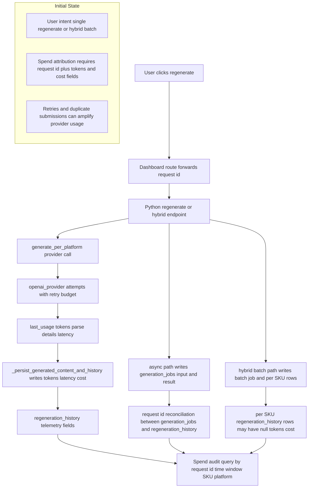

# D11 Spend Attribution Map (As-Is)

```mermaid
flowchart TD
  subgraph Initial_State["Initial State"]
    I1["User intent single regenerate or hybrid batch"]
    I2["Spend attribution requires request id plus tokens and cost fields"]
    I3["Retries and duplicate submissions can amplify provider usage"]
  end

  A["User clicks regenerate"] --> B["Dashboard route forwards request id"]
  B --> C["Python regenerate or hybrid endpoint"]

  C --> D["generate_per_platform provider call"]
  D --> E["openai_provider attempts with retry budget"]
  E --> F["last_usage tokens parse details latency"]

  F --> G["_persist_generated_content_and_history writes tokens latency cost"]
  G --> H["regeneration_history telemetry fields"]

  C --> I["async path writes generation_jobs input and result"]
  I --> J["request id reconciliation between generation_jobs and regeneration_history"]

  C --> K["hybrid batch path writes batch job and per SKU rows"]
  K --> L["per SKU regeneration_history rows may have null tokens cost"]

  H --> M["Spend audit query by request id time window SKU platform"]
  J --> M
  L --> M
```
