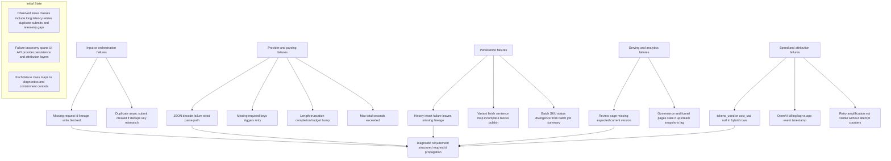

# D12 Failure Taxonomy Map (As-Is)

```mermaid
flowchart TD
  subgraph Initial_State["Initial State"]
    I1["Observed issue classes include long latency retries duplicate submits and telemetry gaps"]
    I2["Failure taxonomy spans UI API provider persistence and attribution layers"]
    I3["Each failure class maps to diagnostics and containment controls"]
  end

  A["Input or orchestration failures"] --> A1["Missing request id lineage write blocked"]
  A --> A2["Duplicate async submit created if dedupe key mismatch"]

  B["Provider and parsing failures"] --> B1["JSON decode failure strict parse path"]
  B --> B2["Missing required keys triggers retry"]
  B --> B3["Length truncation completion budget bump"]
  B --> B4["Max total seconds exceeded"]

  C["Persistence failures"] --> C1["History insert failure leaves missing lineage"]
  C --> C2["Variant finish sentence map incomplete blocks publish"]
  C --> C3["Batch SKU status divergence from batch job summary"]

  D["Serving and analytics failures"] --> D1["Review page missing expected current version"]
  D --> D2["Governance and funnel pages stale if upstream snapshots lag"]

  E["Spend and attribution failures"] --> E1["tokens_used or cost_usd null in hybrid rows"]
  E --> E2["OpenAI billing lag vs app event timestamp"]
  E --> E3["Retry amplification not visible without attempt counters"]

  A1 --> F["Diagnostic requirement structured request id propagation"]
  B1 --> F
  C1 --> F
  D1 --> F
  E1 --> F
```
