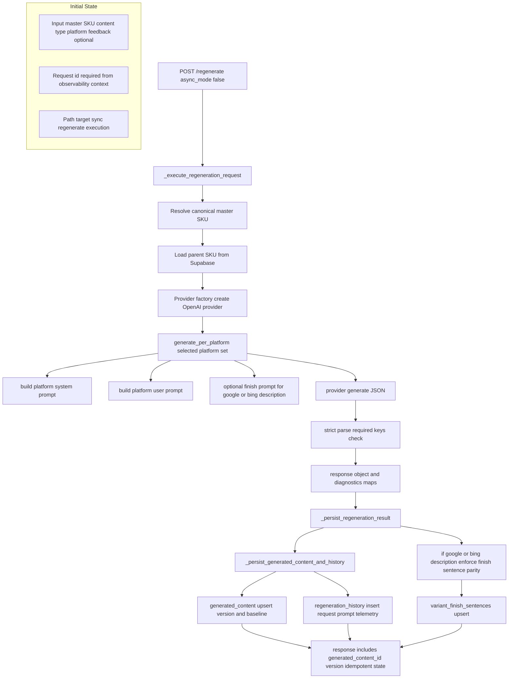

# D2 Regenerate Sync Path (As-Is)

```mermaid
flowchart TD
  subgraph Initial_State["Initial State"]
    I1["Input master SKU content type platform feedback optional"]
    I2["Request id required from observability context"]
    I3["Path target sync regenerate execution"]
  end

  A["POST /regenerate async_mode false"] --> B["_execute_regeneration_request"]
  B --> C["Resolve canonical master SKU"]
  C --> D["Load parent SKU from Supabase"]
  D --> E["Provider factory create OpenAI provider"]
  E --> F["generate_per_platform selected platform set"]

  F --> F1["build platform system prompt"]
  F --> F2["build platform user prompt"]
  F --> F3["optional finish prompt for google or bing description"]

  F --> G["provider generate JSON"]
  G --> H["strict parse required keys check"]
  H --> I["response object and diagnostics maps"]

  I --> J["_persist_regeneration_result"]
  J --> K["_persist_generated_content_and_history"]
  K --> L["generated_content upsert version and baseline"]
  K --> M["regeneration_history insert request prompt telemetry"]

  J --> N["if google or bing description enforce finish sentence parity"]
  N --> O["variant_finish_sentences upsert"]

  L --> R["response includes generated_content_id version idempotent state"]
  M --> R
  O --> R
```
