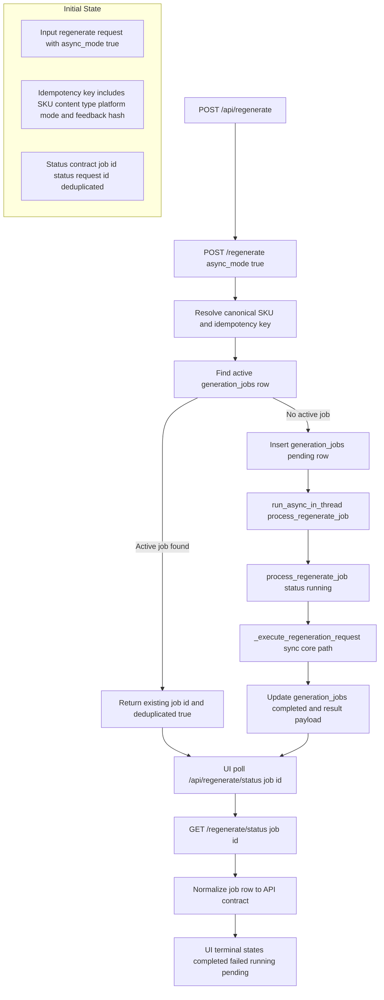

# D3 Regenerate Async Path (As-Is)

```mermaid
flowchart TD
  subgraph Initial_State["Initial State"]
    I1["Input regenerate request with async_mode true"]
    I2["Idempotency key includes SKU content type platform mode and feedback hash"]
    I3["Status contract job id status request id deduplicated"]
  end

  A["POST /api/regenerate"] --> B["POST /regenerate async_mode true"]
  B --> C["Resolve canonical SKU and idempotency key"]
  C --> D["Find active generation_jobs row"]

  D -->|"Active job found"| E["Return existing job id and deduplicated true"]
  D -->|"No active job"| F["Insert generation_jobs pending row"]
  F --> G["run_async_in_thread process_regenerate_job"]
  G --> H["process_regenerate_job status running"]
  H --> I["_execute_regeneration_request sync core path"]
  I --> J["Update generation_jobs completed and result payload"]

  E --> K["UI poll /api/regenerate/status job id"]
  J --> K
  K --> L["GET /regenerate/status job id"]
  L --> M["Normalize job row to API contract"]
  M --> N["UI terminal states completed failed running pending"]
```
