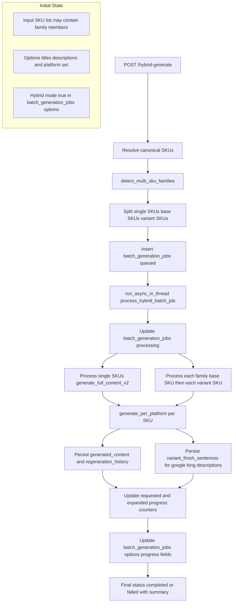

# D4 Hybrid Multi-Size Path (As-Is)

```mermaid
flowchart TD
  subgraph Initial_State["Initial State"]
    I1["Input SKU list may contain family members"]
    I2["Options titles descriptions and platform set"]
    I3["Hybrid mode true in batch_generation_jobs options"]
  end

  A["POST /hybrid-generate"] --> B["Resolve canonical SKUs"]
  B --> C["detect_multi_sku_families"]
  C --> D["Split single SKUs base SKUs variant SKUs"]

  D --> E["Insert batch_generation_jobs queued"]
  E --> F["run_async_in_thread process_hybrid_batch_job"]

  F --> G["Update batch_generation_jobs processing"]
  G --> H["Process single SKUs generate_full_content_v2"]
  G --> I["Process each family base SKU then each variant SKU"]

  H --> J["generate_per_platform per SKU"]
  I --> J

  J --> K["Persist generated_content and regeneration_history"]
  J --> L["Persist variant_finish_sentences for google bing descriptions"]

  K --> M["Update requested and expanded progress counters"]
  L --> M
  M --> N["Update batch_generation_jobs options progress fields"]
  N --> O["Final status completed or failed with summary"]
```
