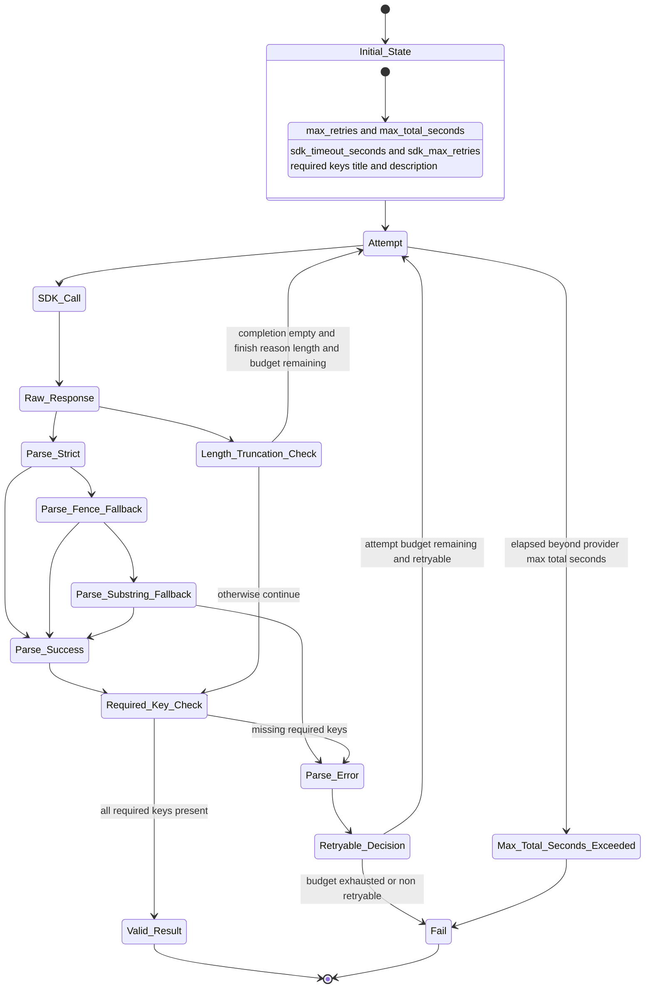

# D5 Provider Retry Timeout Parse State Machine (As-Is)

```mermaid
stateDiagram-v2
  [*] --> Initial_State

  state Initial_State {
    [*] --> Config
    Config: max_retries and max_total_seconds
    Config: sdk_timeout_seconds and sdk_max_retries
    Config: required keys title and description
  }

  Initial_State --> Attempt
  Attempt --> SDK_Call
  SDK_Call --> Raw_Response

  Raw_Response --> Parse_Strict
  Parse_Strict --> Parse_Success
  Parse_Strict --> Parse_Fence_Fallback
  Parse_Fence_Fallback --> Parse_Success
  Parse_Fence_Fallback --> Parse_Substring_Fallback
  Parse_Substring_Fallback --> Parse_Success
  Parse_Substring_Fallback --> Parse_Error

  Parse_Success --> Required_Key_Check
  Required_Key_Check --> Valid_Result: all required keys present
  Required_Key_Check --> Parse_Error: missing required keys

  Parse_Error --> Retryable_Decision
  Retryable_Decision --> Attempt: attempt budget remaining and retryable
  Retryable_Decision --> Fail: budget exhausted or non retryable

  Raw_Response --> Length_Truncation_Check
  Length_Truncation_Check --> Attempt: completion empty and finish reason length and budget remaining
  Length_Truncation_Check --> Required_Key_Check: otherwise continue

  Attempt --> Max_Total_Seconds_Exceeded: elapsed beyond provider max total seconds
  Max_Total_Seconds_Exceeded --> Fail

  Valid_Result --> [*]
  Fail --> [*]
```
