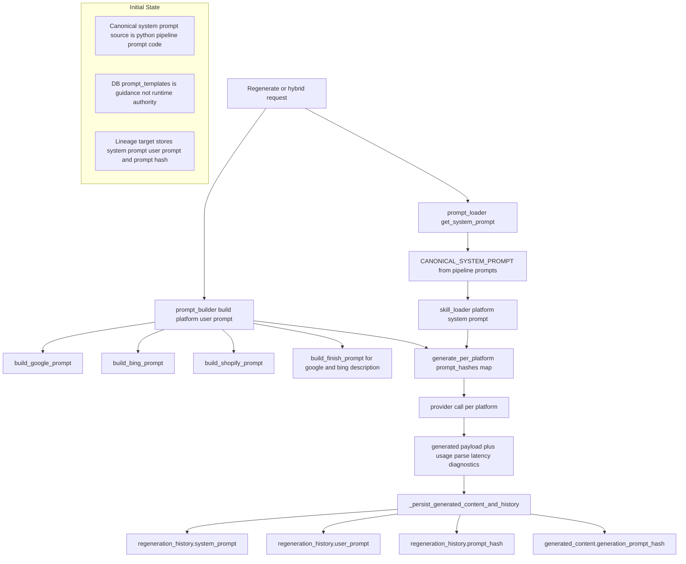

# D6 Prompt Assembly and Prompt Lineage Map (As-Is)

```mermaid
flowchart TD
  subgraph Initial_State["Initial State"]
    I1["Canonical system prompt source is python pipeline prompt code"]
    I2["DB prompt_templates is guidance not runtime authority"]
    I3["Lineage target stores system prompt user prompt and prompt hash"]
  end

  A["Regenerate or hybrid request"] --> B["prompt_loader get_system_prompt"]
  B --> C["CANONICAL_SYSTEM_PROMPT from pipeline prompts"]
  C --> D["skill_loader platform system prompt"]

  A --> E["prompt_builder build platform user prompt"]
  E --> E1["build_google_prompt"]
  E --> E2["build_bing_prompt"]
  E --> E3["build_shopify_prompt"]
  E --> E4["build_finish_prompt for google and bing description"]

  D --> F["generate_per_platform prompt_hashes map"]
  E --> F

  F --> G["provider call per platform"]
  G --> H["generated payload plus usage parse latency diagnostics"]

  H --> I["_persist_generated_content_and_history"]
  I --> J["regeneration_history.system_prompt"]
  I --> K["regeneration_history.user_prompt"]
  I --> L["regeneration_history.prompt_hash"]
  I --> M["generated_content.generation_prompt_hash"]
```
