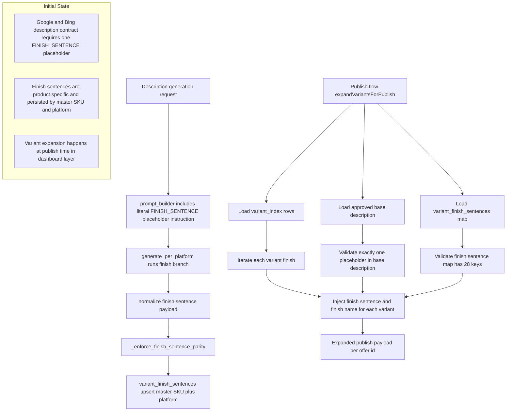

# D7 Finish Sentence Generation and Injection Map (As-Is)

```mermaid
flowchart TD
  subgraph Initial_State["Initial State"]
    I1["Google and Bing description contract requires one FINISH_SENTENCE placeholder"]
    I2["Finish sentences are product specific and persisted by master SKU and platform"]
    I3["Variant expansion happens at publish time in dashboard layer"]
  end

  A["Description generation request"] --> B["prompt_builder includes literal FINISH_SENTENCE placeholder instruction"]
  B --> C["generate_per_platform runs finish branch"]
  C --> D["normalize finish sentence payload"]

  D --> E["_enforce_finish_sentence_parity"]
  E --> F["variant_finish_sentences upsert master SKU plus platform"]

  G["Publish flow expandVariantsForPublish"] --> H["Load variant_index rows"]
  G --> I["Load variant_finish_sentences map"]
  G --> J["Load approved base description"]

  J --> K["Validate exactly one placeholder in base description"]
  I --> L["Validate finish sentence map has 28 keys"]
  H --> M["Iterate each variant finish"]

  M --> N["Inject finish sentence and finish name for each variant"]
  K --> N
  L --> N

  N --> O["Expanded publish payload per offer id"]
```
