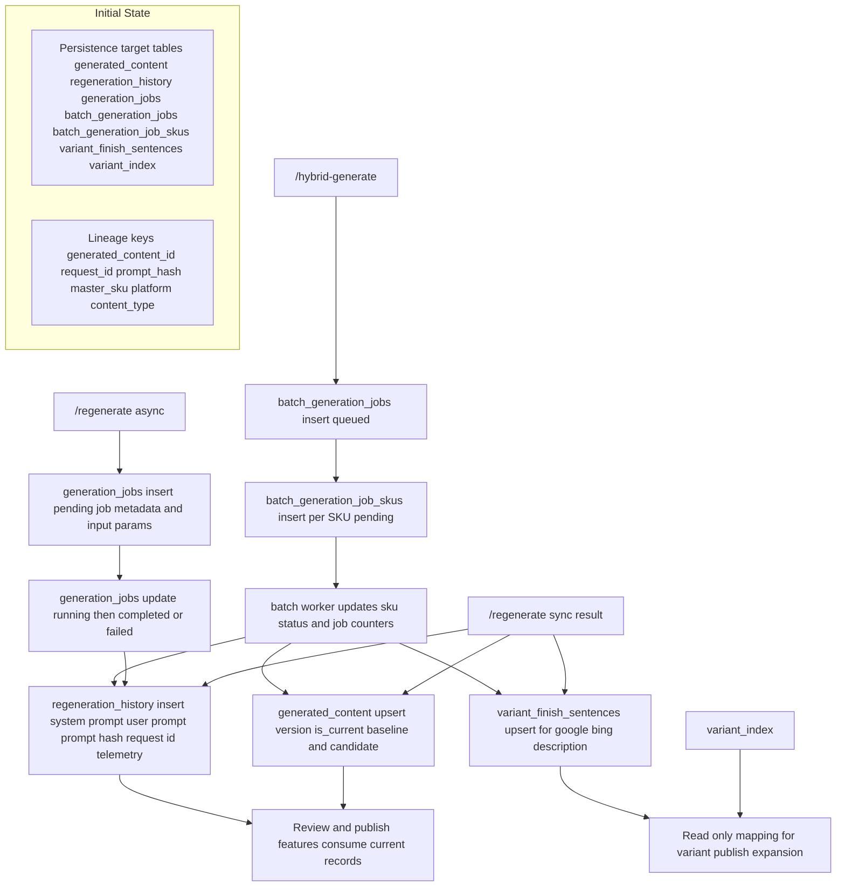

# D8 Persistence and Lineage Map (As-Is)

```mermaid
flowchart TD
  subgraph Initial_State["Initial State"]
    I1["Persistence target tables generated_content regeneration_history generation_jobs batch_generation_jobs batch_generation_job_skus variant_finish_sentences variant_index"]
    I2["Lineage keys generated_content_id request_id prompt_hash master_sku platform content_type"]
  end

  A["/regenerate sync result"] --> B["generated_content upsert version is_current baseline and candidate"]
  A --> C["regeneration_history insert system prompt user prompt prompt hash request id telemetry"]
  A --> D["variant_finish_sentences upsert for google bing description"]

  E["/regenerate async"] --> F["generation_jobs insert pending job metadata and input params"]
  F --> G["generation_jobs update running then completed or failed"]
  G --> C

  H["/hybrid-generate"] --> I["batch_generation_jobs insert queued"]
  I --> J["batch_generation_job_skus insert per SKU pending"]
  J --> K["batch worker updates sku status and job counters"]
  K --> B
  K --> C
  K --> D

  L["variant_index"] --> M["Read only mapping for variant publish expansion"]
  D --> M
  B --> N["Review and publish features consume current records"]
  C --> N
```
