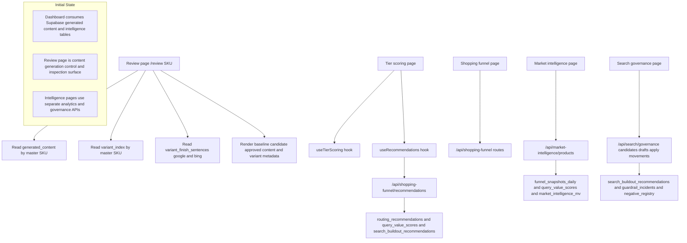

# D9 Dashboard Read Serve Map (As-Is)

```mermaid
flowchart TD
  subgraph Initial_State["Initial State"]
    I1["Dashboard consumes Supabase generated content and intelligence tables"]
    I2["Review page is content generation control and inspection surface"]
    I3["Intelligence pages use separate analytics and governance APIs"]
  end

  A["Review page /review SKU"] --> B["Read generated_content by master SKU"]
  A --> C["Read variant_index by master SKU"]
  A --> D["Read variant_finish_sentences google and bing"]
  A --> E["Render baseline candidate approved content and variant metadata"]

  F["Tier scoring page"] --> G["useTierScoring hook"]
  F --> H["useRecommendations hook"]
  H --> H1["/api/shopping-funnel/recommendations"]

  J["Shopping funnel page"] --> J1["/api/shopping-funnel routes"]
  K["Market intelligence page"] --> K1["/api/market-intelligence/products"]
  L["Search governance page"] --> L1["/api/search/governance candidates drafts apply movements"]

  H1 --> M["routing_recommendations and query_value_scores and search_buildout_recommendations"]
  K1 --> N["funnel_snapshots_daily and query_value_scores and market_intelligence_mv"]
  L1 --> O["search_buildout_recommendations and guardrail_incidents and negative_registry"]
```
