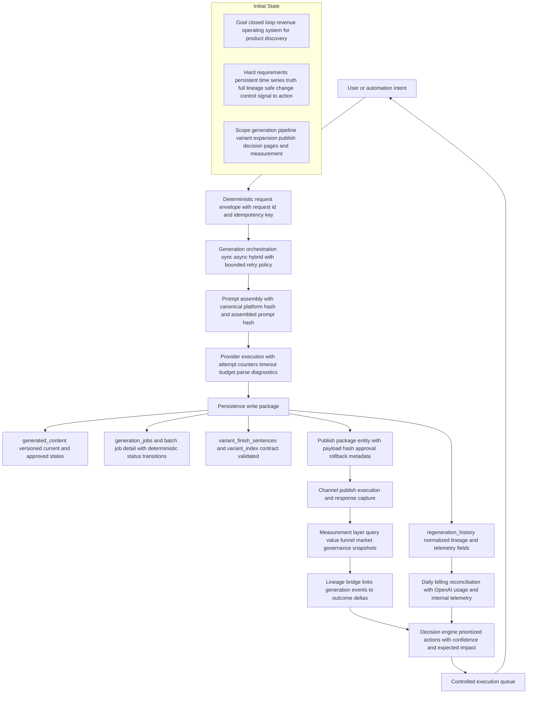

# As-Is Single-SKU + Hybrid Trace, Supabase Persistence Audit, and Architecture Review

## 1) Scope and Reproducibility Header
- Repository: `/Users/bobby/Documents/GitHub/Allied-FeedOps`
- Branch: `codex/e245-asis-trace-and-architecture-audit-20260227`
- Commit: `d2aea9335c720c9c445df6133ac57544ee2b743a`
- Date: `2026-02-27`
- Cases traced:
  - Case A: `CL-55` (Google title + Google description)
  - Case B: `1033` family (`1033/18` evidence row in hybrid path)
- Mode: As-is trace first, then architecture review and recommendations.

## 2) Deliverables Produced
- Trace matrix: `/Users/bobby/Documents/GitHub/Allied-FeedOps/docs/experiments/2026-02-27-single-sku-hybrid-as-is-trace/trace-matrix.md`
- Mermaid suite D1-D12:
  - `/Users/bobby/Documents/GitHub/Allied-FeedOps/docs/experiments/2026-02-27-single-sku-hybrid-as-is-trace/diagrams/D1-system-entry-map.md`
  - `/Users/bobby/Documents/GitHub/Allied-FeedOps/docs/experiments/2026-02-27-single-sku-hybrid-as-is-trace/diagrams/D2-regenerate-sync-path.md`
  - `/Users/bobby/Documents/GitHub/Allied-FeedOps/docs/experiments/2026-02-27-single-sku-hybrid-as-is-trace/diagrams/D3-regenerate-async-path.md`
  - `/Users/bobby/Documents/GitHub/Allied-FeedOps/docs/experiments/2026-02-27-single-sku-hybrid-as-is-trace/diagrams/D4-hybrid-multi-size-path.md`
  - `/Users/bobby/Documents/GitHub/Allied-FeedOps/docs/experiments/2026-02-27-single-sku-hybrid-as-is-trace/diagrams/D5-provider-retry-timeout-parse-state-machine.md`
  - `/Users/bobby/Documents/GitHub/Allied-FeedOps/docs/experiments/2026-02-27-single-sku-hybrid-as-is-trace/diagrams/D6-prompt-assembly-lineage-map.md`
  - `/Users/bobby/Documents/GitHub/Allied-FeedOps/docs/experiments/2026-02-27-single-sku-hybrid-as-is-trace/diagrams/D7-finish-sentence-generation-injection-map.md`
  - `/Users/bobby/Documents/GitHub/Allied-FeedOps/docs/experiments/2026-02-27-single-sku-hybrid-as-is-trace/diagrams/D8-persistence-lineage-map.md`
  - `/Users/bobby/Documents/GitHub/Allied-FeedOps/docs/experiments/2026-02-27-single-sku-hybrid-as-is-trace/diagrams/D9-dashboard-read-serve-map.md`
  - `/Users/bobby/Documents/GitHub/Allied-FeedOps/docs/experiments/2026-02-27-single-sku-hybrid-as-is-trace/diagrams/D10-environment-parity-resolution-map.md`
  - `/Users/bobby/Documents/GitHub/Allied-FeedOps/docs/experiments/2026-02-27-single-sku-hybrid-as-is-trace/diagrams/D11-spend-attribution-map.md`
  - `/Users/bobby/Documents/GitHub/Allied-FeedOps/docs/experiments/2026-02-27-single-sku-hybrid-as-is-trace/diagrams/D12-failure-taxonomy-map.md`

## 3) Evidence Inventory (As-Is)
Evidence path: `/Users/bobby/Documents/GitHub/Allied-FeedOps/docs/experiments/2026-02-27-single-sku-hybrid-as-is-trace/evidence/`

### 3.1 Prompt artifacts
- Case A prompt lineage:
  - `prompts/case-a-cl55-google-description.json`
  - `prompts/case-a-cl55-google-description.system_prompt.txt`
  - `prompts/case-a-cl55-google-description.user_prompt.txt`
- Case B prompt lineage:
  - `prompts/case-b-1033-18-google-description.json`
  - `prompts/case-b-1033-18-google-description.system_prompt.txt`
  - `prompts/case-b-1033-18-google-description.user_prompt.txt`

### 3.2 Content artifacts
- Case A:
  - `content/case-a-cl55-google-title.json`
  - `content/case-a-cl55-google-description.json`
  - baseline/candidate/approved content snapshots (.txt)
- Case B:
  - `content/case-b-1033-18-google-description.json`
  - candidate content snapshot (.txt)

### 3.3 Job and variant artifacts
- Async regenerate example:
  - `generation_jobs.async-example-c3e89bb8.json`
- Hybrid batch example:
  - `batch_generation_jobs.case-b-0c52acdc.json`
  - `batch_generation_job_skus.case-b-0c52acdc.json`
- Variant mappings:
  - `variant_index.case-a-cl55.json`
  - `variant_index.case-b-1033-18.json`
  - `variant_index.case-b-1033-24.json`
- Finish sentence maps:
  - `variant_finish_sentences.case-a-cl55-google.json`
  - `variant_finish_sentences.case-b-1033-18-google.json`

## 4) Supabase Persistence Audit
Project: `qezuszwufortkiutlhym`

### 4.1 Table-by-table expectation matrix

| Table                       | Role in pipeline                                                           | Required lineage fields                                                                                                      | As-is status                                                              |
| --------------------------- | -------------------------------------------------------------------------- | ---------------------------------------------------------------------------------------------------------------------------- | ------------------------------------------------------------------------- |
| `generated_content`         | Current versioned content store per `master_sku + platform + content_type` | `id`, `master_sku`, `platform`, `content_type`, `version`, `is_current`, `generation_prompt_hash`                            | Present and populated for traced rows                                     |
| `regeneration_history`      | Event-level lineage for each regenerate write                              | `generated_content_id`, `request_id`, `prompt_hash`, `system_prompt`, `user_prompt`, `latency_ms`, `tokens_used`, `cost_usd` | Present for traced IDs; hybrid row has null `tokens_used` and `cost_usd`  |
| `generation_jobs`           | Async job queue/state for `/regenerate`                                    | `id`, `status`, `input_params`, `result`, `attempt_count`, timestamps                                                        | Present; request-id linkage validated                                     |
| `variant_finish_sentences`  | Per `master_sku + platform` finish sentence map for expansion              | `finish_sentences` jsonb, timestamps                                                                                         | Present for both traced SKUs with 28 keys each                            |
| `variant_index`             | Variant mapping for expansion and publish payload fanout                   | `master_sku`, `gmc_offer_id`, `finish`, `option_sku`                                                                         | Present; 28 rows each for traced SKU sets                                 |
| `batch_generation_jobs`     | Batch/hybrid job control plane                                             | status/counters/options/error timestamps                                                                                     | Present; traced hybrid job marked failed with partial completion          |
| `batch_generation_job_skus` | Per-SKU status rows under batch job                                        | `job_id`, `master_sku`, status fields                                                                                        | Table populated globally; selected job evidence file returned empty array |

### 4.2 Row-count snapshot
- `generated_content`: `585`
- `regeneration_history`: `1234`
- `generation_jobs`: `1`
- `variant_finish_sentences`: `196`
- `variant_index`: `72023`
- `batch_generation_jobs`: `27`
- `batch_generation_job_skus`: `108`

### 4.3 Traced lineage rows

| ID                                     | master_sku | platform | content_type  | request_id                             | prompt_hash       | generated_content_id                   | latency_ms | tokens_used |   cost_usd | mode                 |
| -------------------------------------- | ---------- | -------- | ------------- | -------------------------------------- | ----------------- | -------------------------------------- | ---------: | ----------: | ---------: | -------------------- |
| `ec9ecd1e-c1e9-4874-9b88-bec221eabbbf` | `CL-55`    | `google` | `title`       | `84f30f6e-e7f4-45ad-a36b-455779fd5ebf` | `e0a1886c...d648` | `8300a24f-d4c0-439b-87d1-94768f069bbe` |    `98763` |     `10835` | `0.101391` | `simple`             |
| `365a2417-186f-43dc-badb-a0c4cd331642` | `CL-55`    | `google` | `description` | `94f95f95-2f3b-4ae3-9592-b1fddeabef55` | `e0a1886c...d648` | `8d276b39-84ff-4fe8-a0d3-3b3f972411c0` |    `62963` |     `15136` | `0.136442` | `simple`             |
| `dba1a8cb-00c1-48ca-b017-b7a1f7fd5aba` | `1033/18`  | `google` | `description` | `6d0dafc52b9b43c8bfb322da8e700b41`     | `95ccb84c...d10f` | `fce0e4b2-e3d3-4b99-971d-865630b2bafd` |   `231308` |      `null` |     `null` | `full_generation_v2` |
| `313abf61-69c7-40bf-8c89-4debf432fdd9` | `1031/30`  | `google` | `title`       | `673e0863-ea52-475d-aa23-87ca194d139d` | `e0ce4f8d...afa8` | `50e8a7b0-5787-47d7-a915-be78d91b8d4c` |    `38564` |      `null` |     `null` | `with_feedback`      |

### 4.4 Generated content rows linked to traced lineage

| generated_content.id                   | master_sku | platform | content_type  | version | is_current | generation_prompt_hash | generation_timestamp     |
| -------------------------------------- | ---------- | -------- | ------------- | ------: | ---------- | ---------------------- | ------------------------ |
| `8300a24f-d4c0-439b-87d1-94768f069bbe` | `CL-55`    | `google` | `title`       |    `11` | `true`     | `e0a1886c...d648`      | `2026-02-27 06:22:04+00` |
| `8d276b39-84ff-4fe8-a0d3-3b3f972411c0` | `CL-55`    | `google` | `description` |     `9` | `true`     | `e0a1886c...d648`      | `2026-02-27 06:24:03+00` |
| `fce0e4b2-e3d3-4b99-971d-865630b2bafd` | `1033/18`  | `google` | `description` |     `1` | `true`     | `95ccb84c...d10f`      | `null`                   |

### 4.5 Finish sentence and variant mapping checks
- `variant_finish_sentences`:
  - `CL-55/google`: `28` keys
  - `1033/18/google`: `28` keys
- `variant_index` rows:
  - `CL-55`: `28` rows, `28` finishes
  - `1033/18`: `28` rows, `28` finishes
  - `1033/24`: `28` rows, `28` finishes

### 4.6 Orphan checks
All three checks returned zero:
1. `regeneration_history.generated_content_id` with missing `generated_content`
2. `generation_jobs` request_id with no matching `regeneration_history.request_id`
3. `batch_generation_job_skus.job_id` with missing parent `batch_generation_jobs`

## 5) Case A As-Is Trace (CL-55)

### 5.1 Request and persistence
- Google title and description rows persisted with shared prompt hash and distinct request IDs.
- Prompt lineage present (`system_prompt`, `user_prompt`, `prompt_hash`) in `regeneration_history`.
- `tokens_used`, `latency_ms`, `cost_usd` are populated for these two rows.

### 5.2 Prompt lineage proof
- `regeneration_history.id = 365a2417-186f-43dc-badb-a0c4cd331642`
- `request_id = 94f95f95-2f3b-4ae3-9592-b1fddeabef55`
- `prompt_hash = e0a1886cac64f3bc618977625d91e55898d1993b68e768da165557877c93d648`
- Full prompt text captured in section 8 (verbatim).

### 5.3 Content snapshots (as stored)
- Baseline description snapshot does not include `{FINISH_SENTENCE}`.
- Candidate and approved snapshots include `{FINISH_SENTENCE}` exactly once.
- As-is implication: current row history shows contract-aligned text now, with older baseline revision still in lineage.

## 6) Case B As-Is Trace (1033 family via hybrid)

### 6.1 Hybrid job record
- `batch_generation_jobs.id = 0c52acdc-ac07-4437-8731-40432ec47a1a`
- `status = failed`
- `total_skus = 2`, `completed_skus = 1`, `failed_skus = 1`
- `options.hybrid = true`, `platforms = [google]`, `titles = false`, `descriptions = true`
- `error_message = Requested: 1/2 completed, 1 failed; Expanded: 0/0 completed, 0 failed`

### 6.2 1033/18 description lineage
- `regeneration_history.id = dba1a8cb-00c1-48ca-b017-b7a1f7fd5aba`
- `request_id = 6d0dafc52b9b43c8bfb322da8e700b41`
- `prompt_hash = 95ccb84cbd95ee645a5188922220947b0e48873aa551ecffdce178deba0fd10f`
- `latency_ms = 231308`
- `tokens_used = null`, `cost_usd = null`
- `generated_content.id = fce0e4b2-e3d3-4b99-971d-865630b2bafd`, `is_current = true`, `version = 1`

### 6.3 Finish/variant coverage
- `variant_finish_sentences` for `1033/18/google` contains `28` finish sentence entries.
- `variant_index` case files confirm 28-variant family slices for `1033/18` and `1033/24`.

## 7) As-Is End-to-End Code Trace (Line Anchors)

### 7.1 Dashboard orchestration
- Regenerate route request handling and forwarding with `X-Request-ID` and async contract:
  - `dashboard/src/app/api/regenerate/route.ts:115`, `:202`, `:215`, `:244`, `:264`
- UI async polling and dedupe response handling:
  - `dashboard/src/components/review/RegenerateButton.tsx:89`, `:95`, `:134`, `:148`, `:153`
- Review page read path (`generated_content`, `variant_index`, `variant_finish_sentences`):
  - `dashboard/src/app/(dashboard)/review/[sku]/page.tsx:114`, `:195`, `:296`, `:309`

### 7.2 Python API runtime
- Persistence core:
  - `_persist_regeneration_result`: `src/feedops/api/main.py:688`
  - `_persist_generated_content_and_history`: `src/feedops/api/main.py:805`
- Finish-sentence parity:
  - `_enforce_finish_sentence_parity`: `src/feedops/api/main.py:1070`
- Core regenerate execution:
  - `_execute_regeneration_request`: `src/feedops/api/main.py:1335`
- Async queue/status:
  - `/regenerate`: `src/feedops/api/main.py:1644`
  - `/regenerate/status/{job_id}`: `src/feedops/api/main.py:1719`
  - `process_regenerate_job`: `src/feedops/api/main.py:1588`
- Hybrid batch:
  - `/hybrid-generate`: `src/feedops/api/main.py:1941`
  - `process_hybrid_batch_job`: `src/feedops/api/main.py:2205`

### 7.3 Prompt and provider layers
- Canonical system prompt sourcing and hash:
  - `src/feedops/api/prompt_loader.py:20`, `:143`, `:166`, `:218`
- Prompt builders and finish placeholder contract:
  - `src/feedops/api/prompt_builder.py:278`, `:317`, `:363`, `:396`, `:491`
- Platform generation and diagnostics maps:
  - `src/feedops/pipeline/generator.py:377`, `:446`, `:462`, `:477`, `:534`, `:555`
- Strict parse and retry budget behavior:
  - `src/feedops/providers/openai_provider.py:25`, `:98`, `:170`, `:300`, `:441`
- Provider env control knobs:
  - `src/feedops/providers/factory.py:45`, `:46`, `:47`, `:48`

### 7.4 Variant expansion publish path
- Placeholder enforcement and finish sentence completeness checks:
  - `dashboard/src/lib/publishing/expand-variants.ts:216`, `:229`, `:372`, `:419`

### 7.5 Decision-plane page and API linkage anchors
- Tier scoring page and hooks:
  - `dashboard/src/app/(dashboard)/tier-scoring/page.tsx:38`
  - `dashboard/src/app/(dashboard)/tier-scoring/hooks/useRecommendations.ts:76`, `:124`, `:305`
- Market intelligence page and API:
  - `dashboard/src/app/(dashboard)/market-intelligence/page.tsx:26`
  - `dashboard/src/app/api/market-intelligence/products/route.ts:76`, `:213`, `:281`
  - `dashboard/src/app/api/market-intelligence/demand/route.ts:77`, `:182`
- Search governance page and API:
  - `dashboard/src/app/(dashboard)/search-governance/page.tsx:148`, `:185`, `:234`, `:276`
  - `dashboard/src/app/api/search/governance/candidates/route.ts:82`
  - `dashboard/src/app/api/search/governance/movements/route.ts:129`, `:153`
  - `dashboard/src/app/api/search/governance/apply/route.ts:104`
- Shopping funnel API linkage used by recommendation hooks:
  - `dashboard/src/app/api/shopping-funnel/recommendations/route.ts:29`, `:362`, `:395`
  - `dashboard/src/app/api/shopping-funnel/tier-scoring/route.ts:218`, `:281`

## 8) Full Prompt Captures (Verbatim)

### 8.1 Case A system prompt (CL-55 Google description)

`source: evidence/prompts/case-a-cl55-google-description.system_prompt.txt`

```text
<creative_direction>
You are writing content that makes shoppers click Allied Brass instead of the Home Depot listing next to it.

Great Allied Brass content leads with what makes THIS SPECIFIC PRODUCT's design special — grounded in evidence from the product data. The first sentence should anchor on a concrete, verifiable design detail or function that differentiates this product, not a manufactured scenario or generic category benefit.
Find the ONE design detail that makes THIS product worth noticing and lead with it — what would a bathroom designer point out that a shopper wouldn't?

DO NOT invent usage scenarios, room contexts, or product features that aren't supported by the evidence table. If the evidence says "reeded texture" — use it. If the evidence says nothing about a spring mechanism — don't mention one.

Use the product's own story (from current_description, bullets, material, collection, mounting_type) as the foundation.

Use specificity as proof, not adjectives. "Solid brass — the same material trusted in marine hardware because it won't corrode, pit, or tarnish" beats "high-quality materials." Every factual detail earns trust; every vague adjective loses it.
</creative_direction>

<objective_hierarchy>
Primary objective: produce the strongest product-specific content for the target platform so the right shopper clicks and buys.

Priority order:
1. Product truth and factual accuracy from evidence.
2. Clear, product-specific differentiation a real shopper can understand quickly.
3. Platform readability and format compliance.
4. Keyword enrichment only when it improves priorities 1-3.

If a keyword hint conflicts with product truth, category fidelity, or natural language clarity, ignore the hint.
</objective_hierarchy>

<brand_voice>
Allied Brass voice: confident but not arrogant, specific and concrete, warm and inviting. Design-aware but practical.

Banned words (never use): finest, luxurious, premium, exclusive, exceptional, unparalleled, superior, exquisite, ultimate

Banned phrases (never use): "heritage bathroom fixtures", "common die-cast zinc", "plated alternatives", "also searched as", "also known as"
</brand_voice>

<accuracy_guardrail>
CRITICAL: Every claim, feature, and usage scenario must be verifiable from the product evidence table. This is the #1 priority — factual accuracy overrides creative engagement.

Prohibited fabrications:
- DO NOT invent product mechanisms (e.g., "spring-loaded", "quick-release") unless evidence confirms them
- DO NOT invent usage contexts (e.g., "hang it along the tub wall") unless the product type and evidence support it
- DO NOT claim specific certifications (ADA, etc.) unless evidence explicitly confirms them
- DO NOT describe how the product feels, sounds, or operates beyond what evidence states

When uncertain about a product feature, use conservative language ("designed for", "suitable for") rather than specific claims. Omitting a detail is always better than fabricating one.

Content prohibitions (from human evaluation feedback):
- Do NOT include weight capacity in descriptions — it creates consumer doubt rather than confidence
- Do NOT include detailed dimensions (width, height, projection, depth) — only the primary searchable dimension (e.g., overall length for towel bars, diameter for mirrors)
- Do NOT use "also searched as," "also known as," or similar keyword list patterns — all keywords must be integrated naturally
- Do NOT name competitor materials: "die-cast zinc," "zinc alloy," "plated alternatives," "chrome-plated steel," "hollow zinc" — frame solid brass positively, never by contrast with cheaper materials
- Do NOT use "heritage bathroom fixtures" or any invented category terms not in the evidence
- In variant-facing descriptions, do NOT mention finish variety counts (e.g., "28 finishes")
- Never use banned promo words in customer-facing copy: finest, luxurious, premium, exclusive, exceptional, unparalleled, superior, exquisite, ultimate

Banned content: No internal SKUs, pipeline terms, source citations, URLs, prices, shipping promises, or keyword lists.
</accuracy_guardrail>

<output_contract>
Return ONE valid JSON object that matches the platform schema exactly. Do not add extra keys.
The claims array must trace every factual claim to a specific evidence field and value.
</output_contract>


<platform_rules>
Google fields only:
- google_title: variant-aware and must begin with literal {FINISH_NAME}
- google_short_title: concise scannable short title
- google_description: plain text variant description that includes literal {FINISH_SENTENCE}

Do not generate Bing or Shopify behavior in this task.
</platform_rules>

<google_objective_priority>
Google optimization order:
1. Product truth and category-faithful naming.
2. Specific differentiation that helps a shopper choose this product.
3. Readable, scan-friendly phrasing that sounds human.
4. Keyword enrichment only when it improves 1-3.

Never force awkward copy to satisfy keyword hints.
Write product copy, not commentary about search behavior.
</google_objective_priority>

<finish_sentence_contract>
{FINISH_SENTENCE} is generated in a separate finish-sentence API call from the same product evidence.
In this Google description call, treat {FINISH_SENTENCE} as a pre-written sentence that will be inserted
during variant expansion (one finish sentence per variant).

Integration requirements:
- Use {FINISH_SENTENCE} exactly once, as its own sentence.
- Keep sentence flow natural before and after insertion.
- Do not rewrite, paraphrase, or expand {FINISH_SENTENCE}.

Good flow:
"[Product-specific opening sentence]. {FINISH_SENTENCE} [Evidence-based support sentence]."
Good flow:
"[Concrete spec opening sentence.] [Differentiator sentence.] {FINISH_SENTENCE} [Trust close sentence]."
Anti-example:
"If you're searching for options, {FINISH_SENTENCE} {FINISH_SENTENCE} [fragment]."
</finish_sentence_contract>

<title_formula>
Write Google Shopping titles using this exact structure:

{FINISH_NAME} [Product Function] [Collection Name Collection*] [Primary Dimension*] [Optional Style Cue*] - Allied Brass

Rules:
- {FINISH_NAME} is ALWAYS the first element. It is a literal placeholder — output it exactly.
- Product function in the first 30 characters after {FINISH_NAME} (e.g., "Towel Bar", "Robe Hook", "Soap Dish").
- Product noun must match the category intent in evidence:
  - Category "Towel Bars" -> use "Towel Bar" (not "Towel Rack")
- Category "Robe Hooks" -> use "Robe Hook"
- Category "Toilet Paper Holders" -> use "Toilet Paper Holder"
- If the product belongs to a named collection, include "[Name] Collection" (always with the word "Collection").
- Include the primary dimension ONLY when the product varies by size (towel bars: yes; robe hooks: no).
- Add a style cue only when evidence supports it (style, collection language, or current description). If unsupported, omit it.
- "Solid Brass" should NOT appear in the title — save prime title space for converting keywords.
- "Allied Brass" is always the final segment, separated by a dash or comma.
- For towel-bar categories, NEVER include the phrase "towel rack" in Google title text. Use "Towel Bar" only.
- Total length: 60-150 characters. Shorter is better if it captures the key terms.

Good: {FINISH_NAME} 24-Inch Towel Bar - Skyline Collection - Allied Brass
Good: {FINISH_NAME} Robe Hook, Contemporary Wall Mount - Waverly Place Collection - Allied Brass
Bad: {FINISH_NAME} 24-Inch Wall Mounted Solid Brass Towel Rack - Skyline Bathroom Towel Holder Brass - Allied Brass  ← keyword-stuffed
Bad: {FINISH_NAME} Solid Brass Robe Hook (2.5" x 2.5" x 1.5") - Allied Brass  ← unnecessary dims
</title_formula>

<google_short_title>
Max 70 characters. Product type + primary dimension only. No brand, no collection, no finish.
Category-fidelity rule still applies:
- "Towel Bars" category -> short title must use "Towel Bar" (never "Towel Rack")
Example: "24-Inch Wall Mounted Towel Bar" or "Double Robe Hook"
</google_short_title>

<description_brief>
Write a Google Shopping description that makes a shopper pick Allied Brass over the generic listing next to it.

Structure (700-900 characters target, plain text; never add filler just to hit length):
1. OPEN with what makes THIS product's design special — a concrete detail from the evidence (e.g., "petite spherical end pieces," "reeded texture grip," "concealed post design"). Not a generic benefit.
2. Place {FINISH_SENTENCE} exactly once where finish context flows naturally — typically after the design opening or as a transition sentence. It is a literal placeholder; output it exactly as {FINISH_SENTENCE}.
3. BUILD with 2-3 evidence-grounded selling points: solid brass durability, collection coordination, mounting style, or a design detail that differentiates this product.
4. CLOSE with a practical trust signal: warranty, what's included, or installation confidence.

What to INCLUDE:
- Product-specific design details from the evidence (dimensions, mounting type, design elements)
- The primary searchable dimension (overall length for bars, diameter for mirrors)
- Collection name when available (for coordination selling)
- Natural keyword integration only when it improves clarity and buying intent.
- Translate keyword hints into clean buyer language; do not mirror raw query fragments.

What to EXCLUDE (these kill conversions or create doubt):
- Weight capacity (creates doubt, not confidence)
- Detailed dimensions beyond the primary one (width, height, projection, depth — these belong in the spec sheet)
- Competitor material names (die-cast zinc, plated alternatives, zinc alloy, chrome-plated steel)
- "Heritage bathroom fixtures" or invented category terms
- "Also searched as" or keyword list patterns
- Meta-search commentary (e.g., mentioning what someone searched for)
- "28 finishes" or finish count references (this listing IS a specific finish variant)
- "Bathroom humidity" as a key selling point (technically true but feels like filler)
- Installation specifics (screw sizes, exact hardware counts)
</description_brief>

<output_contract>
Return JSON with keys: google_title, google_short_title, google_description, claims.
</output_contract>

<final_quality_gate>
Before returning JSON, perform one silent final pass:
- Remove banned promo words (finest, luxurious, premium, exclusive, exceptional, unparalleled, superior, exquisite, ultimate).
- Remove any meta-search narration ("if you're searching", "if you've been comparing", etc.).
- For "Towel Bars" category, keep "Towel Bar" terminology in both google_title and google_short_title.
If any violation appears, rewrite before returning.
</final_quality_gate>
```

### 8.2 Case A user prompt (CL-55 Google description)

`source: evidence/prompts/case-a-cl55-google-description.user_prompt.txt`

```text
<task>Generate Google Shopping content for MasterSKU: CL-55.</task>

<objective>
Create the best product-specific Google title and description for this exact product.
Prioritize conversion clarity and factual accuracy over keyword density.
</objective>

<placeholders>
Use the literal string {FINISH_NAME} where the finish name belongs in the title.
{FINISH_SENTENCE} is generated by a separate finish-sentence API call and inserted during variant expansion.
In this call, place the literal string {FINISH_SENTENCE} exactly once as its own sentence where finish context flows naturally.
Good flow: [Design-specific opening.] {FINISH_SENTENCE} [Material or trust close.]
Good flow: [Concrete spec opening.] [Benefit sentence.] {FINISH_SENTENCE} [Warranty/what's included close.]
Bad flow: [Awkward transition ...] {FINISH_SENTENCE} {FINISH_SENTENCE} [duplicate or broken sentence].
These are literal placeholders — output them exactly. Do not expand, paraphrase, or replace them.
</placeholders>

<evidence_table>
## Available Product Data

| Attribute              | Value                                                                                                                                                                                                                                                                                                       | Source              |
| ---------------------- | ----------------------------------------------------------------------------------------------------------------------------------------------------------------------------------------------------------------------------------------------------------------------------------------------------------- | ------------------- |
| current_title          | Carolina Collection Counter Top Paper Towel Stand                                                                                                                                                                                                                                                           | current_title       |
| current_description    | Elegantly hold your paper towel roll on this classic traditional design paper towel stand. Its design is as functional as it is practical. The roll in the stand sits upright on the counter top allowing for space saving. It has a weight in the base to keep the unit stable as you tear off the sheets. | current_description |
| material               | Brass                                                                                                                                                                                                                                                                                                       | material            |
| style                  | Traditional                                                                                                                                                                                                                                                                                                 | style               |
| mounting_type          | Freestanding                                                                                                                                                                                                                                                                                                | mounting_type       |
| assembly_required      | False                                                                                                                                                                                                                                                                                                       | assembly_required   |
| center_to_center       | 0 in                                                                                                                                                                                                                                                                                                        | center_to_center    |
| included_items         | Paper towel holder.                                                                                                                                                                                                                                                                                         | included_items      |
| bullet_1               | Crafted from the solid brass materials                                                                                                                                                                                                                                                                      | bullet_1            |
| bullet_2               | Contemporary design with traditional design elements                                                                                                                                                                                                                                                        | bullet_2            |
| bullet_3               | Space saving design makes efficient use of your space                                                                                                                                                                                                                                                       | bullet_3            |
| bullet_4               | Felt pad will prevent scratching on any surface                                                                                                                                                                                                                                                             | bullet_4            |
| bullet_5               | Designer finish will provide Corrosion-free and rust-free performance                                                                                                                                                                                                                                       | bullet_5            |
| bullet_6               | Limited Lifetime Warranty                                                                                                                                                                                                                                                                                   | bullet_6            |
| product_length         | 6.5 in                                                                                                                                                                                                                                                                                                      | product_length      |
| search_query_themes    | Material: brass/copper/gold, Style: antique, Function: toilet paper holder/towel holder                                                                                                                                                                                                                     | search_insights     |
| design_style           | traditional (elegant, timeless, refined, luxurious)                                                                                                                                                                                                                                                         | enrichment_style    |
| feature_title_keywords | Freestanding                                                                                                                                                                                                                                                                                                | enrichment_features |
| feature_benefits       | freestanding design requires no wall mounting                                                                                                                                                                                                                                                               | enrichment_features |
</evidence_table>

<product_design_story>
Category: Paper Towel Holders
Collection: Carolina
Manufacturer description: Elegantly hold your paper towel roll on this classic traditional design paper towel stand. Its design is as functional as it is practical. The roll in the stand sits upright on the counter top allowing for space saving. It has a weight in the base to keep the unit stable as you tear off the sheets.
Product selling points:
- Crafted from the solid brass materials
- Contemporary design with traditional design elements
- Space saving design makes efficient use of your space
- Felt pad will prevent scratching on any surface
Mounting type: Freestanding
Style: Traditional
</product_design_story>

<competitive_positioning>
Solid brass construction confirmed — frame this positively (won't corrode, pit, or tarnish) without naming competitor materials. Focus on what makes THIS product's design better than alternatives. Never mention competitor materials by name.
</competitive_positioning>

<keyword_enrichment_hints>
Use keyword hints only when they improve shopper clarity and conversion relevance.
Do not force awkward phrasing. Distill hints into clean buyer language instead of mirroring raw query fragments.
Do not mention what a shopper searched for; write direct product copy.
If a hint conflicts with product truth, category fidelity, or natural language, ignore it.

## Keyword Placement Plan (Deterministic) These phrases represent search intent only; do NOT treat them as product facts or claims. Primary intent anchor (use naturally in the title; adapt wording to accurately describe THIS product): paper towel holder Distilled high-signal intent terms (top 6): - paper towel holder - brass paper towel holder - allied brass - paper towel holders - paper towel holder countertop - traditional bathroom hardware Google short title must include: paper towel holder Title support terms (after 70 chars when space allows): - brass paper towel holder - allied brass Description terms (include at least 2 naturally in the description): - brass paper towel holder - allied brass - paper towel holders - paper towel holder countertop - traditional bathroom hardware Optional buyer phrasing hints (use only if natural): - brass paper towel holder - allied brass - paper towel holders - paper towel holder countertop Brand rule: google_title and bing_title must end with Allied Brass Shopify rule: shopify_title must not include Allied Brass Room context: kitchen (use appropriate language; never describe as the other room type)
</keyword_enrichment_hints>

<gold_examples>
Example 1 (Paper Towel Holders): Google title: Solid Brass Wall Mounted Paper Towel Holder - Skyline Collection Kitchen Hardware - Allied Brass Google description: Free up counter space and keep a full roll at tearing height — this wall-mounted paper towel holder is constructed of solid brass, not the hollow zinc tubing that loosens after a few months of one-handed pulls. {FINISH_SENTENCE} The 5-inch projection holds standard and jumbo rolls without crowding your backsplash, while concealed screw mounting keeps the wall clean with no visible hardware. Solid brass construction means this holder won't corrode, wobble, or need replacing — even mounted next to the sink where steam and splashes are constant. Part of the Skyline Collection, so it coordinates with matching towel bars, soap dishes, and hooks across 28 finishes for a kitchen or bathroom where every detail speaks the same design language. One of the most-searched categories in bathroom hardware — and the difference between solid brass and plated zinc is something you feel every time you tear off a sheet. Shopify title: Shopify description: Why it works: Opens with a benefit scenario (counter space, tearing height) matching the #1 search intent. Differentiates immediately against zinc competitors with a tactile contrast. Naturally integrates: 'wall mounted paper towel holder,' 'solid brass,' 'kitchen hardware.' {FINISH_SENTENCE} sits after the hook and before construction details. Example 2 (Toilet Paper Holders): Google title: Freestanding Euro Style Toilet Paper Holder - Crystal Accents Solid Brass Stand - Carolina Crystal - Allied Brass Google description: No drilling, no wall damage, and no compromising on style — this freestanding toilet paper holder stands on a weighted solid brass base that stays put on tile, marble, or hardwood without tipping. The European-style hook lets you swap rolls with one hand, while Carolina Crystal's signature crystal accents turn a purely functional fixture into a bathroom statement piece. {FINISH_SENTENCE} The heavy weighted base provides anti-tipping stability that cheap plastic stands can't match — solid brass construction means this holder won't corrode, crack, or wobble after years beside the toilet where humidity is highest. Ideal for renters who cannot drill walls, powder rooms where wall space is limited, or anyone who wants a unique freestanding toilet paper holder that guests actually notice. Coordinates with Carolina Crystal towel bars, soap dishes, and robe hooks in 28 finishes for a bathroom where every accessory shares the same crystal-accented design language. Shopify title: Shopify description: Why it works: Opens with the three biggest objections to wall-mounted holders and resolves all three immediately. Euro-style hook is a genuine differentiator. Three distinct buyer scenarios (renters, powder rooms, design-conscious). 893 characters using the full budget.
</gold_examples>

<output>Return JSON with keys: google_title, google_short_title, google_description, claims.</output>```

### 8.3 Case B system prompt (1033/18 Google description)
`source: evidence/prompts/case-b-1033-18-google-description.system_prompt.txt`

```text
<creative_direction>
You are writing content that makes shoppers click Allied Brass instead of the Home Depot listing next to it.

Great Allied Brass content leads with what makes THIS SPECIFIC PRODUCT's design special — grounded in evidence from the product data. The first sentence should anchor on a concrete, verifiable design detail or function that differentiates this product, not a manufactured scenario or generic category benefit.
Find the ONE design detail that makes THIS product worth noticing and lead with it — what would a bathroom designer point out that a shopper wouldn't?

DO NOT invent usage scenarios, room contexts, or product features that aren't supported by the evidence table. If the evidence says "reeded texture" — use it. If the evidence says nothing about a spring mechanism — don't mention one.

Use the product's own story (from current_description, bullets, material, collection, mounting_type) as the foundation.

Use specificity as proof, not adjectives. "Solid brass — the same material trusted in marine hardware because it won't corrode, pit, or tarnish" beats "high-quality materials." Every factual detail earns trust; every vague adjective loses it.
</creative_direction>

<objective_hierarchy>
Primary objective: produce the strongest product-specific content for the target platform so the right shopper clicks and buys.

Priority order:
1. Product truth and factual accuracy from evidence.
2. Clear, product-specific differentiation a real shopper can understand quickly.
3. Platform readability and format compliance.
4. Keyword enrichment only when it improves priorities 1-3.

If a keyword hint conflicts with product truth, category fidelity, or natural language clarity, ignore the hint.
</objective_hierarchy>

<brand_voice>
Allied Brass voice: confident but not arrogant, specific and concrete, warm and inviting. Design-aware but practical.

Banned words (never use): finest, luxurious, premium, exclusive, exceptional, unparalleled, superior, exquisite, ultimate

Banned phrases (never use): "heritage bathroom fixtures", "common die-cast zinc", "plated alternatives", "also searched as", "also known as"
</brand_voice>

<accuracy_guardrail>
CRITICAL: Every claim, feature, and usage scenario must be verifiable from the product evidence table. This is the #1 priority — factual accuracy overrides creative engagement.

Prohibited fabrications:
- DO NOT invent product mechanisms (e.g., "spring-loaded", "quick-release") unless evidence confirms them
- DO NOT invent usage contexts (e.g., "hang it along the tub wall") unless the product type and evidence support it
- DO NOT claim specific certifications (ADA, etc.) unless evidence explicitly confirms them
- DO NOT describe how the product feels, sounds, or operates beyond what evidence states

When uncertain about a product feature, use conservative language ("designed for", "suitable for") rather than specific claims. Omitting a detail is always better than fabricating one.

Content prohibitions (from human evaluation feedback):
- Do NOT include weight capacity in descriptions — it creates consumer doubt rather than confidence
- Do NOT include detailed dimensions (width, height, projection, depth) — only the primary searchable dimension (e.g., overall length for towel bars, diameter for mirrors)
- Do NOT use "also searched as," "also known as," or similar keyword list patterns — all keywords must be integrated naturally
- Do NOT name competitor materials: "die-cast zinc," "zinc alloy," "plated alternatives," "chrome-plated steel," "hollow zinc" — frame solid brass positively, never by contrast with cheaper materials
- Do NOT use "heritage bathroom fixtures" or any invented category terms not in the evidence
- In variant-facing descriptions, do NOT mention finish variety counts (e.g., "28 finishes")
- Never use banned promo words in customer-facing copy: finest, luxurious, premium, exclusive, exceptional, unparalleled, superior, exquisite, ultimate

Banned content: No internal SKUs, pipeline terms, source citations, URLs, prices, shipping promises, or keyword lists.
</accuracy_guardrail>

<output_contract>
Return ONE valid JSON object that matches the platform schema exactly. Do not add extra keys.
The claims array must trace every factual claim to a specific evidence field and value.
</output_contract>


<platform_rules>
Google fields only:
- google_title: variant-aware and must begin with literal {FINISH_NAME}
- google_short_title: concise scannable short title
- google_description: plain text variant description that includes literal {FINISH_SENTENCE}

Do not generate Bing or Shopify behavior in this task.
</platform_rules>

<google_objective_priority>
Google optimization order:
1. Product truth and category-faithful naming.
2. Specific differentiation that helps a shopper choose this product.
3. Readable, scan-friendly phrasing that sounds human.
4. Keyword enrichment only when it improves 1-3.

Never force awkward copy to satisfy keyword hints.
Write product copy, not commentary about search behavior.
</google_objective_priority>

<finish_sentence_contract>
{FINISH_SENTENCE} is generated in a separate finish-sentence API call from the same product evidence.
In this Google description call, treat {FINISH_SENTENCE} as a pre-written sentence that will be inserted
during variant expansion (one finish sentence per variant).

Integration requirements:
- Use {FINISH_SENTENCE} exactly once, as its own sentence.
- Keep sentence flow natural before and after insertion.
- Do not rewrite, paraphrase, or expand {FINISH_SENTENCE}.

Good flow:
"[Product-specific opening sentence]. {FINISH_SENTENCE} [Evidence-based support sentence]."
Good flow:
"[Concrete spec opening sentence.] [Differentiator sentence.] {FINISH_SENTENCE} [Trust close sentence]."
Anti-example:
"If you're searching for options, {FINISH_SENTENCE} {FINISH_SENTENCE} [fragment]."
</finish_sentence_contract>

<title_formula>
Write Google Shopping titles using this exact structure:

{FINISH_NAME} [Product Function] [Collection Name Collection*] [Primary Dimension*] [Optional Style Cue*] - Allied Brass

Rules:
- {FINISH_NAME} is ALWAYS the first element. It is a literal placeholder — output it exactly.
- Product function in the first 30 characters after {FINISH_NAME} (e.g., "Towel Bar", "Robe Hook", "Soap Dish").
- Product noun must match the category intent in evidence:
  - Category "Towel Bars" -> use "Towel Bar" (not "Towel Rack")
- Category "Robe Hooks" -> use "Robe Hook"
- Category "Toilet Paper Holders" -> use "Toilet Paper Holder"
- If the product belongs to a named collection, include "[Name] Collection" (always with the word "Collection").
- Include the primary dimension ONLY when the product varies by size (towel bars: yes; robe hooks: no).
- Add a style cue only when evidence supports it (style, collection language, or current description). If unsupported, omit it.
- "Solid Brass" should NOT appear in the title — save prime title space for converting keywords.
- "Allied Brass" is always the final segment, separated by a dash or comma.
- For towel-bar categories, NEVER include the phrase "towel rack" in Google title text. Use "Towel Bar" only.
- Total length: 60-150 characters. Shorter is better if it captures the key terms.

Good: {FINISH_NAME} 24-Inch Towel Bar - Skyline Collection - Allied Brass
Good: {FINISH_NAME} Robe Hook, Contemporary Wall Mount - Waverly Place Collection - Allied Brass
Bad: {FINISH_NAME} 24-Inch Wall Mounted Solid Brass Towel Rack - Skyline Bathroom Towel Holder Brass - Allied Brass  ← keyword-stuffed
Bad: {FINISH_NAME} Solid Brass Robe Hook (2.5" x 2.5" x 1.5") - Allied Brass  ← unnecessary dims
</title_formula>

<google_short_title>
Max 70 characters. Product type + primary dimension only. No brand, no collection, no finish.
Category-fidelity rule still applies:
- "Towel Bars" category -> short title must use "Towel Bar" (never "Towel Rack")
Example: "24-Inch Wall Mounted Towel Bar" or "Double Robe Hook"
</google_short_title>

<description_brief>
Write a Google Shopping description that makes a shopper pick Allied Brass over the generic listing next to it.

Structure (700-900 characters target, plain text; never add filler just to hit length):
1. OPEN with what makes THIS product's design special — a concrete detail from the evidence (e.g., "petite spherical end pieces," "reeded texture grip," "concealed post design"). Not a generic benefit.
2. Place {FINISH_SENTENCE} exactly once where finish context flows naturally — typically after the design opening or as a transition sentence. It is a literal placeholder; output it exactly as {FINISH_SENTENCE}.
3. BUILD with 2-3 evidence-grounded selling points: solid brass durability, collection coordination, mounting style, or a design detail that differentiates this product.
4. CLOSE with a practical trust signal: warranty, what's included, or installation confidence.

What to INCLUDE:
- Product-specific design details from the evidence (dimensions, mounting type, design elements)
- The primary searchable dimension (overall length for bars, diameter for mirrors)
- Collection name when available (for coordination selling)
- Natural keyword integration only when it improves clarity and buying intent.
- Translate keyword hints into clean buyer language; do not mirror raw query fragments.

What to EXCLUDE (these kill conversions or create doubt):
- Weight capacity (creates doubt, not confidence)
- Detailed dimensions beyond the primary one (width, height, projection, depth — these belong in the spec sheet)
- Competitor material names (die-cast zinc, plated alternatives, zinc alloy, chrome-plated steel)
- "Heritage bathroom fixtures" or invented category terms
- "Also searched as" or keyword list patterns
- Meta-search commentary (e.g., mentioning what someone searched for)
- "28 finishes" or finish count references (this listing IS a specific finish variant)
- "Bathroom humidity" as a key selling point (technically true but feels like filler)
- Installation specifics (screw sizes, exact hardware counts)
</description_brief>

<output_contract>
Return JSON with keys: google_title, google_short_title, google_description, claims.
</output_contract>

<final_quality_gate>
Before returning JSON, perform one silent final pass:
- Remove banned promo words (finest, luxurious, premium, exclusive, exceptional, unparalleled, superior, exquisite, ultimate).
- Remove any meta-search narration ("if you're searching", "if you've been comparing", etc.).
- For "Towel Bars" category, keep "Towel Bar" terminology in both google_title and google_short_title.
If any violation appears, rewrite before returning.
</final_quality_gate>
```

### 8.4 Case B user prompt (1033/18 Google description)
`source: evidence/prompts/case-b-1033-18-google-description.user_prompt.txt`

```text
<task>Generate Google Shopping content for MasterSKU: 1033/18.</task>

<objective>
Create the best product-specific Google title and description for this exact product.
Prioritize conversion clarity and factual accuracy over keyword density.
</objective>

<placeholders>
Use the literal string {FINISH_NAME} where the finish name belongs in the title.
{FINISH_SENTENCE} is generated by a separate finish-sentence API call and inserted during variant expansion.
In this call, place the literal string {FINISH_SENTENCE} exactly once as its own sentence where finish context flows naturally.
Good flow: [Design-specific opening.] {FINISH_SENTENCE} [Material or trust close.]
Good flow: [Concrete spec opening.] [Benefit sentence.] {FINISH_SENTENCE} [Warranty/what's included close.]
Bad flow: [Awkward transition ...] {FINISH_SENTENCE} {FINISH_SENTENCE} [duplicate or broken sentence].
These are literal placeholders — output them exactly. Do not expand, paraphrase, or replace them.
</placeholders>

<evidence_table>
## Available Product Data

| Attribute              | Value                                                                                                                                                                                                                                                                                                         | Source              |
| ---------------------- | ------------------------------------------------------------------------------------------------------------------------------------------------------------------------------------------------------------------------------------------------------------------------------------------------------------- | ------------------- |
| current_title          | Skyline Collection 18 Inch Glass Shelf                                                                                                                                                                                                                                                                        | current_title       |
| current_description    | Add a flare of style to your décor with this decorative glass shelf. Shelf can be used anywhere in the home for a great space to store your products. Glass is 1/4 Inch thick and all of the hardware is made of solid brass and finished with the highest quality materials to provide a lifetime of beauty. | current_description |
| material               | Brass                                                                                                                                                                                                                                                                                                         | material            |
| style                  | Traditional                                                                                                                                                                                                                                                                                                   | style               |
| mounting_type          | Wall mount                                                                                                                                                                                                                                                                                                    | mounting_type       |
| assembly_required      | False                                                                                                                                                                                                                                                                                                         | assembly_required   |
| screw_size             | #8 X1 1/4"                                                                                                                                                                                                                                                                                                    | screw_size          |
| thickness              | 0.19 in                                                                                                                                                                                                                                                                                                       | thickness           |
| included_items         | Glass shelf and all installation hardware.                                                                                                                                                                                                                                                                    | included_items      |
| bullet_1               | Made with 1/4" thick glass for safety and strength                                                                                                                                                                                                                                                            | bullet_1            |
| bullet_2               | Crafted from the solid brass materials                                                                                                                                                                                                                                                                        | bullet_2            |
| bullet_3               | Concealed screw mounting hardware makes installation easy                                                                                                                                                                                                                                                     | bullet_3            |
| bullet_4               | Glass Dimensions: 18 x 5 Inches                                                                                                                                                                                                                                                                               | bullet_4            |
| bullet_5               | Available in a wide variety of lifetime designer finishes                                                                                                                                                                                                                                                     | bullet_5            |
| bullet_6               | Limited Lifetime Warranty                                                                                                                                                                                                                                                                                     | bullet_6            |
| available_sizes        | 18 Inch                                                                                                                                                                                                                                                                                                       | available_sizes     |
| search_query_themes    | Material: brass, Function: hardware                                                                                                                                                                                                                                                                           | search_insights     |
| design_style           | traditional (elegant, timeless, refined, luxurious)                                                                                                                                                                                                                                                           | enrichment_style    |
| feature_title_keywords | Wall Mount                                                                                                                                                                                                                                                                                                    | enrichment_features |
| feature_benefits       | wall-mounted installation saves floor space                                                                                                                                                                                                                                                                   | enrichment_features |
</evidence_table>

<product_design_story>
Category: Glass Shelves
Collection: Skyline
Manufacturer description: Add a flare of style to your décor with this decorative glass shelf. Shelf can be used anywhere in the home for a great space to store your products. Glass is 1/4 Inch thick and all of the hardware is made of solid brass and finished with the highest quality materials to provide a lifetime of beauty.
Product selling points:
- Made with 1/4" thick glass for safety and strength
- Crafted from the solid brass materials
- Concealed screw mounting hardware makes installation easy
- Glass Dimensions: 18 x 5 Inches
Mounting type: Wall mount
Style: Traditional
</product_design_story>

<competitive_positioning>
Solid brass construction confirmed — frame this positively (won't corrode, pit, or tarnish) without naming competitor materials. Focus on what makes THIS product's design better than alternatives. Never mention competitor materials by name.
</competitive_positioning>

<keyword_enrichment_hints>
Use keyword hints only when they improve shopper clarity and conversion relevance.
Do not force awkward phrasing. Distill hints into clean buyer language instead of mirroring raw query fragments.
Do not mention what a shopper searched for; write direct product copy.
If a hint conflicts with product truth, category fidelity, or natural language, ignore it.

## Keyword Placement Plan (Deterministic) These phrases represent search intent only; do NOT treat them as product facts or claims. Primary intent anchor (use naturally in the title; adapt wording to accurately describe THIS product): glass shelf Distilled high-signal intent terms (top 6): - wall mounted bath accessories - durable bathroom fixtures - traditional bathroom hardware - classic bath accessories - traditional bath fixtures - wall mount Google short title must include: glass shelf Title support terms (after 70 chars when space allows): - wall mounted bath accessories - durable bathroom fixtures Description terms (include at least 2 naturally in the description): - wall mounted bath accessories - durable bathroom fixtures - traditional bathroom hardware - classic bath accessories - traditional bath fixtures - wall mount Optional buyer phrasing hints (use only if natural): - wall mounted bath accessories - durable bathroom fixtures - traditional bathroom hardware - classic bath accessories Brand rule: google_title and bing_title must end with Allied Brass Shopify rule: shopify_title must not include Allied Brass Room context: bathroom (use appropriate language; never describe as the other room type)
</keyword_enrichment_hints>

<gold_examples>
Example 1 (Paper Towel Holders): Google title: Solid Brass Wall Mounted Paper Towel Holder - Skyline Collection Kitchen Hardware - Allied Brass Google description: Free up counter space and keep a full roll at tearing height — this wall-mounted paper towel holder is constructed of solid brass, not the hollow zinc tubing that loosens after a few months of one-handed pulls. {FINISH_SENTENCE} The 5-inch projection holds standard and jumbo rolls without crowding your backsplash, while concealed screw mounting keeps the wall clean with no visible hardware. Solid brass construction means this holder won't corrode, wobble, or need replacing — even mounted next to the sink where steam and splashes are constant. Part of the Skyline Collection, so it coordinates with matching towel bars, soap dishes, and hooks across 28 finishes for a kitchen or bathroom where every detail speaks the same design language. One of the most-searched categories in bathroom hardware — and the difference between solid brass and plated zinc is something you feel every time you tear off a sheet. Shopify title: Shopify description: Why it works: Opens with a benefit scenario (counter space, tearing height) matching the #1 search intent. Differentiates immediately against zinc competitors with a tactile contrast. Naturally integrates: 'wall mounted paper towel holder,' 'solid brass,' 'kitchen hardware.' {FINISH_SENTENCE} sits after the hook and before construction details. Example 2 (Toilet Paper Holders): Google title: Freestanding Euro Style Toilet Paper Holder - Crystal Accents Solid Brass Stand - Carolina Crystal - Allied Brass Google description: No drilling, no wall damage, and no compromising on style — this freestanding toilet paper holder stands on a weighted solid brass base that stays put on tile, marble, or hardwood without tipping. The European-style hook lets you swap rolls with one hand, while Carolina Crystal's signature crystal accents turn a purely functional fixture into a bathroom statement piece. {FINISH_SENTENCE} The heavy weighted base provides anti-tipping stability that cheap plastic stands can't match — solid brass construction means this holder won't corrode, crack, or wobble after years beside the toilet where humidity is highest. Ideal for renters who cannot drill walls, powder rooms where wall space is limited, or anyone who wants a unique freestanding toilet paper holder that guests actually notice. Coordinates with Carolina Crystal towel bars, soap dishes, and robe hooks in 28 finishes for a bathroom where every accessory shares the same crystal-accented design language. Shopify title: Shopify description: Why it works: Opens with the three biggest objections to wall-mounted holders and resolves all three immediately. Euro-style hook is a genuine differentiator. Three distinct buyer scenarios (renters, powder rooms, design-conscious). 893 characters using the full budget.
</gold_examples>

<output>Return JSON with keys: google_title, google_short_title, google_description, claims.</output>
```

## 9) North Star Alignment Review (After As-Is Freeze)

### 9.1 Criteria scoring

| North Star criterion             | As-is grade       | Evidence summary                                                                                                                                                      |
| -------------------------------- | ----------------- | --------------------------------------------------------------------------------------------------------------------------------------------------------------------- |
| Persistent time-series truth     | Partial           | Strong generation/event history exists, but batch SKU-level evidence for traced hybrid job is incomplete in captured artifact and hybrid telemetry is partially null  |
| End-to-end lineage               | Partial           | `request_id`, prompt, and generated content linkage exists for regenerate path; cross-surface attribution to decision pages is not first-class linked                 |
| Safe change-control + rollback   | Partial to strong | `generated_content` versioning + approved content fields exist; lineage fields are strong on regenerate, less complete on hybrid telemetry                            |
| Signal -> decision actionability | Partial           | Tier/Funnel/Market/Governance pages consume rich tables, but explicit causal links from specific content generation events to downstream revenue movement are limited |

### 9.2 Ranked findings with severity and confidence

| Severity | Confidence | Finding                                                                                                                            | Evidence                                                                                                                                                                                                                                                                                                                                                                                                                                                                 | Revenue-loop impact                                                                                    |
| -------- | ---------: | ---------------------------------------------------------------------------------------------------------------------------------- | ------------------------------------------------------------------------------------------------------------------------------------------------------------------------------------------------------------------------------------------------------------------------------------------------------------------------------------------------------------------------------------------------------------------------------------------------------------------------ | ------------------------------------------------------------------------------------------------------ |
| P0       |       0.90 | Hybrid lineage telemetry is incomplete (`tokens_used`, `cost_usd` null in traced hybrid row)                                       | `regeneration_history.id=dba1a8cb...` has null tokens/cost                                                                                                                                                                                                                                                                                                                                                                                                               | Spend cannot be fully attributed per generation event, reducing trust in optimization ROI calculations |
| P0       |       0.85 | Hybrid batch forensic detail gap in captured SKU artifact for traced job                                                           | `batch_generation_job_skus.case-b-0c52acdc.json` empty while job reports partial completion                                                                                                                                                                                                                                                                                                                                                                              | Hard to diagnose per-SKU failure root causes in failed hybrid runs                                     |
| P1       |       0.92 | Lineage contract fields (`state`, `idempotent`, `version`) are response-level but not normalized columns in `regeneration_history` | schema query showed no such columns                                                                                                                                                                                                                                                                                                                                                                                                                                      | Makes analytical joins and drift checks harder over time                                               |
| P1       |       0.82 | Regenerate baseline text and approved text can diverge from current placeholder contract in historical versions                    | Case A baseline lacks placeholder, candidate/approved include placeholder                                                                                                                                                                                                                                                                                                                                                                                                | Increases risk of stale payload usage if consumers accidentally read non-approved/non-current content  |
| P1       |       0.76 | Decision-plane pages are strong analytically but not tightly keyed to generation request lineage                                   | `dashboard/src/app/(dashboard)/tier-scoring/page.tsx:38`, `dashboard/src/app/(dashboard)/tier-scoring/hooks/useRecommendations.ts:76`, `dashboard/src/app/(dashboard)/market-intelligence/page.tsx:26`, `dashboard/src/app/(dashboard)/search-governance/page.tsx:148`; API tables in `dashboard/src/app/api/shopping-funnel/recommendations/route.ts:29` and `dashboard/src/app/api/market-intelligence/products/route.ts:213` are not keyed by generation `request_id` | Limits compounding closed-loop learning from "what changed" to "what revenue impact followed"          |
| P2       |       0.70 | Async and hybrid orchestration use background threads with limited explicit attempt telemetry                                      | `process_regenerate_job` and `process_hybrid_batch_job` traces                                                                                                                                                                                                                                                                                                                                                                                                           | Constrains debugging for long-tail latency and retry amplification                                     |

## 10) Spend Concern and Long-Latency Interpretation (Evidence-Based)

### 10.1 What evidence confirms
- Traced CL-55 requests were long but not extreme:
  - `98.8s` (title), `63.0s` (description)
- Traced hybrid SKU row (`1033/18`) was significantly slower:
  - `231.3s`
- Traced hybrid job window (`0c52acdc...`) spans ~11 minutes from created to completed.

### 10.2 What evidence does not yet prove
- No direct traced row in this evidence set showing a single 18-minute one-SKU regenerate call.
- Hybrid telemetry null fields prevent precise token/cost decomposition for that path.

### 10.3 Most plausible mechanisms for perceived spend/latency mismatch
1. Duplicate-intent submissions around async polling and retries (dedupe protects only matching idempotency keys).
2. Hidden amplification from provider retry layers and parse-repair loops.
3. Billing timeline lag between OpenAI usage posting and top-up/balance views.
4. Hybrid or multi-SKU operations misinterpreted as single-SKU cost events.

## 11) Recommendations (Prioritized)

### 11.1 Data model and lineage
1. Add structured lineage columns (or normalized jsonb keys) in `regeneration_history` for `state`, `idempotent`, `result_version`.
- Why: simplifies historical integrity checks and incident forensics.
- Tradeoff: migration + backward-compat parsing for old rows.
- Validation: 100 percent of new rows carry non-null normalized lineage fields.

2. Require non-null telemetry (`tokens_used`, `cost_usd`) for both regenerate and hybrid writes.
- Why: spend attribution must be first-class for closed-loop optimization.
- Tradeoff: if provider usage unavailable, need explicit fallback semantics.
- Validation: zero null telemetry rows for new generation events unless explicitly tagged unavailable.

3. Enforce per-batch per-SKU trace completeness in `batch_generation_job_skus` and evidence exports.
- Why: hybrid failures must be diagnosable SKU by SKU.
- Tradeoff: extra write and extraction overhead.
- Validation: each batch job has `total_skus` matching SKU detail rows.

### 11.2 Orchestration and idempotency
1. Add explicit idempotency key persistence and readback in `generation_jobs` and batch equivalents.
- Why: enables deterministic duplicate suppression and postmortems.
- Tradeoff: schema and route updates.
- Validation: duplicate input within active window always returns existing job reference.

2. Add attempt telemetry counters for provider retries and parse retries into history rows.
- Why: isolates true model latency from retry amplification.
- Tradeoff: instrumentation changes across provider and API layers.
- Validation: each row includes attempt_count and parse_retry_count.

### 11.3 Prompt governance and reproducibility
1. Keep canonical prompt authority in Python and stamp both platform system hash and full hash in lineage.
- Why: clear separation between canonical base prompt and per-request assembled prompt.
- Tradeoff: additional fields and migration.
- Validation: every row has `canonical_platform_hash` + `assembled_prompt_hash`.

2. Add explicit placeholder contract checks at write-time for Google and Bing descriptions.
- Why: prevent stale non-placeholder baseline content from entering publish path.
- Tradeoff: stricter rejection may require regeneration retries.
- Validation: zero new Google/Bing descriptions without exactly one `{FINISH_SENTENCE}`.

### 11.4 Observability and spend attribution
1. Emit a per-request final summary event with request ID, SKU, platform, latency, attempts, tokens, cost.
- Why: single join point for billing and runtime diagnostics.
- Tradeoff: log volume increase.
- Validation: one summary event per successful or failed request.

2. Build a daily reconciliation job: OpenAI usage window vs regeneration history window.
- Why: closes visibility gap between API billing lag and internal event timing.
- Tradeoff: separate scheduled job and mapping logic.
- Validation: reconciliation report with explained deltas each day.

### 11.5 Dashboard decision-plane enablement
1. Introduce a shared lineage key into intelligence tables (or bridge table) linking generation events to downstream funnel/query snapshots.
- Why: enables cause-effect analysis for compounding optimization loop.
- Tradeoff: ETL and schema evolution.
- Validation: can query “generation change set -> impression/click/conversion delta” directly.

2. Add “change package” entity for approvals/rollback with explicit publish payload hash.
- Why: safe change-control and auditable rollback at scale.
- Tradeoff: additional workflow state machine.
- Validation: every publish action tied to immutable change package record.

## 12) Phased Implementation Roadmap

### Phase R1 (Immediate, P0)
1. Hybrid telemetry non-null enforcement.
2. Batch SKU detail completeness checks.
3. Request summary logging with attempts and cost.

### Phase R2 (Near-term, P0/P1)
1. Normalized lineage fields in `regeneration_history`.
2. Idempotency key persistence and duplicate suppression hardening.
3. Placeholder write-time contract gates.

### Phase R3 (Near-term, P1)
1. Billing reconciliation pipeline and dashboard.
2. Provider retry and parse retry counters surfaced to history and logs.

### Phase R4 (Mid-term, P1/P2)
1. Cross-table lineage bridge for generation -> funnel/governance/market intelligence outcomes.
2. Change package model for publish and rollback governance.

### Phase R5 (Mid-term)
1. Closed-loop prioritization queue integrating expected revenue impact and confidence scores.
2. Automated experiment lifecycle tied to immutable lineage and outcome deltas.

## 13) Residual Risks
1. Hybrid path still has partial forensic gaps for selected job artifacts until re-run with stricter instrumentation.
2. Historical baseline rows may violate newer placeholder conventions.
3. Spend attribution remains partially inferential until telemetry completeness and reconciliation are enforced.

## 14) Final TO-BE Target State Diagram


