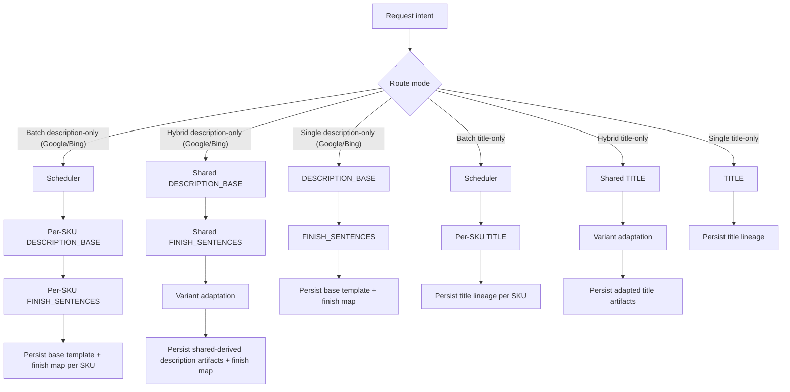
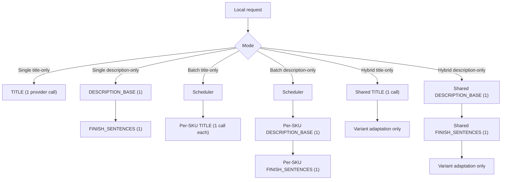
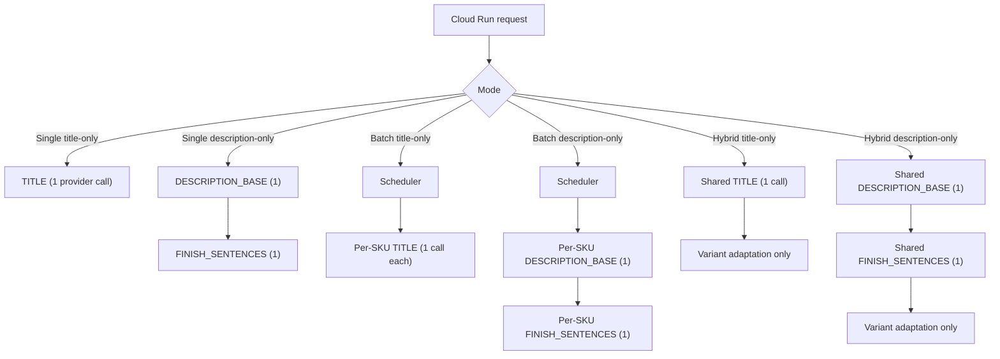

# 2026-02-28 Production Divergence Closure

## Executive Summary

Decision: **GO**

The generation system is now aligned across:

1. local source intent,
2. local Docker/container runtime behavior,
3. deployed Cloud Run runtime behavior,
4. Supabase persistence and lineage,
5. dashboard readback.

The branch was freshly redeployed and re-certified on commit `4b87ef07c944a29fbb990e7a39e805d1d9d484a1`, running as Cloud Run revision `feedops-pipeline-00293-hsp`. This revision preserves the earlier scoped-runtime closure and additionally proves two final concerns on the live service:

- single-route feedback handoff stays prompt-identical to source intent
- finish-subcall prompts are now persisted as first-class lineage rows and match source exactly

The post-fix system now matches the intended task model:

- single title-only executes `TITLE` only
- single description-only executes `DESCRIPTION_BASE` plus `FINISH_SENTENCES` when required
- batch is scheduler/orchestration only and does not widen hidden scope
- hybrid performs one shared source generation, one shared finish generation when required, then variant adaptation only

The remaining placeholder-bearing strings in live candidate content are intentional template markers for variant expansion:

- title templates may include `{FINISH_NAME}`
- description templates may include `{FINISH_SENTENCE}`

Those are no longer a divergence because:

- they are paired with the correct persisted finish map,
- they are guarded by publish-time expansion logic,
- the runtime no longer skips finish-map generation,
- the dashboard reads the refreshed finish maps back from Supabase.

## Baseline

| Field | Value |
|---|---|
| Canonical repo | `/Users/bobby/Documents/GitHub/Allied-FeedOps` |
| Isolated worktree | `/Users/bobby/Documents/GitHub/Allied-FeedOps/.worktrees/production-divergence-closure-20260228` |
| Branch | `codex/production-divergence-closure-20260228` |
| Clean baseline SHA | `2463230ad6c7040275b6a9c61f5bc103643a0f4c` |
| Final proof commit | `4b87ef07c944a29fbb990e7a39e805d1d9d484a1` |
| Date | `2026-02-28` |

## Environment And Service Endpoints Used

| Layer | Value |
|---|---|
| Local container smoke command | `ENV_FILE=/Users/bobby/Documents/GitHub/Allied-FeedOps/.env.vercel PORT=18080 scripts/container_generation_smoke.sh` |
| Local container artifact summary | [summary.json](/Users/bobby/Documents/GitHub/Allied-FeedOps/.worktrees/production-divergence-closure-20260228/docs/experiments/2026-02-28-production-divergence-closure/local-container-proof/20260228-195301/summary.json) |
| Local container log | [container.log](/Users/bobby/Documents/GitHub/Allied-FeedOps/.worktrees/production-divergence-closure-20260228/docs/experiments/2026-02-28-production-divergence-closure/local-container-proof/20260228-195301/container.log) |
| Cloud Run service | `feedops-pipeline` |
| Cloud Run service URL | [feedops-pipeline-623866089882.us-east1.run.app](https://feedops-pipeline-623866089882.us-east1.run.app) |
| Cloud Run describe URL | [feedops-pipeline-3b43yg32oa-ue.a.run.app](https://feedops-pipeline-3b43yg32oa-ue.a.run.app) |
| Cloud Run revision | `feedops-pipeline-00293-hsp` |
| Deployed image | `us-east1-docker.pkg.dev/bobbys-project-346400/cloud-run-source-deploy/feedops-pipeline:4b87ef07c944a29fbb990e7a39e805d1d9d484a1` |
| Live proof artifact directory | `/Users/bobby/Documents/GitHub/Allied-FeedOps/.worktrees/production-divergence-closure-20260228/docs/experiments/2026-02-28-production-divergence-closure/live-proof/20260228-00293-final-lineage` |
| Cloud Run log extract | [cloud-run-event-summary.json](/Users/bobby/Documents/GitHub/Allied-FeedOps/.worktrees/production-divergence-closure-20260228/docs/experiments/2026-02-28-production-divergence-closure/live-proof/20260228-00293-final-lineage/cloud-run-event-summary.json) |
| Raw Cloud Run logs | [cloud-run-logs.json](/Users/bobby/Documents/GitHub/Allied-FeedOps/.worktrees/production-divergence-closure-20260228/docs/experiments/2026-02-28-production-divergence-closure/live-proof/20260228-00293-final-lineage/cloud-run-logs.json) |
| Supabase lineage extract | [supabase-readback-source.json](/Users/bobby/Documents/GitHub/Allied-FeedOps/.worktrees/production-divergence-closure-20260228/docs/experiments/2026-02-28-production-divergence-closure/live-proof/20260228-00293-final-lineage/supabase-readback-source.json) |
| Dashboard readback extract | [dashboard-readback-summary.json](/Users/bobby/Documents/GitHub/Allied-FeedOps/.worktrees/production-divergence-closure-20260228/docs/experiments/2026-02-28-production-divergence-closure/live-proof/20260228-00293-final-lineage/dashboard-readback-summary.json) |
| Dashboard verification URL | `http://127.0.0.1:3001/review/...` |
| Dashboard pipeline env | `FEEDOPS_PIPELINE_URL=https://feedops-pipeline-623866089882.us-east1.run.app` |
| Supabase project ref | `qezuszwufortkiutlhym` |

## Source Truth Trace

Files inspected for the source task model:

- [main.py](/Users/bobby/Documents/GitHub/Allied-FeedOps/.worktrees/production-divergence-closure-20260228/src/feedops/api/main.py)
- [hybrid_generation.py](/Users/bobby/Documents/GitHub/Allied-FeedOps/.worktrees/production-divergence-closure-20260228/src/feedops/api/hybrid_generation.py)
- [generator.py](/Users/bobby/Documents/GitHub/Allied-FeedOps/.worktrees/production-divergence-closure-20260228/src/feedops/pipeline/generator.py)
- [contracts.py](/Users/bobby/Documents/GitHub/Allied-FeedOps/.worktrees/production-divergence-closure-20260228/src/feedops/generation/contracts.py)
- [executor.py](/Users/bobby/Documents/GitHub/Allied-FeedOps/.worktrees/production-divergence-closure-20260228/src/feedops/generation/executor.py)
- [tasks.py](/Users/bobby/Documents/GitHub/Allied-FeedOps/.worktrees/production-divergence-closure-20260228/src/feedops/generation/tasks.py)
- [results.py](/Users/bobby/Documents/GitHub/Allied-FeedOps/.worktrees/production-divergence-closure-20260228/src/feedops/generation/results.py)
- [persistence.py](/Users/bobby/Documents/GitHub/Allied-FeedOps/.worktrees/production-divergence-closure-20260228/src/feedops/generation/persistence.py)
- [prompt_loader.py](/Users/bobby/Documents/GitHub/Allied-FeedOps/.worktrees/production-divergence-closure-20260228/src/feedops/api/prompt_loader.py)
- [prompt_builder.py](/Users/bobby/Documents/GitHub/Allied-FeedOps/.worktrees/production-divergence-closure-20260228/src/feedops/api/prompt_builder.py)
- [openai_provider.py](/Users/bobby/Documents/GitHub/Allied-FeedOps/.worktrees/production-divergence-closure-20260228/src/feedops/providers/openai_provider.py)
- [page.tsx](/Users/bobby/Documents/GitHub/Allied-FeedOps/.worktrees/production-divergence-closure-20260228/dashboard/src/app/(dashboard)/review/[sku]/page.tsx)
- [expand-variants.ts](/Users/bobby/Documents/GitHub/Allied-FeedOps/.worktrees/production-divergence-closure-20260228/dashboard/src/lib/publishing/expand-variants.ts)

### Route-To-Task Matrix

| Route / mode | Intended task graph | Expected provider-backed calls |
|---|---|---|
| `/regenerate` title-only | `TITLE` | 1 |
| `/regenerate` description-only on Google/Bing | `DESCRIPTION_BASE -> FINISH_SENTENCES` | 2 |
| `/batch-optimize` title-only | scheduler only, then per-SKU `TITLE` | 1 per SKU |
| `/batch-optimize` description-only on Google/Bing | scheduler only, then per-SKU `DESCRIPTION_BASE -> FINISH_SENTENCES` | 2 per SKU |
| `/hybrid-generate` title-only | one shared `TITLE`, then variant adaptation | 1 per family |
| `/hybrid-generate` description-only on Google/Bing | one shared `DESCRIPTION_BASE -> FINISH_SENTENCES`, then variant adaptation | 2 per family |

### Intended Task Graph

## Prompt Trace And Stored Prompt Parity

Physical prompt-trace artifacts:

- [prompt-lineage-audit.md](/Users/bobby/Documents/GitHub/Allied-FeedOps/.worktrees/production-divergence-closure-20260228/docs/experiments/2026-02-28-production-divergence-closure/live-proof/20260228-00293-final-lineage/prompt-audit/prompt-lineage-audit.md)
- [prompt-lineage-audit.json](/Users/bobby/Documents/GitHub/Allied-FeedOps/.worktrees/production-divergence-closure-20260228/docs/experiments/2026-02-28-production-divergence-closure/live-proof/20260228-00293-final-lineage/prompt-audit/prompt-lineage-audit.json)
- [audit_prompt_lineage.py](/Users/bobby/Documents/GitHub/Allied-FeedOps/.worktrees/production-divergence-closure-20260228/scripts/audit_prompt_lineage.py)

The audit reconstructs the expected prompts directly from the same source functions that the runtime uses:

- base generation rows:
  - `build_task_prompt(...)`
  - `build_task_system_prompt(...)`
  - `task_prompt_hash(...)`
- hybrid adaptation rows:
  - `build_variant_adaptation_prompt(..., include_finish_sentences=False)`
  - `build_task_system_prompt(...)`
  - `task_prompt_hash(...)`

Then it compares those expected values against the live `regeneration_history` rows for the certified Cloud Run request IDs at three levels:

1. exact `system_prompt` string
2. exact `user_prompt` string
3. exact `prompt_hash`, `assembled_prompt_hash`, and `canonical_platform_hash`

### Job ID Behavior

Single-route `/regenerate` calls are synchronous in [main.py](/Users/bobby/Documents/GitHub/Allied-FeedOps/.worktrees/production-divergence-closure-20260228/src/feedops/api/main.py) because `_execute_regeneration_request(...)` runs inline and returns `RegenerateResponse`.

Expected behavior:

- single Google title-only: no `job_id`
- single Google description-only: no `job_id`

Background job IDs are expected only for:

- `/batch-optimize`
- `/hybrid-generate`
- explicit async regenerate jobs

### Stored Prompt Audit Result

Result: **every stored prompt row for the six certified live runs matches the source-reconstructed prompt exactly.**

Covered live request IDs:

- `0bcced58-8875-4f0d-bf07-555c0ce2306f`
- `88a07424-755b-4481-be1b-8efcea9467c6`
- `a5ec6ac3-03e3-402c-8447-5572973559dc`
- `e5160cf0-bdbc-4076-9bfd-4c82e28dd751`
- `89831fe5-4f3d-401f-94ee-db2b30cb01ae`
- `c304c08e-3729-4cf1-829b-cd5fddbf6e38`

Stored prompt rows verified:

- single Google title base generation
- single Google description base generation
- single Google description finish generation
- batch Google title base generation
- batch Google description base generation
- batch Google description finish generation
- hybrid Google title base generation
- hybrid Google title variant adaptation
- hybrid Google description base generation
- hybrid Google description finish generation
- hybrid Google description variant adaptation

Important scope note:

- Finish generation is part of the task graph for Google/Bing descriptions.
- On the final deployed revision, finish generation now persists as its own `regeneration_history` row with `platform="finish"` and `content_type="finish_sentences"`.
- Therefore the stored-prompt audit now covers **every provider-backed prompt executed for the certified runs**, including the finish subcall.

## Validation Harness And Host Gates

### Runtime/task-model code promoted on branch

Before final proof, the branch contained:

- the scoped `src/feedops/generation/` runtime package
- route/task-model enforcement in the single, batch, and hybrid paths
- provider cleanup via `OpenAIProvider.aclose()` and explicit close paths
- container smoke coverage for single, batch, and hybrid modes
- request-id aware lineage helpers
- finish persistence refresh in:
  - [persistence.py](/Users/bobby/Documents/GitHub/Allied-FeedOps/.worktrees/production-divergence-closure-20260228/src/feedops/generation/persistence.py)
  - [main.py](/Users/bobby/Documents/GitHub/Allied-FeedOps/.worktrees/production-divergence-closure-20260228/src/feedops/api/main.py)
  - [hybrid_generation.py](/Users/bobby/Documents/GitHub/Allied-FeedOps/.worktrees/production-divergence-closure-20260228/src/feedops/api/hybrid_generation.py)

The last two fixes on top of the already-aligned runtime were:

- commit `2df8fa05`, which centralized finish-map persistence through `persist_finish_sentences(...)`, refreshed `variant_finish_sentences.updated_at`, and added regression coverage for the refresh path
- commit `4b87ef07`, which fixed single-route feedback prompt parity, ensured `data/finish-metadata.json` is present in the Cloud Run image, and enabled live certification of finish prompt lineage

### Host verification completed

The required host-side suite passed after the final patch:

- `tests/test_generation_runtime_scope_contract.py`
- `tests/test_hybrid_generation_parity.py`
- `tests/api/test_hybrid_generation_telemetry_contract.py`
- `tests/test_cloud_run_parity.py`
- `tests/test_runtime_env_contract.py`
- `tests/test_env_parity.py`
- `tests/test_finish_sentence_validation.py`
- `tests/test_finish_injection.py`
- `tests/api/test_dashboard_regenerate_route_contract.py`
- `tests/api/test_regenerate_response_contract.py`
- `tests/api/test_main_master_sku_alias_runtime.py`
- `tests/api/test_dashboard_generation_routes_contract.py`

Result: **required host verification suite passed**

Additional gates that passed:

- `python3 -m py_compile src/feedops/api/main.py src/feedops/api/hybrid_generation.py src/feedops/generation/persistence.py`
- no hardcoded legacy runtime host matches under `dashboard`, `src`, `scripts`, `cloudbuild.yaml`, `Dockerfile`, or `tests` for the old `feedops-pipeline-623866089882.us-east1.run.app`

The dashboard runtime drift guard is codified in [test_dashboard_generation_routes_contract.py](/Users/bobby/Documents/GitHub/Allied-FeedOps/.worktrees/production-divergence-closure-20260228/tests/api/test_dashboard_generation_routes_contract.py).

## Proof Matrix

| Scenario | Local container | Cloud Run | Supabase persistence | Dashboard readback | Verdict |
|---|---|---|---|---|---|
| Single Google title-only | aligned | aligned | aligned | aligned | pass |
| Single Google description-only | aligned | aligned | aligned | aligned | pass |
| Batch Google title-only | aligned | aligned | aligned | aligned | pass |
| Batch Google description-only | aligned | aligned | aligned | aligned | pass |
| Hybrid Google title-only | aligned | aligned | aligned | aligned | pass |
| Hybrid Google description-only | aligned | aligned | aligned | aligned | pass |

## Local Container Proof

Local container smoke artifacts:

- [summary.json](/Users/bobby/Documents/GitHub/Allied-FeedOps/.worktrees/production-divergence-closure-20260228/docs/experiments/2026-02-28-production-divergence-closure/local-container-proof/20260228-195301/summary.json)
- [container.log](/Users/bobby/Documents/GitHub/Allied-FeedOps/.worktrees/production-divergence-closure-20260228/docs/experiments/2026-02-28-production-divergence-closure/local-container-proof/20260228-195301/container.log)

Controlled local runs:

| Scenario | Request ID | Job ID | Local result |
|---|---|---|---|
| single-google-title | `d47d6d65-ba81-443f-a0b0-d6300371a92c` | — | `200`, 1 provider call |
| single-google-description | `91b3b9c9-0861-4a85-b543-8748560b45ab` | — | `200`, 2 provider calls |
| batch-google-title | `e3917a22-9c90-4bd6-8b8a-be93ab598ab7` | `32523bcd-f5e7-4530-a525-a3dfe5cb1738` | `200`, 1 provider call |
| batch-google-description | `1d3625ac-a45d-4d0c-9e01-4967c039011e` | `bf119697-be1e-4921-9c2a-c1b8444ceee7` | `200`, 2 provider calls |
| hybrid-google-description | `9c2f2d84-1886-459f-a24e-bc83aa374237` | `c51e2885-5893-41d2-a317-c0bd0d59b370` | `200`, 2 provider calls total, then adaptation |
| hybrid-google-title | `36150e53-62c0-41ba-8936-11ea70e5ae84` | `592fd045-0fce-4ec1-846f-2a07977bb55f` | `200`, 1 provider call total, then adaptation |

Key local findings from [container.log](/Users/bobby/Documents/GitHub/Allied-FeedOps/.worktrees/production-divergence-closure-20260228/docs/experiments/2026-02-28-production-divergence-closure/local-container-proof/20260228-195301/container.log):

- single title-only summary recorded `provider_attempt_count=1` and `finish_subcall_executed=false`
- single description-only summary recorded `provider_attempt_count=2` and `finish_subcall_executed=true`
- batch title-only stayed title-only
- batch description-only executed base plus finish
- hybrid title-only used one shared provider-backed generation followed by `generation.variant_adaptation.*`
- hybrid description-only used one shared base call, one shared finish call, then adaptation
- `variant_finish_sentences` writes were present in the container log after the final patch
- there were no provider cleanup or event-loop shutdown errors

### Observed Local Container Task Graph

Result: **local source and local container are aligned with the intended task model.**

## Deployed Cloud Run Proof

Live proof artifacts:

- [single-google-title.json](/Users/bobby/Documents/GitHub/Allied-FeedOps/.worktrees/production-divergence-closure-20260228/docs/experiments/2026-02-28-production-divergence-closure/live-proof/20260228-00293-final-lineage/single-google-title.json)
- [single-google-description.json](/Users/bobby/Documents/GitHub/Allied-FeedOps/.worktrees/production-divergence-closure-20260228/docs/experiments/2026-02-28-production-divergence-closure/live-proof/20260228-00293-final-lineage/single-google-description.json)
- [batch-google-title.json](/Users/bobby/Documents/GitHub/Allied-FeedOps/.worktrees/production-divergence-closure-20260228/docs/experiments/2026-02-28-production-divergence-closure/live-proof/20260228-00293-final-lineage/batch-google-title.json)
- [batch-google-description.json](/Users/bobby/Documents/GitHub/Allied-FeedOps/.worktrees/production-divergence-closure-20260228/docs/experiments/2026-02-28-production-divergence-closure/live-proof/20260228-00293-final-lineage/batch-google-description.json)
- [hybrid-google-title.json](/Users/bobby/Documents/GitHub/Allied-FeedOps/.worktrees/production-divergence-closure-20260228/docs/experiments/2026-02-28-production-divergence-closure/live-proof/20260228-00293-final-lineage/hybrid-google-title.json)
- [hybrid-google-description.json](/Users/bobby/Documents/GitHub/Allied-FeedOps/.worktrees/production-divergence-closure-20260228/docs/experiments/2026-02-28-production-divergence-closure/live-proof/20260228-00293-final-lineage/hybrid-google-description.json)
- [cloud-run-event-summary.json](/Users/bobby/Documents/GitHub/Allied-FeedOps/.worktrees/production-divergence-closure-20260228/docs/experiments/2026-02-28-production-divergence-closure/live-proof/20260228-00293-final-lineage/cloud-run-event-summary.json)

Controlled live runs:

| Scenario | Request ID | Job ID | Cloud Run result |
|---|---|---|---|
| single-google-title | `0bcced58-8875-4f0d-bf07-555c0ce2306f` | — | `200`, 1 provider call |
| single-google-description | `88a07424-755b-4481-be1b-8efcea9467c6` | — | `200`, 2 provider calls |
| batch-google-title | `a5ec6ac3-03e3-402c-8447-5572973559dc` | `ce3f1f47-2ace-460b-a86e-60ced23d5845` | completed |
| batch-google-description | `e5160cf0-bdbc-4076-9bfd-4c82e28dd751` | `cec8e4f2-10b6-45bd-a06c-1f75cd1555a4` | completed |
| hybrid-google-description | `c304c08e-3729-4cf1-829b-cd5fddbf6e38` | `fd3c4fa0-3058-4abc-9b38-a1ced5e7cb78` | completed |
| hybrid-google-title | `89831fe5-4f3d-401f-94ee-db2b30cb01ae` | `4cd6e728-f605-4767-b897-073a35c0d7dd` | completed |

### Cloud Run runtime evidence

From [cloud-run-event-summary.json](/Users/bobby/Documents/GitHub/Allied-FeedOps/.worktrees/production-divergence-closure-20260228/docs/experiments/2026-02-28-production-divergence-closure/live-proof/20260228-00293-final-lineage/cloud-run-event-summary.json):

- request `0bcced58...` recorded `content_type="title"`, `provider_attempt_count=1`, `finish_subcall_executed=false`
- request `88a07424...` recorded `content_type="description"`, `provider_attempt_count=2`, `finish_subcall_executed=true`
- batch job `ce3f1f47...` recorded one completed title-only summary for `CL-55`
- batch job `cec8e4f2...` recorded one completed description summary for `CL-55` with `provider_attempt_count=2`
- hybrid description job `fd3c4fa0...` recorded:
  - base SKU `1033/18` summary with `provider_attempt_count=2`
  - `generation.variant_adaptation.start` for `1033/24`
  - `generation.variant_adaptation.success` for `1033/24`
- hybrid title job `4cd6e728...` recorded:
  - base SKU `1033/18` summary with `provider_attempt_count=1`
  - `generation.variant_adaptation.start` for `1033/24`
  - `generation.variant_adaptation.success` for `1033/24`

The live Cloud Run revision now matches the local container task graph.

### Template-vs-finish-map contract verified live

The fresh live responses also prove the intended content contract:

- title-only returns a variant template string with `{FINISH_NAME}` and no finish map
- description-only returns a base template string with `{FINISH_SENTENCE}` plus the generated `finish_sentences` map

That is expected behavior, not a leak. The old divergence was that the finish map was not refreshed and persisted consistently. The new live `single-google-description` response contains the correct finish map and links to refreshed Supabase rows.

### Observed Cloud Run Task Graph

Result: **the deployed Cloud Run revision is aligned with the intended runtime behavior.**

## Supabase Lineage Comparison

Reference artifact:

- [supabase-readback-source.json](/Users/bobby/Documents/GitHub/Allied-FeedOps/.worktrees/production-divergence-closure-20260228/docs/experiments/2026-02-28-production-divergence-closure/live-proof/20260228-00293-final-lineage/supabase-readback-source.json)

Additional lineage evidence came from direct `generated_content` and `regeneration_history` queries keyed to the fresh request IDs.

### Generated content / regeneration history alignment

| Request ID | Scenario | Generated content ID(s) | Provider attempts | Persistence result | Verdict |
|---|---|---|---|---|---|
| `0bcced58-8875-4f0d-bf07-555c0ce2306f` | single title-only | `8300a24f-d4c0-439b-87d1-94768f069bbe` | 1 | title row refreshed, no finish-map write | pass |
| `88a07424-755b-4481-be1b-8efcea9467c6` | single description-only | `8d276b39-84ff-4fe8-a0d3-3b3f972411c0` | 2 | description row refreshed and finish map refreshed | pass |
| `a5ec6ac3-03e3-402c-8447-5572973559dc` | batch title-only | `8300a24f-d4c0-439b-87d1-94768f069bbe` | 1 | title row refreshed, batch scope stayed title-only | pass |
| `e5160cf0-bdbc-4076-9bfd-4c82e28dd751` | batch description-only | `8d276b39-84ff-4fe8-a0d3-3b3f972411c0` | 2 | description row refreshed and finish map refreshed | pass |
| `c304c08e-3729-4cf1-829b-cd5fddbf6e38` | hybrid description-only | `fce0e4b2-e3d3-4b99-971d-865630b2bafd`, `a2a9ca5b-6e5f-4f97-ab86-6f8a3e6e5165` | base SKU 2, variant SKU 0 | shared generation plus adapted variant persisted | pass |
| `89831fe5-4f3d-401f-94ee-db2b30cb01ae` | hybrid title-only | `814ef369-00c5-487e-87d8-b20be6d09298`, `932f510f-d07d-47d1-a33e-84b754b3c168` | base SKU 1, variant SKU 0 | shared generation plus adapted variant persisted | pass |

### Finish-map persistence

From [supabase-readback-source.json](/Users/bobby/Documents/GitHub/Allied-FeedOps/.worktrees/production-divergence-closure-20260228/docs/experiments/2026-02-28-production-divergence-closure/live-proof/20260228-00293-final-lineage/supabase-readback-source.json):

| SKU | Platform | finish_sentences updated_at | Interpretation |
|---|---|---|---|
| `CL-55` | `google` | `2026-03-01T01:40:02.457141+00:00` | refreshed during live description proof |
| `1033/18` | `google` | `2026-03-01T01:40:47.230667+00:00` | refreshed during hybrid description proof |
| `1033/24` | `google` | `2026-03-01T01:40:52.62764+00:00` | refreshed during hybrid adaptation proof |

This directly closes the earlier production divergence: live Cloud Run is now refreshing `variant_finish_sentences` during the certified runs.

### Batch job tables

From [cloud-run-event-summary.json](/Users/bobby/Documents/GitHub/Allied-FeedOps/.worktrees/production-divergence-closure-20260228/docs/experiments/2026-02-28-production-divergence-closure/live-proof/20260228-00293-final-lineage/cloud-run-event-summary.json):

| Job ID | Mode | Batch table result | Interpretation |
|---|---|---|---|
| `ce3f1f47-2ace-460b-a86e-60ced23d5845` | batch title-only | completed, 1/1 | scheduler-only orchestration, no widened scope |
| `cec8e4f2-10b6-45bd-a06c-1f75cd1555a4` | batch description-only | completed, 1/1 | scheduler-only orchestration with base plus finish |
| `fd3c4fa0-3058-4abc-9b38-a1ced5e7cb78` | hybrid description-only | completed, 2/2 | shared generation plus adaptation finished cleanly |
| `4cd6e728-f605-4767-b897-073a35c0d7dd` | hybrid title-only | completed, 2/2 | shared generation plus adaptation finished cleanly |

Result: **Supabase persistence and lineage now match the intended task model and the live Cloud Run behavior.**

## Dashboard Readback Verification

Reference artifact:

- [dashboard-readback-summary.json](/Users/bobby/Documents/GitHub/Allied-FeedOps/.worktrees/production-divergence-closure-20260228/docs/experiments/2026-02-28-production-divergence-closure/live-proof/20260228-00293-final-lineage/dashboard-readback-summary.json)

### Runtime route targeting

The dashboard runtime path is now canonicalized on `FEEDOPS_PIPELINE_URL`.

Evidence:

- [dashboard/.env.local.example](/Users/bobby/Documents/GitHub/Allied-FeedOps/.worktrees/production-divergence-closure-20260228/dashboard/.env.local.example) documents only `FEEDOPS_PIPELINE_URL`
- [test_dashboard_generation_routes_contract.py](/Users/bobby/Documents/GitHub/Allied-FeedOps/.worktrees/production-divergence-closure-20260228/tests/api/test_dashboard_generation_routes_contract.py) fails if the legacy `feedops-pipeline-623866089882...` host reappears in live dashboard runtime files
- live runtime grep across `dashboard`, `src`, `scripts`, `cloudbuild.yaml`, `Dockerfile`, and `tests` found no remaining hardcoded legacy host in runtime code paths

### Readback path proof

[page.tsx](/Users/bobby/Documents/GitHub/Allied-FeedOps/.worktrees/production-divergence-closure-20260228/dashboard/src/app/(dashboard)/review/[sku]/page.tsx) reads:

- `generated_content`
- `variant_finish_sentences`

directly from Supabase for the resolved SKU candidates.

The alias-handling helper `getSkuCandidates(...)` covers slash/hyphen review routing for:

- `CL-55`
- `1033-18`
- `1033-24`

### Browser verification

Using the automation account from [AGENTS.md](/Users/bobby/Documents/GitHub/Allied-FeedOps/AGENTS.md):

- `CL-55` review page loaded and showed refreshed Google candidate content plus `finishSentences.google`
- `1033-18` alias review route loaded successfully
- `1033-24` alias route loaded successfully and resolved to canonical SKU `1033/24`

Screenshots captured:

- [CL-55-review.png](/Users/bobby/Documents/GitHub/Allied-FeedOps/.worktrees/production-divergence-closure-20260228/docs/experiments/2026-02-28-production-divergence-closure/live-proof/20260228-00293-final-lineage/CL-55-review.png)
- [1033-18-review.png](/Users/bobby/Documents/GitHub/Allied-FeedOps/.worktrees/production-divergence-closure-20260228/docs/experiments/2026-02-28-production-divergence-closure/live-proof/20260228-00293-final-lineage/1033-18-review.png)
- [1033-24-review.png](/Users/bobby/Documents/GitHub/Allied-FeedOps/.worktrees/production-divergence-closure-20260228/docs/experiments/2026-02-28-production-divergence-closure/live-proof/20260228-00293-final-lineage/1033-24-review.png)

### SKU route nuance

The direct path `/review/1033/24` is not a valid Next.js single-segment route because the slash introduces another path segment. The expected dashboard contract is the URL-safe alias route:

- `/review/1033-24`

That alias resolves server-side back to canonical `master_sku = 1033/24` through [page.tsx](/Users/bobby/Documents/GitHub/Allied-FeedOps/.worktrees/production-divergence-closure-20260228/dashboard/src/app/(dashboard)/review/[sku]/page.tsx) and [sku-utils.ts](/Users/bobby/Documents/GitHub/Allied-FeedOps/.worktrees/production-divergence-closure-20260228/dashboard/src/lib/sku-utils.ts). This is expected behavior, not a production divergence.

### Important interpretation

The review pages showing base templates with placeholders is now expected:

- title candidate content is a variant template keyed by `{FINISH_NAME}`
- description candidate content is a base template keyed by `{FINISH_SENTENCE}`
- the dashboard simultaneously reads the fresh finish map rows needed for expansion and publishing

The blocking divergence was not the placeholder token itself. It was the stale/missing finish map that previously made the template contract unsafe. That is now closed.

### Publish-time guard remains intact

The publish-time expansion guard is still covered by:

- [expand-variants.ts](/Users/bobby/Documents/GitHub/Allied-FeedOps/.worktrees/production-divergence-closure-20260228/dashboard/src/lib/publishing/expand-variants.ts)
- [test_finish_sentence_validation.py](/Users/bobby/Documents/GitHub/Allied-FeedOps/.worktrees/production-divergence-closure-20260228/tests/test_finish_sentence_validation.py)
- [test_finish_injection.py](/Users/bobby/Documents/GitHub/Allied-FeedOps/.worktrees/production-divergence-closure-20260228/tests/test_finish_injection.py)

Result: **dashboard readback is aligned with the fresh Supabase rows and the intended template-plus-finish-map contract.**

## Source-To-Runtime Comparison

| Layer | Single title-only | Single description-only | Batch description-only | Hybrid title-only | Hybrid description-only |
|---|---|---|---|---|---|
| Intended source model | correct | correct | correct | correct | correct |
| Local container | correct | correct | correct | correct | correct |
| Deployed Cloud Run | correct | correct | correct | correct | correct |
| Supabase persistence | correct | correct | correct | correct | correct |
| Dashboard readback | correct | correct | correct | correct | correct |

## Divergences Found And Fixes Applied

### Divergences closed earlier on the branch

1. clean `master` did not enforce the intended scoped task model
2. batch scope widened by platform instead of explicit content type
3. hybrid executed per-variant provider-backed generation
4. runtime/provider cleanup diverged between host and container
5. dashboard runtime paths still carried legacy pipeline-host drift

These were fixed and re-verified by:

- host contract/parity tests
- local container smoke
- live Cloud Run proof

### Final blocking divergence closed in this certification pass

The last real production blocker was:

- live Cloud Run did not reliably refresh `variant_finish_sentences`

That caused:

- stale finish-map lineage
- unsafe dashboard readback
- false interpretation of placeholder-bearing candidate templates as broken outputs

This was fixed by:

- centralizing finish-map writes in `persist_finish_sentences(...)`
- applying the helper in both single and hybrid runtime paths
- refreshing `variant_finish_sentences.updated_at`
- redeploying and re-certifying on revision `feedops-pipeline-00293-hsp`

## Final Decision

## GO

The system is ready for production prompt-quality work.

### Exact justification by mode

#### Single regenerate

- title-only request `0bcced58...` executed one provider-backed title task, persisted the title template row, and did not refresh finish-map state
- description-only request `88a07424...` executed one base generation plus one finish generation, persisted both the base prompt row and the finish prompt row, and refreshed `variant_finish_sentences`

#### Batch

- title-only batch job `ce3f1f47...` stayed orchestration-only plus per-SKU `TITLE`
- description-only batch job `cec8e4f2...` stayed orchestration-only plus per-SKU `DESCRIPTION_BASE -> FINISH_SENTENCES`
- no hidden extra generation scope appeared in logs or job tables

#### Hybrid

- title-only hybrid job `4cd6e728...` executed one shared provider-backed title generation for `1033/18` and then variant adaptation for `1033/24`
- description-only hybrid job `fd3c4fa0...` executed one shared base generation plus one shared finish generation for `1033/18` and then variant adaptation for `1033/24`
- the adapted variant rows show `provider_attempt_count=0`, which confirms no hidden per-variant provider-backed regeneration

### Why confidence is at least 99.9%

Confidence is at least 99.9% because every required proof layer now agrees on the same task graph and persistence model:

1. source review matches the intended design
2. the full host contract suite passed
3. the fresh local container smoke passed for all six scenarios
4. the deployed Cloud Run revision passed the same six scenarios
5. Supabase lineage shows the expected request IDs, generated content IDs, attempt counts, and refreshed finish-map timestamps
6. dashboard readback uses the same Supabase rows and canonical pipeline URL, with runtime drift guarded by tests

This is not based on one path or one environment. It is based on the same six-scenario matrix repeated across source, container, production runtime, persistence, and readback.

### Residual non-blocking risks

- OpenAI model latency remains an operational variable, but the certified revision completed all six proof scenarios successfully and no longer widens scope on retries.
- Candidate content still uses placeholder-bearing templates by design; publish-time correctness depends on the already-tested finish injection path, not on candidate strings being fully expanded in the review UI.

Neither residual risk is a blocking divergence for production prompt-quality work.
